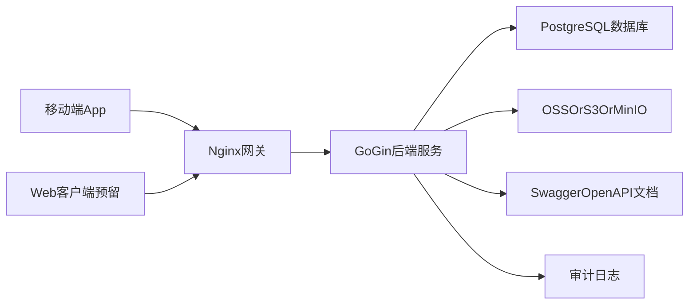
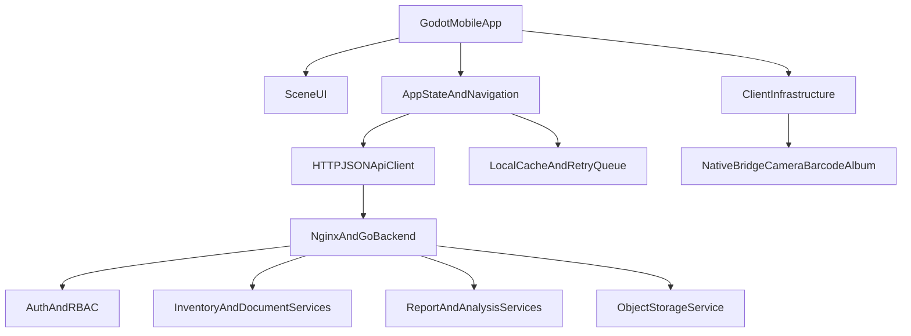

## 🤖 Assistant

# 零售端库存管理系统APP项目需求文档

## 1. 项目概述
### 1.1 项目名称
零售端智能库存管理系统（Retail Inventory Management System，简称RIMS）

### 1.2 项目目标
开发一款面向零售终端的移动端库存管理应用，实现库存实时管理、多角色协同作业、销售数据追踪与统计分析等功能，提升零售库存管理效率和销售决策能力。

### 1.3 目标用户
- 零售店店主/经理（管理员）
- 零售店员工（普通用户）
- 仓库管理员

---

## 2. 功能需求

### 2.1 用户管理模块
#### 2.1.1 用户角色
- **管理员**：可绑定并管理多个仓库；可进行入库、出库（包含非标处理）、库存调拨、盘点结转、以及查看成本价等受控权限操作
- **普通用户**：仅绑定且只能操作一个仓库；仅可执行“销售出库”和“退货入库”；仅可查看其绑定仓库范围内的库存与报表

#### 2.1.2 功能要求
- 用户注册/登录（手机号+验证码或账号密码）
- 角色分配与管理（仅管理员可操作）
- 权限分级控制
- 登录状态保持与安全退出

#### 2.1.3 仓库绑定与数据隔离
- 普通用户只能绑定一个仓库，登录后业务数据范围固定为该仓库，禁止切换到其他仓库，只有管理员能变更。
- 管理员可绑定多个仓库，并可在其绑定范围内切换展示与执行对应仓库的业务数据。
- 系统在库存、销售、退货、盘点、调拨、报表等所有入口执行“仓库权限校验”，确保无法跨仓查询与操作。

#### 2.1.4 仓库切换与默认口径
- 登录后默认展示“用户当前仓库”的库存与业务数据；管理员可在其绑定仓库集合内切换。
- 任意单据（入库/出库/退货/调拨/盘点）都必须具备明确的仓库归属，且该归属必须与操作者权限匹配。

### 2.2 库存管理模块
#### 2.2.1 实时库存显示
- 按仓库维度展示当前库存数量（普通用户仅展示其绑定仓库；管理员可切换展示其绑定仓库集合内的库存）。
- 库存预警设置（低库存提醒）
- 库存变化实时更新

#### 2.2.2 商品信息管理
- 商品基础信息：名称、分类、规格、单位
- 价格信息：
 - 成本价（仅管理员可见）
 - 建议零售价（所有用户可见）
 - 实际销售价（记录每次销售）
- 商品标识：
 - 系统生成唯一商品ID
 - 支持一维码/二维码绑定
 - 商品图片上传

#### 2.2.3 库存分类
- 标准库存（已贴标商品）
- 非标库存（未贴标商品，需特殊标记）

### 2.3 商品操作模块
#### 2.3.1 商品录入
- 扫码录入（支持一维码、二维码）
- 手动录入（备用方案）
- 批量导入（通过Excel模板）

#### 2.3.2 商品查找
- 关键词搜索（名称、分类、ID）
- 扫码快速查找
- 高级筛选（按价格、库存量、分类等）

#### 2.3.3 库存调整
- 入库操作（新增库存、以及盘点结转/非标入库结转等）
  - 管理员可执行
  - 普通用户禁止执行（非退货入库）
- 出库操作（销售出库）
  - 管理员可执行
  - 普通用户可执行，但仅允许对“标准库存”扣减（非标库存不可参与销售出库）
- 退货入库操作（销售退货回写库存）
  - 普通用户可执行，但必须关联已有销售记录以校验可退数量与可退状态
  - 管理员可执行
- 库存调拨（仓库间转移）
  - 仅管理员可执行
  - 仅可调拨“标准库存”；非标不得跨仓调拨
- 库存盘点及盘点结转
  - 仅管理员可执行

### 2.4 销售管理模块
#### 2.4.1 销售记录
- 扫码快速销售
- 手动选择商品销售
- 记录每次销售的实际价格
- 销售时间、操作员记录
- 销售出库发生在操作者的当前仓库；普通用户只能在其绑定仓库内完成扣减。
- 销售出库仅允许扣减“标准库存”；非标库存被系统过滤/拒绝参与销售扣减。

#### 2.4.2 价格管理
- 显示建议零售价给普通用户
- 管理员可查看成本价和平均售价
- 销售价与建议价差异记录

### 2.5 报表与分析模块
#### 2.5.1 销售统计
- 日/周/月/年销售报表
- 商品销售排行榜
- 销售额趋势分析

#### 2.5.2 库存分析
- 库存周转率统计
- 滞销商品预警
- 库存成本分析

#### 2.5.3 可视化图表
- 销售趋势折线图/柱状图
- 商品分类销售占比饼图
- 库存状态仪表盘
- 支持图表导出与分享

#### 2.5.4 报表范围与权限
- 普通用户：报表仅统计其绑定仓库的数据。
- 管理员：报表在其绑定仓库范围内统计；必要时可支持“多仓汇总/按仓切换”（以实现为准）。

### 2.6 扫码功能模块
#### 2.6.1 扫码类型
- 商品条码扫描（一维码）
- 二维码扫描
- 支持相册图片识别

#### 2.6.2 应用场景
- 商品快速入库
- 销售时快速调取商品
- 库存盘点扫码
- 商品信息查询

### 2.7 非标库存管理
#### 2.7.1 非标商品登记
- 非标库存是一个“临时库存标签”，用于承接大批量入库时来不及对所有货物进行及时标签化（商品ID/条码绑定）的场景。
- 非标记录需包含：临时标签号、所属仓库、商品类型/名称（或临时描述）、单位、数量、创建时间、创建人、来源单据/来源方式（如批量入库导入、人工录入等）。
- 权限约束：非标库存的创建/入库、出库（包含盘点结转导致的调减）、以及“非标转标准”仅允许管理员操作；普通用户不得创建/调整非标库存。
- 部分转换支持：管理员可以对同一非标记录进行“部分数量转标准”（转换数量必须 <= 当前非标数量）。未转换的剩余数量仍保留为非标，直至后续完成转换。
- 业务限制：非标商品禁止销售出库，也禁止跨仓调拨；需要销售/调拨的仅允许为“已完成标签化转换后的标准库存”。

#### 2.7.2 非标库存追踪
- 非标与标准库存需区分展示，并在状态标识上体现（如：非标（临时标签）/已转换标准）。
- 非标库存独立统计报告：展示创建量、已转换量、剩余非标量，并支持按仓库查看数量变化。
- 转换记录追踪：记录每次“非标 -> 标准”的转换操作者、时间、转换数量、目标标准商品归属以及来源单据，确保可审计可追溯。
- 业务闭环约束：转换完成后参与销售出库/跨仓调拨的仅为对应的标准库存；剩余未转换的非标数量仍保持不可销售、不可跨仓调拨。

---

## 3. 非功能需求

### 3.1 性能需求
1. 响应时延（常规网络条件下）
- 列表/检索类页面首屏加载：目标 <= 2 秒（含必要的字典与基础数据请求）。
- 常用查询（按商品/订单/单据号筛选）：目标 <= 1 秒（展示结果页）。
- 单据类写入操作（入库/出库/盘点/转换）：目标提交后 <= 3 秒返回成功或失败结果。
- 大批量操作（如批量入库/批量出库/批量盘点录入）：目标总体完成 <= 30 秒；期间提供进度与可恢复提示。
2. 并发与吞吐
- 系统需支持门店/仓库场景下同时操作的并发用户数：目标 >= 30 并发/区域（以实际部署规格为准）。
- 高峰期关键接口（查询、下单/入库/出库、盘点提交）需保持稳定可用，出现抖动时优先保证“提交类操作”的可靠性与一致性。
3. 可用性相关的性能保障
- 缓存策略：对商品基础信息、单位/仓库字典、权限菜单等静态或低变更数据进行缓存；变更后需同步失效。
- 超时与重试：对网络抖动接口设置合理超时与幂等重试；写入类接口需支持幂等键以避免重复提交。
4. 资源占用
- 移动端内存占用需控制在合理范围，列表页采用分页/增量加载；避免一次性拉取全量数据。

### 3.2 可用性需求
1. 使用流程与可理解性
- 覆盖典型业务闭环：非标/标准库存查看、入库/出库、盘点、非标转标准、标签化状态展示等关键路径必须“少步骤可达”。
- 关键操作（如出库/转换/盘点提交）需明确展示将影响哪些库存与数量，并提供二次确认。
2. 错误处理与提示
- 对失败场景（网络失败、权限不足、数据校验失败、库存不足/状态不允许）给出可读错误信息与可操作建议。
- 提交类操作失败后需提供“重试/回到上一步/查看原因”的能力，避免用户无从处理。
3. 可学习性
- 新用户上手支持：提供基础引导或“新手提示”，对关键页面字段含义给出解释（如数量、批次/标签含义、状态标识等）。
- 对常用功能提供快捷入口（如最近使用单据、常用仓库、常用操作按钮）。
4. 访问与交互
- 支持离线/弱网下的基本浏览能力（商品列表/库存展示应尽可能使用本地缓存）；涉及提交的操作需在恢复网络后可重新发起。
- 表单输入具备校验：必填/范围/格式校验前置提示，减少无效提交。

### 3.3 兼容性需求
1. 终端与系统兼容
- 移动端：需支持主流 Android 版本（以实际目标版本范围为准），界面适配不同分辨率与常见机型，兼容IOS。
- 鸿蒙设备一期支持 Android 兼容层运行方式，前端需确保核心业务流程在兼容层设备上可用；HarmonyOS NEXT 原生形态以正式专项方案为准。
2. 网络兼容
- 支持 2G/3G/4G/5G 及 Wi-Fi 网络环境；在网络波动时保证提交类操作的可靠性（幂等、重试、状态回传）。
3. 数据与接口兼容
- API 向后兼容策略：新增字段不破坏旧版本客户端；接口版本化并提供灰度升级机制。
4. 数据一致性兼容
- 在跨仓/跨单据展示场景下，状态字段（非标/已转换标准等）需保持一致展示口径，避免因缓存延迟导致用户误判。

### 3.4 安全性需求
1. 身份认证与授权
- 身份认证：支持登录鉴权机制（如账号密码/验证码/单点登录以实际方案为准），会话需具备过期与刷新策略。
- 权限控制：采用基于角色的访问控制（RBAC）并与文档业务权限规则一致，确保非标库存的创建/入库、出库（含盘点结转导致的调减）、以及“非标转标准”等操作仅管理员可执行。
2. 数据保护
- 传输安全：客户端与服务端通信使用 TLS/HTTPS。
- 数据存储安全：敏感数据（如用户凭证、密钥、可能的个人信息）需进行加密或脱敏存储；密钥管理需符合最小权限原则。
3. 审计与追溯
- 关键操作必须记录审计日志：包括非标/标准库存的创建、入库、出库、盘点提交、非标转标准转换（操作者、时间、数量、来源单据等）。
- 审计日志需具备不可抵赖特征（至少包含用户身份与时间戳），并支持按业务对象（商品/仓库/单据号）查询。
4. 防护能力
- 防止常见安全风险：接口鉴权校验、参数校验、越权访问拦截、防止重复提交（幂等）、CSRF/重放攻击防护（按实际形态适配）。
- 应用端防篡改：对关键写入操作进行签名校验或服务端校验，避免客户端篡改导致的数据异常（以实际方案为准）。
5. 备份与恢复
- 关键业务数据需定期备份并验证可恢复性；备份期间与恢复后保证基本一致性。

### 3.5 可扩展性需求
1. 架构与模块化
- 系统采用分层与模块化设计：业务领域（库存/非标转换/盘点）、权限领域、数据访问层、集成层（如对接其他系统）解耦。
- 新增库存规则或流程（如新增状态类型、扩展转换策略、增加新的单据类型）应以“新增模块/配置”为主，避免大范围改动核心逻辑。
2. 配置化与字典扩展
- 仓库、单位、状态码、操作类型等采用配置或数据字典管理，尽量避免硬编码。
- 业务状态（如非标（临时标签）/已转换标准）应支持枚举扩展，前端展示保持可配置化。
3. 接口演进
- 接口版本化：通过版本号或兼容策略支持逐步演进；客户端升级采用灰度策略以降低风险。
- 支持扩展字段与能力开关：对于可能逐步推出的能力（如新报表、新转换规则），通过特性开关逐步启用。
4. 数据扩展与性能演进
- 数据量增长（商品、批次/标签、单据、转换记录）应通过索引优化、分区/归档策略等保证查询性能。
- 日志与审计数据保留策略可配置（如按月/按年归档），并避免影响核心业务性能。

---

## 4. 后端系统架构、数据库与技术需求

### 4.1 后端总体架构
1. 架构目标
- 后端系统需采用前后端分离架构，为 iOS、Android 以及未来 Web 端提供统一的 HTTP/JSON 服务接口。
- 系统部署形态采用“客户端 -> Nginx 网关 -> Go 后端应用 -> PostgreSQL / 对象存储”的方式，满足库存、销售、退货、调拨、盘点、报表等业务协同需求。
- 当前后端技术基线采用 Go + Gin Framework，数据库采用 PostgreSQL，文件存储采用阿里云 OSS、AWS S3 或兼容 MinIO 的对象存储方案。
- 本章同时描述“目标生产架构要求”与“当前工程技术基线”：其中 Nginx、对象存储、完整业务模块属于正式建设目标，当前仓库已具备的基础骨架以 Go、Gin、PostgreSQL、JWT、Swagger、Docker 为主。

2. 分层设计要求
- 后端应用应采用清晰的模块化分层设计，至少包括：接口层（Handler/Controller）、业务层（Service）、数据访问层（Repository/DAO）、基础设施层（DB、对象存储、鉴权、中间件、配置管理）。
- 各层职责应单一明确：接口层负责参数接收与响应输出，业务层负责业务规则编排，数据访问层负责数据库读写，基础设施层负责通用能力封装。
- 不同业务模块之间应通过明确接口协作，避免库存、销售、权限、报表等领域逻辑相互耦合。

3. 总体架构关系

4. 网关与服务职责
- Nginx 部署于云服务器，负责 SSL 卸载、反向代理、负载均衡、静态资源分发以及基础访问控制。
- Go 后端服务负责认证鉴权、业务规则校验、库存流水处理、报表计算、文件上传授权以及对外 API 提供。
- 图片等大文件不得直接存放在数据库中，应由对象存储服务保存，数据库仅保存 URL、文件标识、业务归属与必要元数据。

### 4.2 后端模块划分
1. 认证与用户模块
- 负责账号登录、JWT 签发与校验、用户信息维护、角色与权限绑定、登录状态管理。
- 应支持管理员与普通用户两类主要角色，并预留后续扩展仓库管理员、审计角色等能力。

2. 仓库与权限模块
- 负责仓库主数据维护、用户与仓库绑定关系、当前仓库上下文切换、仓库范围内的数据访问控制。
- 普通用户只允许绑定一个仓库，管理员可绑定多个仓库，并在授权范围内切换。

3. 商品与库存模块
- 负责商品档案、条码/二维码绑定、标准库存与非标库存管理、库存预警、库存状态展示。
- 所有库存数据必须带有明确仓库归属，并可追踪库存变更来源。

4. 单据与业务流水模块
- 应包括入库、销售出库、退货入库、库存调拨、库存盘点、非标转标准等业务流程。
- 每类业务都应形成独立单据主表、明细表与库存流水记录，保证业务可审计、可回放、可追溯。

5. 报表与分析模块
- 负责销售统计、库存分析、排行榜、趋势图、库存周转率、滞销预警等能力。
- 报表数据口径必须受角色与仓库权限约束，避免出现跨仓越权统计。

6. 文件与附件模块
- 负责商品图片上传、访问授权、文件元数据存储、文件生命周期管理。
- 应支持后续扩展到凭证图片、盘点附件、导入模板、导出报表等附件场景。

7. 审计与日志模块
- 负责关键操作审计、接口调用日志、异常日志、任务执行日志与安全事件记录。
- 审计日志应支持按用户、仓库、商品、单据号、操作时间等维度查询。

8. 当前工程约束
- 当前工程中的示例认证接口、JWT 中间件、Swagger 文档与 `handler -> service -> repository -> db` 分层结构，可作为正式库存系统后端基础设施与工程分层的骨架。
- 当前示例中的 `todo` 模块与演示登录逻辑仅用于验证后端基础能力，不应直接作为正式业务模型。

### 4.3 数据库设计要求
1. 数据库选型
- 系统主业务数据库采用 PostgreSQL，承载用户、商品、库存、单据、报表汇总、图片 URL、审计日志等核心数据。
- 数据库设计应优先保证事务一致性、查询性能、扩展能力与运维可管理性。

2. 核心实体范围
- 用户表：存储用户基本信息、登录标识、状态、角色关系。
- 角色表 / 权限表：存储 RBAC 权限模型及角色授权关系。
- 仓库表：存储仓库主数据、仓库状态、地址、负责人等信息。
- 用户仓库绑定表：记录用户可访问仓库范围、默认仓库、绑定状态。
- 商品表：存储商品名称、分类、规格、单位、条码/二维码、建议零售价、成本价控制字段、图片关联信息。
- 库存表：按“仓库 + 商品 + 库存状态”维度维护可用库存、锁定库存、预警阈值等数据。
- 非标库存表：存储临时标签号、仓库、描述、数量、状态、来源方式、价格、创建人等数据。
- 单据主表与明细表：包括入库单、销售单、退货单、调拨单、盘点单、非标转换单等。
- 库存流水表：记录每次库存变化前后数量、业务类型、来源单据、操作者、时间戳。
- 图片资源表：存储对象存储文件路径、访问 URL、文件哈希、文件类型、业务归属。
- 审计日志表：存储关键操作摘要、操作者、目标对象、变更前后摘要、时间、来源终端等信息。

3. 建模原则
- 所有核心业务表应包含主键、创建时间、更新时间、创建人、更新人等基础字段；按需要设计逻辑删除字段或状态字段。
- 单据与库存表必须体现仓库维度，所有涉及库存变化的数据均需可定位到具体仓库。
- 需要唯一识别的数据应建立唯一约束，例如商品编码、条码、临时标签号、单据号等。
- 高频查询字段应建立索引，包括仓库 ID、商品 ID、条码、单据号、创建时间、操作人、业务状态等。
- 对于库存流水、审计日志、报表明细等高增长表，应预留按时间分区、归档或冷热分层策略。

4. 数据一致性要求
- 库存变更必须基于事务处理，确保单据写入与库存扣减/回补一致提交或一致回滚。
- 对销售出库、退货入库、盘点结转、非标转标准、跨仓调拨等关键写操作，应具备幂等控制，避免重复提交造成数据错乱。
- 对普通用户不可见的数据（如成本价、非授权仓库数据），数据库查询与应用层返回都应进行双重限制。

### 4.4 接口与通信规范
1. 接口风格
- 客户端与服务端之间统一采用 HTTP/JSON 通信，接口风格以 RESTful 为主。
- API 应采用版本化路径，例如 `/api/v1`，以支持后续平滑演进与兼容旧版本客户端。

2. 接口设计要求
- 查询接口应支持分页、关键字搜索、条件筛选、排序、按仓库过滤等通用能力。
- 写入接口应明确区分“创建单据”“提交审核”“执行转换”“确认盘点”等业务动作，避免接口语义混乱。
- 涉及批量导入、批量出库、批量盘点等长耗时场景时，应支持异步任务、进度反馈或结果查询机制。

3. 响应与错误规范
- 系统应定义统一的响应结构，至少包括业务状态码、提示信息、业务数据、追踪标识等字段。
- 系统应定义统一错误码体系，覆盖认证失败、权限不足、参数校验失败、库存不足、状态不允许、资源不存在、重复提交、系统异常等场景。
- 错误提示应便于客户端直接展示，同时避免暴露数据库结构、内部路径、密钥等敏感实现细节。

4. 文档与调试支持
- 后端接口需提供 Swagger / OpenAPI 文档，并与实际发布版本保持同步更新。
- 开发环境应支持基于 Swagger 的接口调试与联调，减少移动端与后端协作成本。

### 4.5 安全与权限技术要求
1. 认证机制
- 系统采用 JWT 作为统一鉴权令牌机制，适用于 App 端及未来 Web 端。
- 登录成功后由后端签发访问令牌，令牌应包含最小必要身份信息，并设置明确过期时间。
- 应预留刷新令牌或续签机制，以满足移动端长期登录体验与安全性平衡。

2. 授权机制
- 系统应采用 RBAC 进行权限控制，并与第二章定义的角色能力保持一致。
- 所有库存、销售、退货、调拨、盘点、非标转换、报表查询等接口都必须在服务端执行权限校验，不得仅依赖客户端隐藏按钮。
- 涉及仓库范围的数据访问必须附加仓库权限校验，普通用户只能访问其绑定仓库，管理员仅能访问其已授权仓库集合。

3. 数据安全
- 生产环境必须使用 HTTPS/TLS，禁止明文传输登录凭证、JWT、敏感业务参数。
- 密码、密钥、数据库凭证等敏感配置应通过环境变量或安全配置中心管理，不得硬编码在客户端或公开仓库中。
- 成本价、密钥、审计信息等敏感字段应按角色最小权限原则控制读取范围。

4. 审计与防护
- 关键写入操作应记录审计日志，包括操作者、仓库、业务类型、目标对象、操作结果、时间、来源终端。
- 系统应具备参数校验、越权拦截、防重复提交、基础限流、防重放与异常告警等能力。
- 对导入、上传、批量操作等高风险接口，应增加额外校验、大小限制与可追踪记录。

### 4.6 文件存储与图片管理
1. 存储要求
- 商品图片、附件、导入模板、导出结果等文件应保存在对象存储中，可选阿里云 OSS、AWS S3 或兼容 MinIO。
- 数据库仅存储文件 URL、对象键、业务类型、上传人、上传时间、文件大小、文件哈希、MIME 类型等元数据。

2. 上传与访问控制
- 上传接口应校验文件类型、大小、命名规则与业务归属，防止恶意文件上传。
- 文件访问应区分公开资源与受控资源；对受控资源可采用签名 URL、短期访问凭证或服务端代理下载。
- 删除图片或业务数据时，应定义元数据删除与对象存储文件回收策略，避免产生脏数据或孤儿文件。

3. 扩展要求
- 文件服务应支持后续扩展缩略图、图片压缩、水印、批量导出与 CDN 加速等能力。

### 4.7 部署与运行环境要求
1. 开发环境
- 本地开发环境应基于 Docker 启动 PostgreSQL 等基础依赖，并支持使用 Air 进行 Go 服务热重载。
- 开发环境应提供 Swagger 文档访问入口，便于接口联调与验收。
- 配置管理应以环境变量为主，可辅以示例配置文件，确保开发、测试、生产环境可分离管理。

2. 测试与生产环境
- 应采用 Docker 进行应用打包与部署，确保环境一致性并降低部署复杂度。
- Nginx 作为统一入口，负责反向代理、HTTPS 终止与负载均衡；Go 后端服务可按需水平扩容。
- PostgreSQL 数据需配置持久化存储、健康检查、备份策略与恢复演练机制。
- 当前仓库中的部署编排主要体现 PostgreSQL 本地依赖启动能力；Nginx 网关、对象存储及完整生产部署链路属于正式交付阶段需补齐的目标能力。

3. 配置与初始化要求
- 数据库初始化脚本、迁移脚本、Docker Compose 编排文件与实际工程目录应保持一致，避免出现部署配置引用路径与真实迁移目录不一致的问题。
- 应建立明确的数据库迁移策略，保证新环境初始化、版本升级、回滚与补丁发布过程可控。

### 4.8 技术约束与演进要求
1. 当前技术路线
- 当前项目后端基线已采用 Go、Gin、PostgreSQL、JWT、Swagger、Docker 等核心技术，后续正式建设应尽量沿用该技术路线，以降低切换成本。
- 当前工程已具备基础服务启动、配置读取、JWT 中间件、示例 API、数据库连接与 Swagger 文档能力，可作为库存系统第一阶段开发骨架。

2. 演进要求
- 后续应在现有基础能力上逐步引入正式业务模块，包括用户与角色、仓库绑定、商品档案、库存事务、单据流转、报表汇总、对象存储接入与审计体系。
- 对高并发、高数据量场景，应逐步补充缓存、异步任务、消息通知、统计汇总表、历史归档与监控告警能力。
- 对未来 Web 端接入、多仓汇总、组织架构扩展、第三方系统对接等需求，应在接口版本、权限模型、数据模型上预留扩展空间。

3. 文档维护要求
- 本章内容应作为后端实施与数据库设计的基准约束，后续若发生技术路线、数据库模型或部署方案调整，需同步更新本需求文档、接口文档与数据库设计文档。

---

## 5. 前端架构以及外观设计要求

### 5.1 设计目标与适用范围
1. 建设目标
- 前端系统应面向零售门店与仓库业务场景，提供覆盖登录鉴权、仓库切换、库存管理、销售出库、退货入库、盘点、非标转标准、报表分析、扫码与附件上传等核心流程的移动端操作界面。
- 本章仅针对 iOS、Android 以及鸿蒙设备 Android 兼容层的移动端 App 设计，不将 Web 端作为本阶段前端交付范围；但在页面结构、设计语言与接口契约上需为后续 Web 端扩展预留统一设计基础。
- 前端设计需与第二章业务需求、第三章非功能要求、第四章后端架构与接口规范以及第六章数据要求保持一致，避免出现权限口径、状态定义、字段含义与交互流程不一致的问题。

2. 设计原则
- 界面风格以“简洁、专业、现代、扁平化”为核心，强调信息层级清晰、状态可辨识、操作路径短、视觉噪音低。
- 前端应优先适配触屏操作习惯，保障扫码、快捷出入库、盘点录入、报表查看等高频动作在单手或双手持机状态下均可完成。
- 前端需同时考虑手机与平板设备、横竖屏切换、白天与黑夜主题、弱网与离线缓存、以及不同角色的权限显示差异。
- 前端的职责边界应聚焦于界面组织、交互体验、状态展示、本地缓存和终端能力调用；权限校验、库存事务、成本价控制、审计记录、幂等控制等最终裁决均以服务端返回结果为准。

### 5.2 客户端总体架构与技术路线
1. 总体技术路线
- 移动端前端以 Godot 4.x 稳定版本作为主要 UI 开发工具，承担页面布局、主题系统、动画播放、图表展示、资源管理、输入处理与跨平台导出能力。
- UI 与业务编排层优先采用 GDScript 开发，以降低界面迭代成本；对性能敏感、需要调用原生系统能力或社区库无法满足需求的部分，可通过 Godot Android Plugin、iOS 原生桥接或 GDExtension 进行扩展。
- 客户端与服务端采用第四章定义的 HTTP/JSON 接口通信方式，通过 `/api/v1` 版本化接口访问认证、商品、库存、单据、报表、文件上传授权等能力。
- 鸿蒙端一期以“鸿蒙设备 Android 兼容层运行 Android 包”的方式纳入支持范围，不在本阶段要求单独建设 HarmonyOS NEXT 原生 UI 工程。

2. 架构分层
- 表现层：负责页面场景、控件组件、主题换肤、动画、图表、弹窗、提示与触屏事件处理。
- 应用层：负责导航路由、页面状态编排、表单校验、错误映射、请求发起、上传流程、离线缓存读取与提交重试队列管理。
- 领域层：负责前端侧业务规则表达，如角色菜单裁剪、库存状态标签映射、单据状态文案、图表指标格式化、仓库上下文管理与交互约束；其中仓库切换仅面向管理员开放，普通用户固定在其绑定仓库上下文内。
- 基础设施层：负责网络请求封装、JWT 持久化、安全存储、日志埋点、设备信息、扫码桥接、相机/相册/文件访问、声音与触觉反馈等底层能力。

3. 前端总体关系

4. 模块划分建议
- 认证与会话模块：登录、注销、令牌续签、用户信息、角色与仓库上下文初始化。
- 首页与导航模块：角色化首页、快捷入口、最近操作、预警提醒、待办状态摘要。
- 库存与商品模块：库存列表、库存详情、商品档案、图片查看、预警状态、标准/非标区分展示。
- 单据与业务操作模块：入库、销售出库、退货入库、调拨、盘点、非标转标准及历史记录。
- 报表与图表模块：趋势图、排行榜、分类占比、库存分析、导出与分享。
- 终端能力模块：扫码、相册识别、图片上传、声音与触感、日志上报、性能监测。

### 5.3 终端适配与响应式布局策略
1. 设备适配原则
- 前端需优先适配主流 Android 手机、iPhone、iPad 及常见安卓平板分辨率，并保证在鸿蒙设备 Android 兼容层中维持核心功能可用。
- 界面设计应兼顾小屏单栏操作与大屏双栏/三栏信息展示，在不改变业务口径的前提下提升平板端信息密度与连续操作效率。
- 页面需适配异形屏、安全区、手势返回区域与系统状态栏高度差异，避免关键按钮、扫码框与输入控件被遮挡。

2. 横竖屏策略
- 手机默认以竖屏为主要操作形态，保障登录、扫码、销售、退货、盘点录入等高频流程单手可达；对图表、长表格与盘点对账场景可支持横屏增强显示。
- 平板应同时支持横屏与竖屏；横屏优先采用“主列表 + 详情面板”或“左侧导航 + 右侧内容区”的布局，竖屏采用分层页面与抽屉式筛选。
- 横竖屏切换时应保持当前仓库、查询条件、草稿数据与滚动定位尽可能不丢失，避免用户在盘点、调拨、批量录入等场景中重复操作。

3. 响应式布局要求
- 小屏手机：采用单栏流式布局，底部主导航不超过 5 个一级入口，关键提交按钮固定在底部安全区域附近。
- 大屏平板：允许同屏展示筛选、列表、详情、统计摘要与辅助说明，常用操作按钮可放置于顶部工具栏与右侧操作区。
- 图表页面在平板横屏下应优先展示更多维度切换控件、时间范围筛选和多图联动能力；在手机竖屏下应采用分段折叠与卡片化布局。
- 对大量字段的单据表单，应优先使用分组卡片、分步流程或底部弹出层，而非一次性铺满全屏，减少触屏误触和认知负担。

### 5.4 视觉风格、色彩系统与双主题规范
1. 视觉风格要求
- 整体视觉应采用简洁、专业、现代、扁平化设计语言，减少复杂纹理、过重阴影和非必要装饰，突出数据、状态与操作入口。
- 页面信息层级应通过字号、字重、留白、分组边界与色彩语义进行表达，避免依赖大量边框和颜色堆叠。
- 图标风格应统一为线性或轻量面性图标，状态类图标需与业务语义一致，如预警、成功、待处理、禁止操作、非标状态等。

2. 主色与语义色
- `#1F2937`：用于深色导航栏、主标题、高层级容器背景、深色主题主背景。
- `#374151`：用于次级导航、卡片描边、辅助说明区、深色主题次级表面。
- `#3B82F6`：作为品牌主色，用于主按钮、链接、当前选中状态、图表主折线、关键高亮。
- `#10B981`：用于成功反馈、库存充足、提交完成、通过校验、正向趋势。
- `#F59E0B`：用于预警、非标库存、待处理状态、库存不足提醒、风险提示。
- 错误与拦截状态应补充红色语义色作为异常提示，但不应替代上述主色体系在正常业务场景中的表达职责。

3. 双主题设计
- 客户端需提供浅色主题与深色主题两套设计 Token，支持“跟随系统”“手动切换浅色”“手动切换深色”三种模式。
- 浅色主题下，页面以白色或低饱和浅灰为主背景，确保表格、卡片、图表和表单在强光环境下具有良好可读性。
- 深色主题下，以 `#1F2937` 和 `#374151` 为核心背景层级，控制高亮色面积，避免长时间使用造成视觉疲劳。
- 标准库存、非标库存、已转换标准、失败状态、禁用状态等语义标签在两套主题中必须保持一致含义，不得因换肤导致业务口径误判。

4. 字体与组件规范
- 字体层级应至少区分页面标题、模块标题、正文、辅助说明、标签与按钮文案，并保持统一字号梯度。
- 组件应建立统一设计规范，包括按钮、输入框、搜索框、筛选器、分页加载、卡片、空状态、错误页、标签、Toast、对话框、底部操作栏等。
- 触控控件应具备清晰的按下、禁用、加载中与完成状态，避免用户在弱网或高峰期误以为操作未生效而重复提交。

### 5.5 信息架构与核心页面设计原则
1. 导航结构
- 一级导航建议围绕“首页”“库存”“业务单据”“报表”“我的”组织；若角色差异明显，可按权限裁剪入口，但保持导航心智一致。
- 管理员首页应突出仓库切换、库存预警、待处理单据、报表摘要和快捷业务入口；普通用户首页应突出当前仓库、扫码销售、退货入库、库存查询和最近操作记录。
- 所有涉及库存、商品、单据、报表的页面都应明确展示当前仓库上下文，防止多仓角色误操作。

2. 核心页面清单
- 登录与身份认证页面：支持手机号验证码或账号密码登录，展示登录状态、协议提示与安全退出入口。
- 仓库选择与切换页面：普通用户仅展示绑定仓库；管理员展示授权仓库集合与默认仓库设置。
- 库存总览页面：展示库存列表、预警状态、标准/非标分类入口、搜索与筛选能力。
- 商品详情与商品维护页面：展示名称、分类、规格、单位、条码、建议零售价、图片等信息；成本价仅对管理员可见。
- 销售出库页面：支持扫码快速添加、手动选择商品、数量与价格编辑、标准库存校验、提交确认。
- 退货入库页面：必须关联销售记录，展示可退数量、退货原因、回写结果和校验失败提示。
- 调拨、盘点、入库与非标转标准页面（管理员）：采用分步式或卡片式流程，突出仓库、库存状态、数量、来源单据与确认信息；普通用户不展示无权限入口。
- 报表与分析页面：展示时间维度筛选、图表切换、排行榜、导出分享与仓库范围控制。

3. 状态展示原则
- 标准库存、非标库存、已转换标准等状态需通过标签、图标与文案双重表达，不得仅依赖颜色区分。
- 成本价、跨仓汇总、敏感审计信息等受控字段应按角色进行显隐处理，并通过占位文案或权限提示说明不可见原因。
- 对库存不足、状态不允许、权限不足、网络失败、重复提交等场景，应在列表、详情和提交反馈中使用统一术语与统一错误映射策略。

### 5.6 触屏交互、表单、扫码与业务反馈规则
1. 触屏交互要求
- 所有高频触控目标应采用适合移动端触摸的点击热区尺寸，并保证列表项、复选框、加减数量按钮、底部操作栏在戴手套或高强度作业环境下仍具备可操作性。
- 关键操作入口应尽量靠近拇指易达区域，如底部导航、底部主按钮、悬浮扫码入口、常用筛选与快捷提交按钮。
- 列表支持下拉刷新、分页加载、惯性滚动、吸顶筛选栏和空态提示；避免在单一页面中堆叠过多复杂手势，减少学习成本。

2. 表单与单据交互
- 表单应支持必填、格式、范围、数量上限、价格异常、仓库权限、库存状态等前置校验，并与服务端校验结果保持文案一致。
- 长流程业务页面应按“基础信息 -> 商品或库存明细 -> 结果确认 -> 提交反馈”组织，关键步骤需给出当前进度与返回上一步能力。
- 对销售出库、退货入库、盘点结转、非标转标准、调拨提交等关键动作，客户端必须在提交前展示受影响的仓库、商品、数量与状态，并提供二次确认。
- 对重复点击风险较高的提交按钮，应提供加载锁定、请求幂等标识绑定与明确的成功/失败结果反馈，避免重复入账。

3. 扫码与图片识别
- 扫码入口应在首页、库存查询、销售出库、盘点录入等高频场景中保持就近可达，优先支持一维码与二维码识别。
- 支持相册图片识别作为备用路径，适用于条码受损、远程传图核对或历史照片补录场景。
- 扫码结果需立即展示商品或记录匹配结果；当识别失败、匹配多个商品或识别到非标准库存不可售场景时，需给出清晰可执行的后续指引。
- 相机、相册、文件访问等权限请求需采用按需申请策略，并在被拒绝后提供重新授权指引。

4. 错误处理与可恢复性
- 对网络失败、超时、权限不足、库存不足、状态不允许、数据过期、资源不存在、重复提交等场景，应直接展示用户可理解文案，并附可执行建议，如“重试”“返回修改”“查看原因”“联系管理员”。
- 对批量导入、批量盘点、长耗时报表等场景，客户端应提供进度展示、任务状态轮询、失败重试和结果回看能力。
- 弱网或离线状态下，允许用户浏览本地缓存的商品、库存与报表摘要；所有提交类操作均应明确提示当前网络状态与可否发起。

### 5.7 动效、特效、声音与触感反馈规范
1. 动效原则
- 动效应服务于状态传达、层级切换与操作反馈，不以炫技为目的，整体风格保持克制、轻量与专业。
- 页面切换、卡片展开、底部弹层、筛选面板、成功反馈、错误提示、图表刷新等动效需统一时长与节奏，避免不同页面手感割裂。
- 对低性能设备、弱网或批量数据页面，应支持自动降级或关闭高开销动画，优先保证列表滚动、表单输入与扫码响应速度。

2. 特效要求
- 特效主要应用于品牌启动页、加载过渡、提交成功提示、数据刷新高亮等轻量场景，不应在业务密集页面引入复杂粒子效果。
- 图表切换、库存数字变化、预警状态变更等可使用低成本的渐变、淡入淡出或数值滚动动画强化反馈，但不得影响数据可读性。
- 深色主题下应避免大面积高亮发光或长时间闪烁，防止夜间使用产生视觉疲劳。

3. 声音与触感
- 扫码成功、扫码失败、关键提交成功可提供轻量声音提示与短触感反馈；默认应尊重系统静音模式，并允许用户在设置中关闭声音或触感。
- 门店环境中不应依赖声音作为唯一反馈手段，任何声音反馈都必须有同步视觉反馈作为补充。
- 对关键风险操作如删除草稿、取消单据、放弃未保存内容等，应以视觉确认优先，触感仅作为辅助提醒。

### 5.8 图表、报表与数据可视化表现要求
1. 可视化设计要求
- 前端需承接第二章报表与分析模块中的日/周/月/年销售统计、商品销售排行榜、销售趋势、库存周转率、滞销预警、分类销售占比与库存状态仪表盘等能力。
- 图表展示需与角色与仓库权限口径严格一致，普通用户仅可查看绑定仓库范围的数据，管理员仅可查看其授权仓库范围内的数据。
- 图表颜色应遵循全局色彩规范，避免一图多色导致信息噪音；重要趋势线、对比指标与预警状态要具备统一视觉语义。

2. 展示与交互
- 手机端报表页面应采用卡片式图表堆叠布局，支持时间范围切换、指标切换、维度筛选与下钻详情。
- 平板横屏场景可支持同屏展示趋势图、排行榜、筛选条件和指标摘要，提升经营分析效率。
- 图表与表格之间应支持切换或联动展示，以便在概览与明细之间快速核对。
- 导出与分享能力可采用导出截图、导出图片或导出由服务端生成的报表文件三种方式实现，具体格式以正式实施方案为准，但必须遵循权限口径与受控数据限制。

### 5.9 Godot 工程组织、导出与多端构建方案
1. 工程组织建议
- Godot 工程应采用模块化目录结构，至少区分 `scenes`、`ui_components`、`themes`、`scripts`、`services`、`models`、`assets`、`plugins`、`locales`、`tests` 等目录。
- 页面级场景应与业务模块保持一致，如认证、库存、单据、报表、设置；公共组件与主题资源统一沉淀，避免不同页面复制样式。
- 环境配置应区分开发、测试、生产，至少包括 API 基地址、对象存储访问域名、日志级别、功能开关与监控开关等。

2. 多端导出方案
- Android 端通过 Godot 官方 Android 导出链路生成调试包与正式发布包，并接入必要的原生插件以支持扫码、相机、相册、文件选择、通知与安全存储。
- iOS 端通过 Godot 导出 Xcode 工程，再结合 Apple 签名、权限声明、图标与启动图配置完成发布包生成。
- 鸿蒙设备兼容层场景下，优先复用 Android 包完成测试与发布验证，并单独记录机型兼容性、扫码能力、文件访问与通知行为差异。
- 导出工程需保留 CI/CD 可接入能力，便于后续接入自动打包、版本号注入、资源校验与构建产物归档。

3. 原生能力桥接
- 扫码、相机控制、相册识别、图片压缩、文件分享、安全存储、崩溃采集等与系统深度耦合的能力，应通过成熟插件优先集成，必要时补充自研桥接。
- 原生桥接接口需定义统一的前端调用协议与错误码映射，避免在不同平台出现相同行为返回不一致的问题。

### 5.10 发布、部署、运维与版本管理方案
1. 发布与环境管理
- 客户端应至少区分开发环境、测试环境、预发布环境与生产环境，并与第四章后端部署环境保持接口地址、鉴权配置和对象存储域名的一致性。
- 版本管理应采用明确的语义版本或阶段版本策略，保证客户端版本、接口版本与数据库变更窗口协同可追踪。
- 正式发布渠道可包括 Android 应用市场、企业内部分发、iOS TestFlight 与正式商店发布；鸿蒙兼容层按 Android 分发链路验证。

2. 运维能力要求
- 客户端应接入崩溃监控、性能监控、行为埋点与关键业务日志上报能力，用于跟踪启动失败、页面卡顿、接口异常、扫码失败率、关键单据提交流程耗时等指标。
- 对高风险能力如批量导入、报表导出、新图表组件、新扫码策略等，应支持远程配置或特性开关，配合灰度发布降低风险。
- 客户端日志与埋点不得泄露密码、令牌、成本价、敏感审计内容等受控信息。

3. 升级与回滚策略
- 客户端需支持强制升级与建议升级两种策略，针对影响库存一致性、权限安全、接口兼容性的问题应具备快速强更能力。
- 当新版本出现严重兼容性问题时，应支持通过应用市场回滚、关闭特性开关、切换服务端兼容策略等方式快速止损。
- 不建议依赖动态代码热更新作为核心交付手段；若后续需要资源级热更新，必须提前评估各平台商店政策、资源签名、缓存一致性与审计要求。

### 5.11 社区插件与自研能力边界
1. 优先使用社区或官方能力的范围
- 网络请求、JSON 解析、基础图表绘制、图片加载缓存、通用 UI 动画、日志上报、设备信息获取等通用能力，优先评估 Godot 官方能力或成熟社区插件。
- Android / iOS 的相机、条码识别、相册访问、安全存储等能力，优先选用维护活跃、许可证清晰、可长期升级的社区插件或官方扩展方式。

2. 需要自研或定制封装的范围
- 仓库上下文切换、角色裁剪导航、库存状态标签系统、单据提交流程编排、弱网重试队列、受控字段显隐、业务错误码映射等强业务相关能力应由项目自行封装。
- 若社区图表或扫码插件无法满足性能、兼容性或许可证要求，应通过自研桥接或替换底层实现的方式确保可控性。
- 所有外部插件均需经过许可证审查、版本锁定、升级评估与兼容性回归测试，避免因插件停更影响正式交付。

3. 建议技术栈
- UI 与交互：Godot 4.x、GDScript、Theme 主题系统、Tween/AnimationPlayer。
- 平台桥接：Godot Android Plugin、iOS 原生桥接、必要时使用 GDExtension。
- 网络与数据：HTTP/JSON、JWT、统一错误码映射、本地缓存与安全存储。
- 图表与资源：Godot 绘制能力或成熟图表插件、图片缓存、对象存储签名上传配合。
- 运维与质量：崩溃监控、性能监控、行为埋点、远程配置、自动构建流水线。

### 5.12 技术可行性、限制与风险说明
1. 可行性判断
- 使用 Godot 作为本项目移动端 UI 主开发工具具备可行性，尤其适合统一三端界面框架、主题系统、动画系统、资源管理和较高频率的界面迭代。
- 对以表单、列表、图表、扫码与业务流转为核心的库存管理场景，Godot 可承担主要界面层与交互层工作，并通过原生桥接补足终端能力。
- 在一期仅要求兼容鸿蒙设备 Android 兼容层的前提下，Godot 导出 Android 与 iOS 的路线具备现实落地基础。

2. 主要限制
- Godot 在企业级移动业务 App 生态、原生插件成熟度、部分系统能力接入和商店分发经验方面，相较传统原生或主流跨平台方案可能存在社区资源较少的问题。
- 扫码、相册识别、推送、复杂文件分享、系统级通知、崩溃监控等能力仍需依赖原生桥接或第三方 SDK，前期应预留兼容性验证时间。
- 若后续必须支持 HarmonyOS NEXT 原生分发，则可能需要新增原生前端层或单独桥接方案，本章不将其作为一期交付承诺。

3. 风险缓解建议
- 在正式进入界面开发前，应优先完成 Godot 移动端技术预研，重点验证扫码、相册识别、图片上传、安全存储、深浅主题切换、图表性能和平板横屏布局。
- 对所有关键终端能力建立最小可运行样例，并在 Android、iOS、鸿蒙兼容层设备上进行真机验证，避免仅凭编辑器内预览判断可行性。
- 对社区插件建立替代方案清单，确保一旦出现停更、授权冲突或兼容性问题，能够快速切换到自研桥接或替代实现。
- 前端实施阶段需将第五章作为设计基线，并与接口文档、数据库设计文档、测试用例文档、UI/UX 设计稿持续联动更新。

### 5.13 用户信息搜集与隐私边界
1. 前端需处理的用户信息范围
- 账号身份信息：手机号、账号、用户 ID、角色类型、用户状态、最后登录时间等，用于登录、鉴权与首页初始化。
- 授权与业务上下文信息：用户可访问仓库集合、默认仓库、当前仓库、权限点集合、角色菜单配置，用于前端入口显隐和业务上下文展示。
- 终端与运行信息：设备型号、系统版本、应用版本、渠道标识、网络状态、主题模式、语言环境、通知授权状态，用于兼容性适配、日志定位和埋点分析。
- 业务行为信息：页面访问、按钮点击、扫码结果、单据提交、报表查看、导出动作、异常提示确认等，用于产品迭代、问题诊断与运营分析。
- 本地偏好信息：主题模式、声音开关、触感开关、默认筛选项、最近访问页面、缓存时间戳、草稿恢复标识等，用于提升连续使用体验。

2. 信息搜集原则
- 前端仅搜集支撑登录鉴权、权限展示、业务流转、稳定性监控和产品分析所必需的信息，不得超出业务目标额外采集敏感数据。
- 密码、验证码、访问令牌、刷新令牌、成本价、敏感审计信息等数据不得以明文写入日志、埋点或可被普通用户导出的本地文件。
- 终端权限如相机、相册、通知、文件访问应采用按需申请方式；在申请前需向用户说明用途，在被拒绝后需提供引导说明但不得强制循环弹窗。
- 涉及埋点与性能监控的数据采集应遵循最小必要原则，尽量使用用户 ID、仓库 ID、单据 ID 等内部标识，不在埋点中直接记录明文敏感业务内容。

3. 本地存储边界
- 登录会话、主题设置、声音与触感开关、缓存时间戳、离线浏览数据、草稿箱和弱网重试队列可存储于本地安全区域或受控缓存中。
- 本地缓存中的商品、库存、报表摘要与最近操作记录应设置失效策略，避免因旧缓存长期驻留导致跨仓误判、状态误判或数据过期展示。
- 当用户退出登录、切换账号或服务端鉴权失效时，前端应清除该账号对应的本地敏感缓存与草稿关联信息，防止数据串号。

### 5.14 前端权限矩阵与展示规则
1. 前端权限原则
- 前端权限控制用于页面入口显隐、按钮可用性、字段可见性和提示信息表达，最终权限裁决仍以第四章服务端校验结果为准。
- 对于无权限能力，优先采用“隐藏入口”或“置灰并说明原因”的方式，避免用户误以为系统故障；涉及关键受控能力时应同时在服务端拦截。

2. 角色与页面权限矩阵
| 功能域 | 页面或入口 | 管理员 | 普通用户 | 说明 |
|------|------------|--------|----------|------|
| 登录鉴权 | 登录、退出、会话续签 | 可用 | 可用 | 所有用户通用 |
| 仓库上下文 | 仓库切换、默认仓库设置 | 可用 | 不可切换 | 普通用户固定绑定仓库 |
| 首页快捷入口 | 入库、调拨、盘点、非标转标准 | 可见 | 隐藏 | 管理员专属能力 |
| 首页快捷入口 | 销售出库、退货入库、库存查询 | 可见 | 可见 | 普通用户核心能力 |
| 商品信息 | 商品基础信息、建议零售价、图片 | 可见 | 可见 | 按仓库范围控制 |
| 商品信息 | 成本价、平均售价 | 可见 | 隐藏 | 受控字段 |
| 库存管理 | 标准库存查看 | 可见 | 可见 | 受仓库权限限制 |
| 库存管理 | 非标库存查看与处理 | 可见 | 仅可见状态摘要或隐藏 | 普通用户不得调整非标库存 |
| 单据操作 | 普通入库 | 可用 | 不可用 | 指新增库存、批量入库、盘点结转入库等 |
| 单据操作 | 销售出库 | 可用 | 可用 | 仅允许标准库存参与销售 |
| 单据操作 | 退货入库 | 可用 | 可用 | 必须关联销售记录 |
| 单据操作 | 调拨、盘点、非标转标准 | 可用 | 不可用 | 管理员专属 |
| 报表分析 | 单仓报表查看 | 可用 | 可用 | 普通用户限绑定仓库 |
| 报表分析 | 多仓汇总、库存成本分析 | 可用 | 隐藏 | 仅管理员或授权角色可见 |
| 导出分享 | 普通报表导出 | 可用 | 可用 | 导出内容受权限口径限制 |
| 导出分享 | 含成本价或多仓敏感数据导出 | 可用 | 不可用 | 服务端二次校验 |
| 设置菜单 | 主题、声音、触感、缓存、退出登录 | 可用 | 可用 | 个性化设置 |
| 设置菜单 | 权限管理、角色管理 | 可用 | 隐藏 | 若后续提供前端入口，仅管理员可见 |

3. 字段级显隐规则
| 数据字段 | 管理员 | 普通用户 | 前端表现规则 |
|---------|--------|----------|--------------|
| 成本价 | 显示 | 隐藏 | 普通用户不渲染字段，避免占位泄露 |
| 平均售价 | 显示 | 隐藏或不展示 | 与成本相关的经营指标受控 |
| 多仓汇总数据 | 显示 | 隐藏 | 普通用户仅显示当前绑定仓库口径 |
| 非标处理按钮 | 显示 | 隐藏 | 普通用户仅可见非标状态，不可操作 |
| 仓库切换控件 | 显示 | 隐藏 | 普通用户显示固定仓库名称 |
| 审计摘要 | 按授权显示 | 隐藏 | 非业务必要信息不对普通用户开放 |

### 5.15 埋点与事件数据规范
1. 埋点目标
- 埋点体系用于支撑登录转化、功能使用分析、关键链路成功率、弱网问题定位、扫码识别效果评估、报表导出使用情况及性能瓶颈排查。
- 埋点设计需与 5.10 运维监控协同，形成“行为埋点 + 性能监控 + 异常日志”三层数据闭环。

2. 埋点字段规范
- 公共字段建议包括：事件时间、用户 ID、角色类型、当前仓库 ID、终端平台、系统版本、应用版本、页面标识、网络类型、主题模式、是否平板、是否横屏。
- 业务字段按事件最小必要原则附带，如商品 ID、单据类型、单据 ID、扫码类型、结果状态、耗时区间、失败原因码、导出类型、图表类型等。
- 埋点字段命名建议统一英文或统一拼音缩写，避免同义字段重复出现；事件文档需与前端实现和后端分析口径保持一致。

3. 核心事件清单
| 事件分类 | 事件名称 | 触发时机 | 关键字段 |
|---------|----------|----------|----------|
| 会话事件 | login_submit | 用户提交登录 | 登录方式、账号类型 |
| 会话事件 | login_result | 登录成功或失败 | 结果、失败原因码、耗时 |
| 会话事件 | role_init_result | 角色与首页初始化完成 | 角色类型、仓库数量 |
| 页面事件 | page_view | 页面进入完成 | 页面标识、来源页面 |
| 页面事件 | filter_apply | 搜索或筛选生效 | 页面标识、筛选项类型 |
| 扫码事件 | scan_start | 打开扫码 | 扫码场景、扫码类型 |
| 扫码事件 | scan_result | 扫码完成 | 成功/失败、结果类型、失败原因 |
| 单据事件 | sale_submit | 提交销售出库 | 商品数、总数量、仓库 ID |
| 单据事件 | sale_result | 销售出库返回结果 | 成功/失败、失败原因、耗时 |
| 单据事件 | return_submit | 提交退货入库 | 销售单 ID、商品数 |
| 单据事件 | return_result | 退货结果返回 | 成功/失败、失败原因 |
| 管理事件 | transfer_submit | 提交调拨 | 调出仓、调入仓、商品数 |
| 管理事件 | count_submit | 提交盘点结转 | 盘点单 ID、差异数 |
| 报表事件 | report_view | 查看报表或图表 | 报表类型、时间范围 |
| 报表事件 | report_export | 执行导出或分享 | 导出格式、图表类型、结果 |
| 设置事件 | settings_change | 修改设置项 | 设置项名称、新值类型 |
| 稳定性事件 | api_error | 接口错误提示产生 | 接口标识、错误码、页面标识 |

4. 埋点边界与脱敏要求
- 埋点中不得记录密码、验证码、完整手机号、完整条码内容、成本价明细、敏感审计详情或任何可直接识别隐私身份的原始文本。
- 对失败原因应优先记录错误码、错误分类和流程节点，而非服务端原始异常堆栈。
- 埋点开关、采样率和远程关闭能力应纳入 5.10 所述运维方案，避免在故障期间放大客户端负担。

### 5.16 关键操作流程设计
1. 登录流程
- 入口：启动页、登录页、鉴权失效弹窗跳转页。
- 前置条件：用户未登录、令牌过期或主动退出后再次进入系统。
- 主流程：输入手机号验证码或账号密码 -> 本地校验输入格式 -> 调用登录接口 -> 获取用户身份、角色、仓库权限、主题配置 -> 拉取首页初始化数据 -> 进入对应首页。
- 失败分支：验证码错误、密码错误、账号停用、网络失败、服务端异常时，页面显示明确原因和可执行操作，如重新发送验证码、重新输入、重试或联系客服。
- 会话过期处理：在业务页检测到鉴权过期时，保留当前页面意图与必要草稿，跳转重新登录；登录成功后尽可能恢复至原操作上下文。

2. 用户类型确认与首页初始化流程
- 若账号仅绑定单一角色，则登录成功后直接按角色进入首页，不额外展示用户类型选择页。
- 若后续产品允许一个账号具备多个可用身份，则应在登录成功后展示“用户类型确认页”，列出可选身份、可访问仓库范围和默认首页说明，由用户选择后进入对应工作区。
- 首页初始化必须完成角色菜单裁剪、仓库上下文设置、快捷入口渲染、消息与预警摘要加载；普通用户固定绑定仓库，管理员可进入仓库选择与切换流程。

3. 仓库选择与切换流程
- 普通用户：系统自动使用其绑定仓库作为当前仓库，不展示切换操作，仅在页面顶部显示当前仓库名称。
- 管理员：登录后进入默认仓库；点击仓库切换控件后，展示授权仓库列表、搜索、最近使用仓库和默认仓库标记；切换成功后刷新库存、单据、报表和快捷入口上下文。
- 切换失败时需保持原仓库上下文不变，并提示失败原因，如权限失效、仓库停用或网络异常。

4. 销售出库流程
- 入口：首页快捷卖出、库存页卖出入口、扫码后直接卖出入口。
- 主流程：选择仓库上下文 -> 扫码或手动选商品 -> 仅展示可销售的标准库存 -> 输入数量与实际销售价 -> 展示建议零售价对比与库存校验结果 -> 二次确认 -> 提交销售单 -> 展示成功回执与后续操作。
- 校验规则：普通用户仅能操作其绑定仓库；非标库存不可加入销售；数量不得超过可销售库存；同一商品重复添加时应支持合并或明确区分。
- 成功结果页建议提供“继续卖出”“查看销售单”“发起退货入口”三个后续动作。
- 失败结果页需明确区分库存不足、非标不可售、价格校验失败、重复提交、网络中断等原因，并支持重试或返回修改。

5. 退货入库流程
- 入口：销售记录详情、首页快捷退货、单据中心。
- 主流程：查询或扫码关联原销售单 -> 选择可退商品和数量 -> 校验可退数量、状态与仓库归属 -> 填写退货原因 -> 提交退货入库 -> 展示库存回写结果。
- 当原销售记录不存在、可退数量不足、商品状态不允许或仓库权限不匹配时，应阻断提交并说明原因。

6. 报表查看与导出流程
- 入口：底部导航报表页、首页经营分析入口、商品详情统计入口。
- 主流程：进入报表页 -> 选择时间范围、仓库范围和图表类型 -> 拉取统计结果 -> 在图表与表格间切换核对 -> 执行导出或分享 -> 展示导出结果或失败原因。
- 权限规则：普通用户仅可查看并导出其绑定仓库范围内的报表；涉及成本价、多仓汇总或其他敏感字段的导出由服务端再次校验。

7. 管理员专属流程
- 入库流程：支持扫码录入、手动录入、批量导入三种路径；需在提交前确认仓库、商品、数量、来源方式与备注信息。
- 调拨流程：仅允许标准库存参与；需明确调出仓、调入仓、商品、数量、预期结果及失败回滚提示。
- 盘点流程：应体现“盘点录入 -> 差异确认 -> 盘点结转”三步，并保留中途草稿与差异说明。
- 非标转标准流程：应体现“选择非标记录 -> 输入转换数量 -> 关联标准商品 -> 二次确认 -> 完成转换”的路径，并明确剩余非标数量去向。

### 5.17 设置菜单与“我的”模块结构
1. 信息架构
- “我的”模块应作为一级导航或首页进入入口，承载账号信息、当前角色、当前仓库摘要、设置菜单、帮助说明和退出登录。
- 设置菜单应兼顾账号安全、个性化体验、通知与反馈、缓存管理、关于信息和隐私说明，避免将业务操作入口与系统设置混杂。

2. 建议菜单结构
| 一级菜单 | 二级菜单或内容 | 说明 |
|---------|----------------|------|
| 账号与安全 | 账号信息、手机号、修改密码、登录设备、退出登录 | 与鉴权体系联动 |
| 当前身份 | 当前角色、绑定仓库、默认仓库说明 | 普通用户只展示单仓信息 |
| 主题与显示 | 跟随系统、浅色模式、深色模式、字号预设 | 对应 5.4 双主题规范 |
| 声音与触感 | 扫码提示音、提交成功提示音、触感反馈开关 | 对应 5.7 |
| 通知与提醒 | 库存预警提醒、系统消息、应用通知引导 | 与系统通知权限关联 |
| 数据与缓存 | 清理缓存、离线数据更新时间、草稿恢复说明 | 与弱网和缓存策略联动 |
| 帮助与反馈 | 操作指引、常见问题、意见反馈、联系客服 | 支撑可学习性 |
| 关于与协议 | 应用版本、隐私政策、用户协议、开源许可说明 | 法务与合规内容 |

3. 设置交互要求
- 所有设置项应在修改后即时生效或明确提示何时生效；涉及通知、相机、相册等系统级权限时，应跳转系统设置并返回后刷新状态。
- 清理缓存操作需明确区分“仅清理图片与临时缓存”与“清理草稿和离线浏览数据”，避免误删业务草稿。
- 退出登录前应检查是否存在未提交草稿、待恢复流程或未同步的弱网队列，并提示用户确认。

### 5.18 逐界面元素清单
1. 登录与身份认证页面
| 区域 | 元素 | 说明 |
|------|------|------|
| 头部区 | Logo、应用名称、环境标识 | 测试环境可显示环境标记 |
| 登录表单区 | 手机号输入框、验证码输入框、密码输入框、获取验证码按钮、登录按钮 | 验证码模式与密码模式可切换 |
| 协议区 | 用户协议、隐私政策勾选项与链接 | 未勾选时禁止登录 |
| 状态区 | 加载态、错误提示、网络异常提示 | 提示需可读且可恢复 |

2. 用户类型确认页
| 区域 | 元素 | 说明 |
|------|------|------|
| 列表区 | 角色卡片、角色说明、可访问仓库数量 | 仅在账号具备多个身份时展示 |
| 操作区 | 确认进入按钮、返回登录按钮 | 选定角色后进入对应首页 |
| 提示区 | 权限说明、默认首页说明 | 说明不同身份差异 |

3. 首页
| 区域 | 元素 | 说明 |
|------|------|------|
| 顶部区 | 当前仓库、角色标识、搜索入口、消息入口 | 管理员可见仓库切换 |
| 摘要区 | 库存预警卡片、今日销售、待处理单据、最近操作 | 按角色展示不同摘要 |
| 快捷区 | 扫码卖出、退货、库存查询、入库、盘点、调拨、非标处理 | 普通用户仅显示有权限项 |
| 底部导航 | 首页、库存、业务单据、报表、我的 | 全局主导航 |

4. 仓库选择与切换页面
| 区域 | 元素 | 说明 |
|------|------|------|
| 搜索区 | 仓库搜索框、最近使用筛选 | 仅管理员使用 |
| 列表区 | 仓库名称、状态、地址摘要、默认标识、当前选中标识 | 停用仓库不可选 |
| 操作区 | 确认切换按钮、取消按钮 | 切换成功后返回上一页或首页 |

5. 库存总览页面
| 区域 | 元素 | 说明 |
|------|------|------|
| 顶部区 | 当前仓库、搜索框、筛选按钮、扫码入口 | 扫码用于快速查找 |
| 统计区 | 总库存、预警数量、标准库存数量、非标库存数量 | 支持按仓库刷新 |
| 列表区 | 商品图、名称、分类、规格、库存数量、状态标签、建议零售价 | 成本价仅管理员可见 |
| 底部区 | 分页加载、空状态、网络异常重试 | 支撑弱网与大数据量 |

6. 商品详情页面
| 区域 | 元素 | 说明 |
|------|------|------|
| 图片区 | 商品主图、缩略图列表、放大查看 | 支持空图占位 |
| 基础信息区 | 商品名称、分类、规格、单位、商品 ID、条码/二维码 | 与主数据一致 |
| 价格区 | 建议零售价、实际销售均价、成本价 | 普通用户至少可见建议零售价；实际销售均价与成本价按 5.14 字段规则受控 |
| 库存区 | 当前仓库库存、预警值、标准/非标状态 | 可跳转库存明细 |
| 操作区 | 卖出、退货、查看历史、编辑信息 | 卖出与退货按角色开放；商品主数据编辑入口默认仅管理员可见 |

7. 销售出库页面
| 区域 | 元素 | 说明 |
|------|------|------|
| 录入区 | 扫码按钮、手动选商品按钮、搜索框 | 支持连续扫码 |
| 商品明细区 | 商品名称、库存状态、数量加减、单价输入、删除按钮 | 非标库存不可加入 |
| 汇总区 | 商品总数、总数量、总金额、建议价差异提示 | 便于确认 |
| 操作区 | 提交销售按钮、暂存草稿、取消按钮 | 提交前二次确认 |
| 反馈区 | 成功回执、失败原因、重试入口 | 与埋点事件联动 |

8. 退货入库页面
| 区域 | 元素 | 说明 |
|------|------|------|
| 查询区 | 销售单搜索、扫码关联、最近销售记录 | 先定位原销售单 |
| 明细区 | 可退商品列表、已售数量、可退数量、退货数量输入 | 超量时即时校验 |
| 原因区 | 退货原因选择、备注输入 | 支持可配置原因 |
| 操作区 | 提交退货、返回修改 | 提交前展示回写结果预览 |

9. 管理员业务页面
| 页面 | 核心元素 | 说明 |
|------|----------|------|
| 入库页面 | 仓库选择、录入方式、商品明细、数量、来源单据、提交按钮 | 支持扫码/手动/批量导入 |
| 调拨页面 | 调出仓、调入仓、标准库存明细、数量、确认信息 | 非标不得调拨 |
| 盘点页面 | 盘点范围、扫码录入、差异列表、结转按钮、草稿恢复 | 强调差异确认 |
| 非标转标准页面 | 非标记录、当前剩余量、转换数量、目标标准商品、结果摘要 | 支持部分转换 |

10. 报表页面
| 区域 | 元素 | 说明 |
|------|------|------|
| 筛选区 | 时间范围、报表类型、仓库范围、图表维度切换 | 普通用户不显示多仓汇总 |
| 图表区 | 折线图、柱状图、饼图、仪表盘 | 遵循统一色彩规范 |
| 列表区 | 排行榜、明细表格、导出结果列表 | 支持图表与表格联动 |
| 操作区 | 导出按钮、分享按钮、刷新按钮 | 导出内容受权限控制 |

11. 设置与“我的”页面
| 区域 | 元素 | 说明 |
|------|------|------|
| 用户信息区 | 头像占位、账号、角色、当前仓库、版本号 | 体现当前身份 |
| 菜单区 | 主题与显示、声音与触感、通知与提醒、缓存与数据、帮助与反馈、关于与协议 | 一级设置入口 |
| 安全区 | 修改密码、退出登录、登录设备说明 | 与账号安全相关 |
| 状态区 | 缓存大小、通知权限状态、更新提示 | 展示设置生效状态 |

---

## 6. 数据需求

### 6.1 数据范围与目标
1. 数据需求范围
- 本章描述系统在业务运行过程中所涉及的核心数据范围，包括用户与权限、仓库、商品、标准库存、非标库存、业务单据、库存流水、图片附件、报表汇总以及审计日志等数据对象。
- 本章重点从“数据视角”补充业务需求与技术设计之间的承接关系，用于指导后续数据库设计、接口字段设计、数据校验规则与报表口径统一。

2. 数据建设目标
- 数据设计需支撑库存管理、销售出库、退货入库、库存调拨、盘点结转、非标转标准、统计分析与审计追溯等完整业务闭环。
- 数据模型需满足“按仓库管理、按角色授权、按业务单据追踪、按时间维度统计”的核心要求，保证系统中的所有关键业务变化均可记录、可查询、可追溯。
- 数据定义需与第四章中“后端系统架构、数据库与技术需求”保持一致，但本章不重复技术实现细节，而是强调数据对象、关系、状态、约束与生命周期。

### 6.2 核心数据域
1. 用户与权限数据
- 应包含用户基础信息、登录标识、角色信息、用户状态、所属组织或门店信息、最后登录时间等基础数据。
- 应包含角色、权限点、角色权限映射、用户仓库绑定关系、默认仓库等授权相关数据，用于支撑 RBAC 控制与仓库范围隔离。

2. 仓库与主数据
- 应包含仓库主数据，如仓库编码、仓库名称、仓库状态、仓库地址、负责人、联系方式等。
- 应包含商品主数据，如商品名称、分类、规格、单位、系统商品 ID、条码/二维码、建议零售价、成本价控制信息、图片关联信息等。
- 应包含用于业务统一展示的数据字典，如单位、商品分类、库存状态、单据状态、操作类型、预警等级等可配置化数据。

3. 库存数据
- 标准库存数据用于记录已标签化商品的库存数量、仓库归属、可用库存、锁定库存、库存状态、预警阈值、更新时间等信息，其中锁定库存用于表达待处理业务、预留占用或其他尚未最终结转的库存占用状态。
- 非标库存数据用于记录临时标签库存，包括临时标签号、所属仓库、商品类型或临时描述、单位、数量、来源方式、来源单据、创建人、创建时间、当前状态以及必要的价格参考信息；如存在价格字段，应明确其仅作为业务录入或核对参考，不替代标准商品档案中的正式价格口径。
- 库存数据应支持区分“标准库存”“非标库存”“已转换标准”等不同业务语义，并在展示和统计口径上保持一致。

4. 业务单据与流水数据
- 应包含入库单、销售单、退货单、调拨单、盘点单、非标转换单等业务单据数据，以及对应的单据明细数据。
- 应包含库存流水数据，用于记录每次库存变化的前后数量、变化方向、业务类型、来源单据、操作者、发生时间及备注信息。
- 应包含价格相关数据，如每次销售实际价格、建议价与实际价差异、成本价查看权限口径等，用于销售统计和经营分析。

5. 附件、报表与审计数据
- 图片与附件数据应保存业务归属、对象存储地址、文件类型、上传时间、上传人、文件大小、文件哈希等元数据。
- 报表汇总数据应支持销售额、销量、库存周转率、滞销预警、分类销售占比、库存状态汇总等分析结果的统计与展示。
- 审计数据应记录关键业务操作、权限操作、数据变更摘要、操作来源、操作者与时间戳等信息。

### 6.3 数据关系与约束
1. 业务关系要求
- 用户与仓库之间为授权绑定关系，普通用户仅允许绑定一个仓库，管理员可绑定多个仓库；所有业务数据访问都应受该绑定关系约束。
- 商品与库存之间为基础主数据与库存实例关系；同一商品可在多个仓库存在库存，但每条库存记录必须明确其所属仓库与库存状态。
- 业务单据与库存流水之间应形成可追溯关联；任一库存增减变化都应能定位到来源单据、操作人和发生时间。
- 销售单与退货单之间应具有关联关系，退货数据必须基于原销售数据校验可退数量与状态。
- 非标库存与转换记录之间应形成一对多或多次转换关系，确保部分转换、剩余数量保留、后续继续转换等场景可准确记录。
- 图片资源与商品、单据或其他业务对象之间应建立清晰归属关系，避免附件孤立存在。

2. 数据约束要求
- 所有库存类、单据类、流水类数据必须带有仓库归属，不允许存在无法定位到仓库的业务数据。
- 商品编码、条码、临时标签号、单据编号等关键识别字段应具备唯一性约束，避免重复数据影响业务判断。
- 非标库存不得参与销售出库与跨仓调拨；仅完成转换后的标准库存可进入销售或调拨流程。
- 成本价、跨仓汇总、敏感审计内容等受控数据必须按角色和权限范围限制访问。
- 对涉及重复提交风险的关键业务请求，应建立幂等标识与去重约束，确保同一业务动作不会因网络重试或重复提交而被重复入账。
- 数据约束需同时体现在数据库设计、服务端业务校验和接口返回口径中，避免出现前后口径不一致。

### 6.4 数据状态与生命周期
1. 商品与库存生命周期
- 商品主数据从创建、维护、启用、停用到归档应具备明确状态定义，并支持条码、图片、分类、规格等信息持续维护。
- 标准库存应支持创建、增加、扣减、盘点调整、调拨变化、预警触发、历史归档等生命周期节点。
- 非标库存应支持“创建 -> 累计入库 -> 部分转换或全部转换 -> 保留剩余非标数量或完成转换归档”的流转过程。

2. 单据生命周期
- 各类业务单据应至少具备创建、提交、处理完成、取消或关闭等生命周期状态，并保留状态变化时间与操作人信息。
- 盘点单需体现“盘点录入 -> 差异确认 -> 盘点结转”的业务流转逻辑。
- 非标转换单需体现“选择非标库存 -> 填写转换数量 -> 关联目标标准商品 -> 完成转换 -> 生成转换记录”的完整路径。

3. 附件与审计生命周期
- 图片与附件应支持上传、绑定业务对象、替换、失效、删除或归档等生命周期管理。
- 审计日志与库存流水属于关键追溯数据，原则上不得随业务对象普通删除而丢失，应按保留策略归档管理。

### 6.5 数据质量与一致性要求
1. 主数据质量要求
- 用户、仓库、商品、单位、分类、状态枚举等主数据应保持命名统一、编码统一、状态口径统一，避免出现重复定义与脏数据。
- 对商品名称、分类、单位、条码、图片关联等关键字段应进行完整性校验，减少后续业务单据录入错误。

2. 事务与一致性要求
- 入库、销售出库、退货入库、调拨、盘点结转、非标转标准等关键操作必须保证“单据数据、库存数据、库存流水、审计记录”之间的一致性。
- 关键写入操作应支持事务控制与幂等校验，必要时保存请求级幂等标识或业务级去重依据，防止因重复请求、弱网重试、用户误操作导致库存数量重复变化。
- 报表、图表、列表与详情页展示所使用的状态字段和统计口径必须保持一致，避免同一数据在不同页面出现冲突解释。

3. 可追溯与时间一致性要求
- 每项关键业务数据应至少保留创建时间、更新时间、创建人、更新人、来源方式或来源单据等追踪信息。
- 库存流水、转换记录、销售记录、退货记录、盘点结果等应具备可按时间序列查询和还原的能力，支持后续审计与问题追查。

### 6.6 数据安全与访问口径
1. 数据访问范围
- 普通用户仅允许访问其绑定仓库范围内的商品、库存、销售、退货、报表与相关单据数据。
- 管理员可访问其已授权仓库集合内的数据，并可根据业务需要进行按仓切换或多仓汇总查看。
- 所有查询、导出、报表与接口返回都必须遵循相同的数据权限口径，不得出现“列表限制了权限但导出未限制”的情况。

2. 字段级敏感数据控制
- 成本价、敏感审计信息、系统凭证、密钥配置、内部风控信息等字段应按最小权限原则控制读取范围。
- 面向普通用户展示的数据应避免暴露与其业务无关的敏感字段；必要时应通过脱敏、隐藏或替换展示方式处理。

3. 数据保护与保留要求
- 关键业务数据需具备备份、恢复与保留策略，确保出现误操作、系统故障或审计追溯需求时可恢复。
- 审计日志、库存流水、关键业务单据等数据应具备较长保留周期；对于历史归档数据，应保证可查询性与可追溯性。

### 6.7 数据存储、归档与扩展要求
1. 存储与分层要求
- 在线业务数据应优先保证实时读写性能，历史数据、日志数据、统计汇总数据可根据访问频率采用分层存储策略。
- 对库存流水、审计日志、报表明细、批量导入结果等高增长数据，应预留按时间归档、冷热分层、索引优化与分区扩展能力。

2. 缓存与同步要求
- 商品基础信息、仓库字典、单位字典、权限菜单、分类字典等低频变更数据可采用缓存提升读取效率，但变更后必须及时失效或同步更新。
- 对库存状态、单据处理结果、报表统计等易受缓存影响的关键数据，应保证展示口径与真实数据尽可能一致，避免因缓存延迟造成业务误判。

3. 扩展与演进要求
- 数据模型应支持后续扩展新的库存状态、新的单据类型、新的报表维度、新的附件类型及第三方系统对接字段。
- 枚举、状态码、操作类型、业务标签等应优先采用字典化、配置化方式管理，避免未来扩展时大范围修改核心数据模型。
- 当前工程中的数据库迁移与示例接口仅体现技术基线；正式库存系统的数据模型应以本章与第四章定义的数据需求为准逐步落地实现。

---

## 7. 项目里程碑

### 7.1 阶段划分原则
1. 以核心业务闭环优先
- 项目实施应优先围绕“登录鉴权 -> 仓库权限生效 -> 商品与库存管理 -> 销售出库/退货入库 -> 盘点/调拨 -> 非标转标准 -> 报表统计”的主链路推进，避免先建设外围功能而核心链路未打通。
- 里程碑定义应以“是否形成可演示、可验证、可联调的阶段成果”为准，而不仅以页面数量或接口数量衡量进度。

2. 以技术可行性与交付风险并重
- 对 Godot 多端导出、扫码识别、相册识别、图片上传、安全存储、图表展示、原生桥接等关键能力，应在正式大规模开发前完成技术预研与真机验证。
- 对涉及库存一致性、权限隔离、重复提交防护、跨仓口径控制等高风险能力，应纳入前置验收，不宜延后到上线前集中处理。

3. 以阶段交付和验收标准驱动实施
- 每个阶段应同步产出对应的需求确认结果、技术方案、接口文档、测试用例、部署说明、风险清单或培训材料，保证后续阶段可顺利承接。
- 若某阶段未达到最小验收标准，应优先闭环问题并更新风险评估，而不是简单推进下一阶段。

### 7.2 关键里程碑建议
1. 里程碑一：需求冻结与技术预研
- 完成需求文档、角色权限边界、仓库隔离口径、标准/非标库存定义、关键业务单据生命周期的统一确认。
- 完成移动端技术基线验证，重点覆盖 Godot 多端适配、扫码、相册识别、图片上传、安全存储、主题切换、图表能力与真机兼容性。
- 明确后端核心模块边界、数据库核心数据域、接口版本策略、环境划分方式及基础运维方案。

2. 里程碑二：后端核心能力建设
- 完成认证鉴权、用户与角色权限、仓库绑定与数据隔离、商品主数据、库存管理、库存流水、单据基础能力等后端核心能力建设。
- 完成关键接口的事务控制、幂等校验、审计记录、错误码规范、Swagger / OpenAPI 文档及基础环境部署能力。
- 建立数据库迁移、配置管理、日志监控、对象存储接入等技术基础设施，为前后端联调提供稳定基线。

3. 里程碑三：前端核心页面与业务闭环开发
- 完成登录鉴权、首页、库存列表与详情、商品录入与查询、销售出库、退货入库、入库、盘点、调拨、非标库存管理、报表展示、设置与“我的”等核心页面开发。
- 完成权限裁剪、仓库上下文切换、受控字段显隐、状态标签展示、弱网提示、关键操作二次确认等交互能力。
- 打通前后端核心业务联调，形成“可登录、可操作、可留痕、可追溯”的阶段演示版本。

4. 里程碑四：集成联调、测试与试运行
- 完成接口联调、端到端业务回归、真机兼容性测试、弱网与异常场景测试、权限与越权测试、数据一致性测试、报表口径核对。
- 完成测试用例文档、缺陷清单、修复闭环、用户试用反馈收集与关键培训材料准备。
- 对库存流水、审计日志、幂等机制、报表统计、导出能力、灰度发布和回滚策略进行上线前验证。

5. 里程碑五：灰度上线与正式发布
- 完成开发、测试、预发布、生产环境的发布验证，确认客户端版本、接口版本、数据库变更窗口和配置项一致。
- 通过灰度发布、特性开关、监控告警和回滚预案控制上线风险，优先观察关键业务链路和异常指标。
- 完成正式发布、上线复盘、问题跟踪和首轮优化排期，为后续版本迭代建立稳定交付节奏。

### 7.3 各阶段核心交付物
1. 需求冻结与技术预研阶段
- 交付物应至少包括：需求基线文档、权限矩阵、核心流程图、技术预研结论、关键能力验证记录、阶段风险清单。

2. 后端核心能力建设阶段
- 交付物应至少包括：数据库设计文档、接口文档、迁移脚本、核心模块实现、基础部署说明、日志与监控接入方案。

3. 前端核心页面与业务闭环阶段
- 交付物应至少包括：页面原型或设计稿落地结果、前端工程结构、核心页面实现、原生桥接方案、交互规范落实清单、联调问题记录。

4. 集成测试与试运行阶段
- 交付物应至少包括：测试用例文档、兼容性测试记录、缺陷清单与修复记录、试运行反馈、上线检查表与培训材料。

5. 灰度上线与正式发布阶段
- 交付物应至少包括：发布说明、版本记录、灰度策略、回滚预案、监控指标清单、上线复盘结论与后续优化建议。

### 7.4 里程碑验收标准
1. 功能与流程验收
- 关键业务流程必须可闭环验证，包括登录、仓库权限切换、库存查询、商品录入、销售出库、退货入库、盘点结转、跨仓调拨、非标转标准、报表查看等。
- 所有核心单据和库存变化均应具备明确状态、可查询记录与操作追踪信息。

2. 权限与数据验收
- 普通用户与管理员在仓库范围、菜单入口、字段展示、操作权限、导出范围等方面必须严格符合权限口径。
- 入库、出库、调拨、盘点、退货、非标转换等关键操作必须验证“单据数据、库存数据、库存流水、审计记录”之间的一致性。

3. 性能与稳定性验收
- 系统应满足第三章中定义的响应时延、并发能力、弱网可用性、错误提示和兼容性要求。
- Android、iOS 以及鸿蒙设备 Android 兼容层的关键业务页面和核心终端能力应通过真机验证。

4. 发布与运维验收
- 发布包、环境配置、接口文档、数据库迁移、日志监控、告警策略、回滚方案和版本记录应同步完备。
- 上线前必须完成灰度发布方案确认，并具备通过特性开关、版本回滚或兼容策略快速止损的能力。

---

## 8. 风险评估与应对

### 8.1 技术实现风险
1. Godot 多端能力与原生桥接风险
- 风险说明：Godot 在企业级移动业务 App 场景中的插件生态、商店分发经验和部分系统能力接入成熟度相对有限，可能影响扫码、相册、通知、安全存储、崩溃监控等关键能力的交付稳定性。
- 应对措施：在正式开发前完成关键终端能力最小可运行样例，优先进行真机验证；对高依赖插件建立替代方案清单，必要时采用自研桥接或替换实现。

2. 跨端兼容与终端差异风险
- 风险说明：Android、iOS 与鸿蒙设备 Android 兼容层在权限申请、相机调用、文件访问、通知行为、扫码效果等方面可能存在差异，导致功能表现不一致。
- 应对措施：建立多端兼容性测试矩阵，对关键机型和系统版本持续回归；对平台差异接口统一封装错误码与行为映射，并保留特性降级能力。

3. 接口与版本兼容风险
- 风险说明：若客户端版本、后端接口版本、数据库变更窗口和配置项不同步，可能导致老版本客户端异常、新版本功能不可用或数据口径不一致。
- 应对措施：采用接口版本化、灰度发布、向后兼容策略和多环境配置管理；在每次发布前完成接口变更检查、联调回归和上线窗口确认。

### 8.2 业务与流程风险
1. 权限越权与跨仓操作风险
- 风险说明：若仓库权限校验、角色权限裁剪或导出口径控制不一致，可能出现普通用户越权查看敏感数据、跨仓操作库存或导出超权限数据的问题。
- 应对措施：在服务端、接口层、前端展示层和导出逻辑中统一执行权限校验；将权限与仓库范围校验列为测试重点，并对高风险操作保留审计日志。

2. 标准/非标库存流转风险
- 风险说明：若非标库存与标准库存边界定义不清、转换规则不严或页面状态展示不明确，可能导致非标库存误参与销售、调拨或统计口径混乱。
- 应对措施：在数据模型、业务校验、页面状态标识和报表统计中统一区分标准与非标库存；对“部分转换”“剩余非标量”“来源单据追踪”等关键场景编制专项测试用例。

3. 单据流程复杂导致误操作风险
- 风险说明：销售、退货、盘点、调拨、非标转换等单据涉及多种状态与数量变化，若交互反馈不清晰，容易出现误提交、误确认或操作路径理解错误。
- 应对措施：对关键操作提供影响提示、二次确认、失败原因说明和结果回执；同步准备培训材料、试运行指引和常见问题说明，降低上手成本。

### 8.3 数据与安全风险
1. 库存数据不一致风险
- 风险说明：若关键写入流程缺少事务控制、幂等校验或异常补偿，可能导致单据数据、库存数量、库存流水与审计记录不一致，直接影响库存可信度。
- 应对措施：对入库、出库、退货、盘点、调拨、非标转标准等关键操作统一实施事务控制、幂等机制与异常回滚；上线前重点验证重复提交、弱网重试和异常中断场景。

2. 敏感数据泄露风险
- 风险说明：成本价、令牌、敏感审计内容、系统配置、内部风控信息等若在前端展示、日志埋点、导出文件或接口返回中控制不严，可能引发合规和经营风险。
- 应对措施：按最小权限原则控制字段访问范围，对日志、埋点、导出和缓存内容进行脱敏或隐藏；对权限边界和敏感字段展示建立专项检查机制。

3. 备份恢复与追溯不足风险
- 风险说明：若关键业务数据、库存流水、审计日志、附件和历史单据缺少合理备份与归档策略，出现误操作或系统故障时将难以恢复和追责。
- 应对措施：建立备份、恢复、保留与归档策略，定期验证恢复能力；保证历史数据可查询、可追溯，并明确关键数据保留周期和访问口径。

### 8.4 项目交付与协作风险
1. 需求变更与范围膨胀风险
- 风险说明：项目实施过程中若频繁加入新角色、新单据类型、新终端能力或新的报表维度，可能导致排期失控、测试回归范围扩大和一期目标失焦。
- 应对措施：以本文档为需求基线执行变更控制；新增需求应评估优先级、影响范围、交付窗口与回归成本，必要时纳入后续版本而非当前里程碑。

2. 跨角色协作不同步风险
- 风险说明：前端、后端、设计、测试、产品之间若接口文档、字段定义、状态口径、权限规则和验收标准不同步，容易造成联调反复和返工。
- 应对措施：建立固定的联调评审与缺陷同步机制，确保需求文档、接口文档、数据库设计、测试用例和 UI/UX 设计稿持续联动更新。

3. 测试覆盖不足与环境差异风险
- 风险说明：若仅在开发环境或模拟器中验证，缺少真机测试、弱网测试、灰度验证和预发布回归，可能导致上线后暴露严重兼容性或稳定性问题。
- 应对措施：建立开发、测试、预发布、生产多环境验证流程，并要求关键链路经过真机、弱网、异常场景、权限场景和灰度环境验证后方可上线。

### 8.5 风险监控与应急机制
1. 风险分级与责任机制
- 应根据影响范围和严重程度对风险进行分级管理，至少区分高、中、低等级，并明确责任人、跟踪周期、触发条件和升级路径。
- 对影响库存一致性、权限安全、核心提交流程、发布稳定性的高等级风险，应纳入项目例会持续跟踪并设置整改截止时间。

2. 监控与预警机制
- 上线后应重点监控登录成功率、接口错误率、扫码失败率、关键单据提交成功率、库存异常变动、崩溃率、页面性能和灰度版本反馈情况。
- 对异常指标应建立自动告警和人工复核流程，确保问题能够在影响扩大前被识别和处理。

3. 应急与回滚机制
- 当出现严重权限漏洞、库存数据异常、接口兼容性错误或大面积终端兼容性问题时，应立即启动应急机制，暂停灰度扩量并评估是否回滚。
- 应急手段可包括关闭特性开关、回退客户端版本、切换服务端兼容策略、限制高风险功能入口、执行数据核对与修复流程等。
- 应急处理完成后应形成复盘记录，沉淀根因、影响范围、修复方案和后续预防措施，纳入下一阶段优化计划。

---

## 9. 后续扩展建议

### 9.1 上传商品图片用于训练拍照快速识别 AI
1. 建设目标
- 在现有“商品图片上传”“相册图片识别”和对象存储能力基础上，逐步沉淀可用于训练和验证的商品图片样本，为后续“拍照识别商品”“条码模糊识别辅助”“相似商品匹配推荐”等能力提供数据基础。
- 该能力定位为后续增强方向，一期不应将拍照 AI 识别作为唯一业务入口，仍需保留扫码、关键词检索和手动选择等稳定路径。

2. 数据采集与治理要求
- 训练样本应尽量覆盖商品正面图、侧面图、包装变化、不同光照环境、不同拍摄距离、货架陈列图等常见场景，并关联准确的商品 ID、分类、规格、条码和版本信息。
- 图片采集需建立质量标准，包括清晰度、遮挡程度、背景复杂度、是否包含多个商品、是否存在反光或变形等，并对低质量样本进行筛除或单独标记。
- 应建立样本标注、人工复核、版本管理和失效样本清理机制，避免因错误标签、历史包装变更或重复样本导致识别效果下降。

3. 使用边界与落地建议
- AI 识别结果应展示候选商品、置信度、匹配依据和人工确认入口，不得在未确认情况下直接执行出库、盘点结转或商品信息变更等关键操作。
- 推荐优先在“商品查询”“盘点辅助识别”“新员工快速找货”等场景试点，再逐步评估是否扩展到入库校验、货架巡检等场景。
- 涉及训练数据、样本图片和识别日志时，应遵循全文的数据安全、访问权限、脱敏和审计要求，避免图片中包含店员隐私信息、敏感经营信息或非授权品牌素材。

### 9.2 竞品记录和对比
1. 能力定位
- 在库存管理主业务之外，可扩展“竞品记录与对比”能力，帮助门店或区域管理者持续记录竞品价格、包装、促销活动和陈列情况，为选品、定价和补货提供辅助信息。
- 该能力属于经营分析与市场辅助模块，不应影响库存、单据、权限和结算等核心链路的稳定性。

2. 建议记录维度
- 竞品记录可包含：品牌/商品名称、分类、规格、建议售价或实际售价、促销标签、拍照附件、采集门店、采集人、采集时间、来源渠道、备注说明等信息。
- 若存在与自有商品的映射关系，可增加“对应本品商品 ID”“对比分组”“价格带区间”“目标竞品标签”等字段，便于形成稳定的分析口径。
- 图片附件、价格信息和备注内容应支持后续追溯、更新和失效处理，避免历史数据长期失真。

3. 对比输出建议
- 系统可从价格差异、规格差异、活动强度、销量趋势、库存压力和毛利空间等维度生成对比结果，作为经营决策参考。
- 对比结果应以“辅助建议”为主，不应替代人工对区域策略、品牌政策和门店实际情况的判断。
- 涉及竞品信息采集时，应明确数据来源和内部使用边界，避免因采集方式不规范引发合规或品牌合作风险。

### 9.3 AI 分析和建议
1. 分析方向建议
- 在现有销售统计、库存分析、滞销预警和报表能力基础上，可逐步引入 AI 分析，为门店提供补货建议、缺货风险提示、滞销清理建议、价格调整建议和活动时机提醒。
- 结合竞品记录、历史销售、库存周转和季节变化数据，可进一步输出“重点关注商品”“异常波动商品”“建议促销商品”等经营提示。

2. 输出形式与约束
- AI 分析结果应明确展示结论、影响范围、主要依据、适用时间窗口和建议动作，避免仅输出笼统结论。
- 对关键建议应提供置信度、阈值来源或触发规则说明，使业务人员能够理解建议来源并决定是否采纳。
- AI 建议默认应为只读辅助，不得直接自动修改商品价格、库存数量、权限配置或单据状态；涉及高风险业务动作时必须由人工确认。

3. 迭代与治理建议
- 建议先从规则模型和统计模型起步，在验证价值后再逐步引入更复杂的 AI 模型，以降低早期数据质量不足带来的误导风险。
- 应建立 AI 建议效果评估机制，持续跟踪“建议采纳率、采纳后效果、误报率、漏报率、用户反馈”等指标，为后续优化提供依据。
- 涉及 AI 分析的埋点、日志与反馈数据，应与全文埋点规范、敏感字段控制和权限隔离要求保持一致。

### 9.4 商业化内容开发
1. 内容能力定位
- 可围绕零售经营场景建设内容服务能力，包括经营知识库、商品陈列建议、销售话术模板、活动方案模板、店员培训内容和行业案例等，增强产品的持续使用价值。
- 该内容模块既可作为用户增长与留存工具，也可为会员权益、广告投放和活动转化提供承载页面与内容分发基础。

2. 内容生产与分发建议
- 内容来源可包括平台策划内容、行业合作内容、AI 生成草稿和人工审核发布内容；正式对外展示前应建立审核、修订、下架和版本管理机制。
- 内容分发可基于用户角色、门店类型、经营类目、仓库规模、活跃度和阶段目标进行分层推送，避免无差别推送影响体验。
- 对商业化内容应区分“公共免费内容”“会员专享内容”“活动合作内容”三类口径，并在展示层明确标识。

3. 使用边界
- 内容推荐不应干扰库存录入、出库、退货、盘点、调拨等核心操作链路，宜布局在首页经营区、资讯页、会员页或消息中心等非强操作区域。
- 内容效果应纳入埋点体系，监测浏览、点击、收藏、转化、分享与反馈情况，但不得记录超出授权范围的敏感经营明细。

### 9.5 广告接入
1. 接入原则
- 后续若引入广告能力，应坚持“低打扰、强相关、可配置、可关闭”的原则，优先保障库存管理主链路的操作效率和专业可信感。
- 广告能力应作为可控运营模块接入，支持按角色、页面、时段、地区、会员状态和活动策略进行投放控制。

2. 建议投放位置
- 广告位宜优先布局在资讯流、活动页、会员页、经营推荐页或消息中心等非核心作业页面，避免进入扫码、销售出库、盘点录入、库存调整等高频操作界面。
- 可优先引入与零售经营相关的广告或合作活动，如供应链服务、陈列物料、行业培训、促销资源、支付服务或会员联合权益等，提升广告相关性。

3. 治理与约束
- 广告内容需建立准入审核、频次控制、效果监测、投诉反馈和应急下线机制，避免低质量或误导性内容影响平台口碑。
- 需支持与会员权益联动，如“专业版减少广告曝光”“企业版免广告”或“指定页面不展示广告”等策略。
- 广告点击、转化与归因埋点应遵循全文的数据合规、最小必要采集和审计追溯要求。

### 9.6 订阅会员的商业化方案
1. 方案定位
- 可在基础库存管理能力稳定后，逐步建设订阅会员体系，形成“基础功能免费使用 + 高价值经营能力付费订阅”的商业化模式。
- 会员商业化设计应以提升经营效率和决策质量为核心，而非通过限制核心库存能力影响基础使用体验。

2. 分层权益建议
- 免费版可保留基础登录、库存查询、商品维护、扫码查找、基础销售记录和基础报表等能力，满足小规模门店的基本需求。
- 专业版可重点开放 AI 分析建议、竞品记录与对比、增强版数据报表、经营内容库、更多导出能力、更多消息提醒与运营辅助工具。
- 企业版可进一步支持多门店/多仓协同增强能力、精细化权限策略、专属数据看板、组织级经营分析、定制化服务与更高等级的支持保障。

3. 订阅机制与运营要求
- 订阅体系应明确月付、季付、年付等周期，配套试用期、续费提醒、到期降级、权益变更通知和数据保留策略。
- 当会员到期或降级时，应明确哪些功能关闭、哪些历史数据继续可读、哪些导出能力受限，避免因口径不清引发经营风险或客户争议。
- 与支付、订单、发票、退款、续费和优惠活动相关的商业化流程，应在正式实施前补充独立专题需求与风控说明。

### 9.7 分阶段推进建议
1. 第一阶段：数据基础与运营准备
- 优先补强商品图片采集规范、对象存储治理、图片元数据质量、内容审核机制和经营类埋点，为后续 AI 与商业化能力打基础。

2. 第二阶段：AI 辅助能力试点
- 先在拍照识别、补货建议、滞销预警和竞品对比等低风险场景开展小范围验证，通过灰度试点评估识别准确率、建议有效性和用户接受度。

3. 第三阶段：内容与会员能力建设
- 在 AI 能力具备初步价值后，再逐步上线经营内容服务、会员权益体系和分层运营机制，形成稳定的留存与付费路径。

4. 第四阶段：广告与生态合作变现
- 在用户规模、内容流量和会员体系较稳定后，再谨慎引入广告和合作资源位，并通过投放策略、频控和会员免广告权益平衡商业化收益与产品体验。

5. 总体实施原则
- 第九章所述内容均建议作为后续版本扩展方向，实施时应坚持“小范围验证、数据驱动决策、灰度发布、风险可控”的原则，避免对一期核心库存管理能力造成范围膨胀和交付风险。

---

## 10. 文档维护

### 10.1 文档版本控制
| 版本 | 日期 | 修改内容 | 修改人 |
|------|------|----------|--------|
| V1.2 | 2026-03-29 | 补全第九章后续扩展建议 | GPT-5.4 |
| V1.1 | 2026-03-29 | 补全第七章项目里程碑与第八章风险评估与应对 | GPT-5.4 |
| V1.0 | 2026-03-19 | 初始版本创建 | SteveSimon|

### 10.2 相关文档
- UI/UX设计稿
- API接口文档
- 数据库设计文档
- 测试用例文档
- 用户操作手册

---

**文档结束**

*注：本文档为需求基准文档，后续修改需通过变更控制流程，并更新版本记录。*
