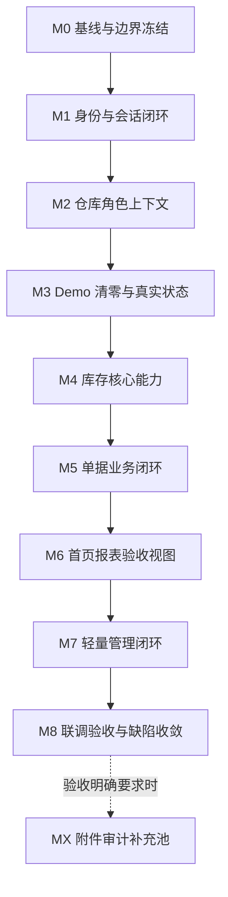

# RIMS APP 完善里程碑重设计

> **For agentic workers:** This roadmap targets an internally usable APP, not a release-ready product. Implement one milestone at a time, keep changes scoped to the Flutter MVVM architecture, use TDD for non-trivial behavior, and run verification before moving forward.

**Final Goal:** 将 RIMS Flutter 前端从“框架和 Demo 已完善”推进到“内部验收可用的业务 APP”。

**Definition of Done:** 内部测试人员可以使用真实后端账号登录，在真实仓库、真实权限、真实接口下完成库存、单据、首页、报表和轻量管理的核心业务闭环。

**Not Goal:** 不进入应用商店发布级别，不做签名打包、商店素材、隐私政策发布流程、生产监控、崩溃分析、推送通知、完整离线同步、生产级安全审计、运营后台全量替代。

**Architecture:** 继续使用 feature-first MVVM。页面只负责 UI 和用户动作转发；ViewModel 管理状态、校验、加载和错误；Repository 返回 `Result<T>`；DataSource 通过 `ApiClient` 访问后端；认证、角色、仓库上下文由 session 和 shell 统一维护。

**Tech Stack:** Flutter, Dart, Provider/ChangeNotifier, GoRouter, Dio, secure storage, shared preferences, flutter_test。

---

## 1. 终点重新定义

本路线图的终点不是“可发布”，而是“可内部验收”。

到达终点时，APP 应该满足：

- 账号来自后端或管理员创建；前端没有 Demo 账号、公开注册误导或本地伪登录。
- 登录、会话恢复、退出登录、token 失效回登录页稳定可测。
- 当前用户、角色、可见仓库、当前仓库全部来自后端。
- 首页、库存、单据、报表、我的、轻量管理都使用真实接口数据。
- 核心业务能闭环：查库存、建单、完成/确认/结转单据、库存变化、流水查询、首页刷新、报表查看。
- 管理员能完成内测必要配置：用户、密码、商品、仓库、仓库用户绑定、角色权限。
- 普通用户不能看到或执行管理员能力。
- 所有主流程都有加载、空态、错误、权限不足、提交中、提交成功状态。
- 自动化检查和本地后端联调冒烟通过。
- 文档清楚说明：当前是内部验收版 APP，不是发布版 APP。

明确不做：

- 应用商店上架、签名证书、安装包分发流程。
- 生产监控、告警、崩溃分析、埋点体系。
- 完整离线模式、同步冲突、离线重试队列。
- 摄像头扫码高级体验；本阶段只要求条码/关键字可输入、可查询、可用于业务。
- 后台管理系统全量替代；只做 APP 内测需要的轻量管理。

## 2. 当前状态判断

当前工程已经具备中型 Flutter 前端框架基础：

- `core`、`routes`、`features` 分层已建立。
- 路由、主题、资源、网络、存储、Result/Failure、事件总线已有基础。
- 登录、会话恢复、仓库切换、角色上下文已有首轮实现。
- Shell 已承载首页、库存、单据、报表、我的 5 个主 Tab。
- 库存、单据、首页、报表已接入真实 Repository/DataSource 结构。
- 管理功能已启动，用户、密码、商品、仓库、仓库用户绑定、角色权限已有首轮实现。

当前主要风险不是“页面不够多”，而是：

- Demo 展示、固定数据、假成功和开发说明残留需要持续清理。
- 后端真实账号、真实仓库、真实权限下的闭环联调还不充分。
- 管理动作、业务页刷新、权限边界、失败状态需要逐项验收。
- 需要稳定的本地冒烟脚本，避免每次修改只靠肉眼点页面。

## 3. 里程碑总览



推荐执行顺序：

1. M0 锁定目标、基线、环境和验收口径。
2. M1-M3 解决“不能再像 Demo”的问题。
3. M4-M6 解决“核心业务能真实跑完”的问题。
4. M7 解决“内测配置不依赖改数据库”的问题。
5. M8 做全链路联调、集中修补和验收记录。
6. MX 只在业务验收明确要求附件或审计时追加。

## 4. 里程碑设计

### M0: 基线与边界冻结

**目标:** 固定最终目标为“内部验收可用 APP”，建立可重复验证的当前基线。

**状态:** 已完成首轮目标收口，并在 `rims_frontend/README.md` 写入本地启动、`API_BASE_URL`、账号来源、无公开注册策略和冒烟验收步骤。后续每个阶段仍要重复 Demo 残留搜索和自动化检查。

**子阶段:**

- M0.1 重写路线图，移除发布级事项。
- M0.2 明确本地后端地址、前端启动方式、测试账号来源。
- M0.3 建立 Demo 残留搜索清单。
- M0.4 跑一次自动化基线，记录当前失败原因。
- M0.5 明确本阶段不做内容，放入补充池或发布后事项。

**交付物:**

- 本文档作为唯一主线。
- `rims_frontend/README.md` 的本地启动和验收说明。
- 一组固定验证命令。

**出阶段标准:**

- 团队确认终点不是发布版，而是内部验收版。
- 后续任务不再把商店发布、监控、离线同步混入主线。
- 当前自动化检查结果可复现。

**验证:**

```powershell
cd rims_frontend
flutter analyze --no-pub
flutter test --no-pub
cd ..
git diff --check
rg -n "DemoAuthRepository|DemoUser|登录 Demo|管理员 Demo|普通用户 Demo|admin123|user123|DM-|2024-05|Good morning, 张三|U10086|假数据|模拟数据|固定数据" rims_frontend/lib rims_frontend/test
```

### M1: 身份与会话闭环

**目标:** 用户只能通过真实后端身份进入 APP，登录、恢复、退出和失效处理稳定。

**状态:** 已完成首轮实现：登录页已移除公开注册入口和 Demo 快捷入口，并提示账号由管理员创建后分配。登录响应已兼容 `token/accessToken/access_token` 和 `user/userInfo/currentUser/profile` 等常见字段，当前用户模型已兼容 `userId/account/nickname` 与嵌套 `role`，避免真实后端字段名差异导致空 token、空姓名或空角色。登录和当前用户接口如果成功 envelope 中的 payload 不是对象，会按失败处理，不再让类型转换异常逃出 Result 边界。登录成功响应如果缺少有效 token 或可识别账号，会返回明确失败且不会保存 token、不会继续加载仓库；启动恢复拿到缺少账号的用户信息时会清理本地 token，避免前端产生不可用的假会话。网络错误映射已覆盖 RIMS 认证、权限、库存、状态等业务错误码；HTTP 401/403 兜底映射会保留后端 `traceId`，便于 token 失效和权限不足场景联调排障。

**子阶段:**

- M1.1 登录页移除 Demo 快捷入口、公开注册入口和本地账号提示。
- M1.2 登录失败展示后端错误，不在前端伪造成功。
- M1.3 登录成功后持久化 token 和当前用户基础信息。
- M1.4 启动时恢复会话，调用 `/users/me` 和 `/users/me/warehouses`。
- M1.5 退出登录清理 token、用户、仓库上下文。
- M1.6 401、token 失效、会话恢复失败时清理本地状态并回到登录页。
- M1.7 登录页说明账号来源：请使用管理员创建或后端提供的账号。

**验收场景:**

- 正确账号登录进入 Shell。
- 错误密码显示后端错误。
- 刷新或重启后恢复有效会话。
- 后端拒绝 token 后自动回登录页。
- 退出登录后不能通过浏览器返回进入业务页。

**出阶段标准:**

- `lib` 中不存在前端 Demo 账号或伪登录入口。
- 登录相关 ViewModel 覆盖成功、失败、提交中、防重复提交。
- 用户不会再因为没有公开注册入口而不知道账号来源。

### M2: 仓库角色上下文

**目标:** 所有仓库域请求都在当前仓库下运行，受控动作按真实角色显隐和拦截。

**状态:** 已完成首轮实现：切换仓库后 Shell 发布全局刷新事件；全局刷新已改为后台会话刷新入口，刷新接口短暂失败时会保留当前登录态和业务上下文，认证失败仍按过期会话清空；管理员角色判断已统一使用归一化后的 `AppUser.isAdmin`。仓库切换控件已按角色收口，管理员多仓时可切换，普通用户即使后端返回多个仓库也只展示当前仓库名称，不提供切换入口。`/users/me/warehouses` 已兼容 `warehouses/list/items/records/rows` 等常见列表包裹，仓库 id 可兼容数字或数字字符串，仓库编码可兼容字符串或数字，默认仓库标记可兼容布尔、数字和常见布尔字符串，避免真实后端字段类型差异导致登录后仓库上下文为空；如果成功 envelope 缺少明确列表 payload，或列表项不是对象，会按失败处理，不再静默生成空仓库列表。切换当前仓库已兼容后端成功但不返回仓库对象 payload 的响应：前端会确认请求成功并保留用户选择的仓库作为当前仓库；如果后端返回仓库对象，仍优先使用后端对象并保留当前选择态。

**子阶段:**

- M2.1 `ApiClient` 对仓库域请求携带 `X-Warehouse-ID`。
- M2.2 “我的”页展示当前用户、角色、当前仓库、可切换仓库。
- M2.3 仓库切换调用后端并保持失败回滚。
- M2.4 切换成功后刷新首页、库存、单据、报表。
- M2.5 管理入口、库存设置、报表金额字段、危险动作统一按角色判断。
- M2.6 普通用户误触受控动作时显示权限提示，不静默失败。
- M2.7 角色判断统一归一化，避免 `Admin`、` ADMIN ` 等后端差异导致误判。

**验收场景:**

- 用户有多个仓库时可以切换。
- 切换成功后新请求使用新仓库。
- 切换失败时 UI 保持旧仓库并显示错误。
- 普通用户看不到管理入口和管理员动作。
- 普通用户接口被后端拒绝时页面显示权限不足。

**出阶段标准:**

- 仓库上下文不由页面各自维护。
- 所有主 Tab 都能响应全局刷新。
- 权限判断复用统一模型，不在页面内散落字符串比较。

### M3: Demo 清零与真实状态

**目标:** 主流程不再依赖 Demo 展示，所有页面呈现真实数据、真实状态、真实失败。

**状态:** 已开始清理：首页问候语改为基于真实用户姓名；个人中心移除无后端支撑状态；开发说明型面板已删除；首页、库存、单据、报表错误态已提供重试入口。

**子阶段:**

- M3.1 清除前端写死账号、用户名、仓库名、单号、商品、KPI、日期。
- M3.2 清除“本地创建成功但后端未成功”的乐观假成功。
- M3.3 保留测试 fake/mock，但只允许出现在 `test/` 或明确测试替身中。
- M3.4 每个主页面补齐加载、空态、错误、重试。
- M3.5 表单补齐提交中、防重复提交、后端错误展示。
- M3.6 页面文案从“展示型 Demo”调整为“业务操作型 APP”。
- M3.7 删除开发说明卡片、接口架构展示、静态模块展示等非用户任务内容。

**验收场景:**

- 空仓库显示空态，不显示示例数据。
- 后端失败显示错误，不产生本地假记录。
- 页面重试会重新请求对应接口。
- 表单提交期间按钮不可重复触发。
- 错误账号、空列表、无权限、网络失败都有可理解提示。

**出阶段标准:**

- Demo 残留搜索没有命中主业务代码。
- `test/` 中的 fake/mock 命名清晰，不会被误接入生产代码。
- 主页面不再出现开发说明型内容。

### M4: 库存核心能力

**目标:** 库存模块能承担真实查询、预警、详情、流水和管理员基础设置。

**状态:** 库存列表、关键词搜索、条码查询、详情页、管理员库存设置已有首轮实现；库存页已补齐“低库存”和“停用”状态筛选，能按后端状态或低可用库存进行本地筛选，且停用商品不再计入低库存指标或低库存列表。库存列表、低库存预警和非标库存列表请求已显式携带 `page` + `pageSize`，减少真实后端默认分页差异导致库存数据不完整。库存列表刷新失败时会保留已经加载的库存项并显示错误，避免真实接口短暂不可用时把可验收数据清空；首次加载失败仍显示空列表和错误。库存详情已复用真实库存流水接口展示当前商品最近流水，流水加载失败只影响详情内流水区块，不会清空库存列表或设置能力。条码查询和库存设置更新如果拿到成功 envelope 但缺少商品或库存对象 payload，会按失败处理，不再生成空商品或空库存记录。库存列表、低库存预警和非标库存列表如果成功 envelope 缺少明确列表 payload，或列表项不是对象，会按失败处理，不再静默渲染为空列表。完整库存变化和流水一致性仍需真实后端逐项验收。

**子阶段:**

- M4.1 库存列表来自真实接口，支持分页或后端当前能力范围内的完整加载。
- M4.2 支持关键字、条码、商品名、SKU 搜索。
- M4.3 支持低库存、停用、异常库存等后端可提供筛选。
- M4.4 库存详情展示商品、仓库、库存数量、预警阈值、状态。
- M4.5 库存流水展示单据动作产生的变化。
- M4.6 管理员可调整预警阈值和库存状态。
- M4.7 普通用户只能查看，不可执行管理员设置。
- M4.8 库存数量不能在库存页直接手改，只能由单据、盘点或后端允许的业务流程改变。

**验收场景:**

- 搜索一个存在商品，列表和详情一致。
- 搜索不存在商品，显示空态。
- 低库存筛选只显示低库存商品。
- 管理员修改预警阈值后低库存状态刷新。
- 普通用户无法看到或提交库存设置。
- 完成一张影响库存的单据后，库存数量和流水变化可验证。

**出阶段标准:**

- 库存列表、详情、流水没有固定样例数据。
- 库存相关错误都可局部重试。
- 库存数量变更路径符合业务约束。

### M5: 单据业务闭环

**目标:** 采购入库、销售出库、退货入库、调拨、盘点、非标转换等核心单据能创建、查看、推进生命周期，并影响库存。

**状态:** 单据创建成功、完成单据、确认盘点差异、结转盘点差异已在成功后发布全局刷新事件。最近单据已支持基于已加载真实单据的类型、状态、关键字和后端日期字段筛选；类型筛选会把 `docType` 传给后端 `/documents` 列表，避免只在最近 10 条本地数据里筛选导致漏掉更早单据；最近单据请求已对齐后端统一分页口径，使用 `page` + `pageSize` 而不是旧 `size` 参数；无日期字段的单据在启用日期范围时不展示；日期筛选输入会校验为 `YYYY-MM-DD`，非法输入会保留上一组有效筛选并显示格式错误，避免静默清空日期范围。后端只返回数字状态码时，普通单据 `1/2` 会映射为 `草稿/已完成`，盘点单 `1/2/3` 会映射为 `盘点中/差异已确认/已结转`，避免真实接口缺少状态标签时生命周期按钮失效。单据页和首页最近单据的状态标签已复用统一语义映射，`草稿/盘点中` 显示为待处理，`差异已确认/待结转` 显示为待结转，`已完成/已结转` 显示为成功。调拨和非标转标准已按角色收口为管理员专属入口：普通用户首页快捷动作和单据页动作列表会隐藏对应流程，ViewModel 也会拒绝选择管理员专属单据动作；如果普通用户因后端列表或缓存看到待提交的管理员专属单据，完成动作也会被拦截并提示无权限。单据模型在顶层缺少商品摘要时，会从第一条 `lines/items/details` 明细回填商品名和数量，避免真实接口只返回明细数组时最近单据或详情显示为空商品。创建接口成功但仅返回单据头时，最近单据会用本次已提交的真实商品和数量补齐展示，避免创建后立刻出现空商品记录；销售出库创建会从库存商品候选透传后端 `retailPrice` 到单据明细，库存响应无价格时不在前端伪造价格；如果创建接口返回成功 envelope 但缺少单据对象 payload，会按失败处理，不再生成 id=0 的本地假单据。最近单据和库存流水接口如果成功 envelope 缺少明确列表 payload，或列表项不是对象，会按失败处理，不再静默渲染为空列表；最近单据和库存流水在已有数据后刷新失败时会保留上一轮已加载数据并展示错误，避免真实接口短暂不可用时把单据页清空。最近单据可打开详情面板，展示单据头信息、商品明细、状态和当前可执行生命周期动作；详情动作失败时会停留在详情上下文并展示后端错误，例如销售出库库存不足。创建单据和生命周期动作已补齐提交中防重入保护，避免重复创建或重复完成同一单据；商品搜索只接收最后一次请求结果，避免旧请求晚返回覆盖新候选。选中商品候选后表单会显示真实商品名，创建成功后商品和数量输入会清空，调拨目标选择已有创建后清空回归覆盖，避免搜索词或旧输入残留误导继续操作。退货入库切换时会专门请求 `docType=2` 的销售单来源，并只展示已完成/已结算单据；来源加载中和失败会在表单内显示，不再只依赖最近 10 条混合单据列表。退货来源单据和非标库存来源在刷新后若不再可选，会自动清空并阻止继续提交过期 `refDocId` 或 `nonStdInventoryId`。完整库存变化仍需真实后端逐项验收。

**子阶段:**

- M5.1 单据列表支持类型、状态、日期、关键字筛选。
- M5.2 单据详情展示头信息、明细、状态、可执行动作。
- M5.3 采购入库单可创建并完成。
- M5.4 销售出库单可创建并完成，库存不足显示后端错误。
- M5.5 退货入库单可创建并完成。
- M5.6 调拨单可创建并完成，源仓和目标仓结果可验证。
- M5.7 盘点单可创建、确认差异、结转差异。
- M5.8 非标转换单可创建并完成。
- M5.9 生命周期动作成功后刷新库存、首页、报表、最近单据。
- M5.10 生命周期动作失败时保持原状态并展示后端错误。

**验收场景:**

- 采购完成后库存增加，流水出现。
- 销售完成后库存减少，库存不足时不能完成。
- 调拨完成后源仓减少、目标仓增加。
- 盘点确认和结转后库存结果符合后端返回。
- 非标转换使用真实非标库存。
- 完成单据后首页最近单据刷新。

**出阶段标准:**

- 单据创建不出现本地假成功。
- 每类核心单据至少有一条真实后端冒烟记录。
- 单据动作按钮按状态和角色显示。

### M6: 首页报表验收视图

**目标:** 首页和报表能支撑内部业务验收，不追求发布级 BI 体验。

**状态:** 首页快捷入口已进入对应单据流程；最近单据失败已收敛为区块级错误；库存预警和库存概览接口失败时可退回库存列表计算；首页非标库存提醒已优先来自真实非标库存接口，接口失败时回退库存列表标签推断；首页在已有数据后刷新失败时会保留上一轮库存指标、预警和最近单据并展示错误，避免真实接口短暂不可用时把验收首页清空；报表页已按角色隐藏普通用户金额类内容并跳过敏感接口，普通用户会跳过销售汇总、趋势和排行接口，避免被财务类授权失败拖垮库存报表；库存概览、周转或滞销等库存类报表接口失败时会保留已成功加载的销售统计、趋势和排行，并在库存报表区域展示区块错误，避免一个库存子接口拖垮整页报表；报表趋势、排行、周转、滞销等列表接口已兼容常见分页 `rows` 字段，避免真实后端分页响应被解析为空；销售排行请求已按 API 文档显式携带 `metric` + `limit`，默认获取金额排行 Top 5；销售汇总接口成功 envelope 缺少统计对象 payload 时会按失败处理，不再渲染 0 收入、0 单量的假统计；列表型报表接口成功 envelope 缺少列表 payload，或列表项不是对象时会按失败处理，不再静默渲染空图表；库存概览接口成功 envelope 缺少 payload 时会按失败处理，仍保留明确空列表和 summary 对象解析；窄屏指标卡溢出已修补。

**子阶段:**

- M6.1 首页仓库摘要来自真实当前仓库和后端统计。
- M6.2 首页库存概览、低库存、最近单据、非标提醒来自真实接口或可解释 fallback。
- M6.3 首页每个区块独立加载和失败，局部失败不拖垮整页。
- M6.4 首页快捷入口只指向真实可用流程。
- M6.5 报表支持销售汇总、趋势、排行、库存概览、周转、滞销。
- M6.6 日期区间按当前日期计算，不使用固定 2024 日期。
- M6.7 普通用户隐藏无权限或敏感财务字段，并跳过对应接口。
- M6.8 报表无数据时显示空态，不画假图。

**验收场景:**

- 切换仓库后首页和报表刷新。
- 完成单据后首页最近单据、库存提醒、报表摘要能变化。
- 普通用户看不到金额类报表。
- 管理员能看到后端允许的金额类报表。
- 单个首页区块失败时其他区块仍可用。
- 报表接口失败时显示错误和重试入口。

**出阶段标准:**

- 首页没有固定 KPI。
- 报表没有固定日期和固定图表数据。
- 首页和报表可用于验收核心业务变化。

### M7: 轻量管理闭环

**目标:** 管理员能在 APP 内完成内测所需配置，不依赖直接改数据库。

**状态:** 用户、密码、商品、仓库、仓库用户绑定、角色权限已有首轮实现，但需要真实后端联调确认。管理员创建或更新用户、商品、仓库时，如果后端返回成功 envelope 但缺少对应对象 payload，或对象缺少有效业务身份字段，前端会按失败处理并展示错误，不再插入 id=0 或空名称的本地假记录。用户、商品、仓库管理列表请求已显式携带 `page` + `pageSize`，减少真实后端默认分页差异导致的内测配置缺项；管理列表接口如果成功 envelope 缺少明确列表 payload，会按失败处理，不再把用户、商品、仓库、仓库用户、角色或权限误渲染为空列表；列表项不是对象时也会按失败处理，不再静默丢弃坏项；角色和权限列表项缺少有效 id、编码或名称时也会按失败处理，避免权限配置页出现空角色或空权限；角色返回的权限 ID 列表如果包含不可解析项，会按失败处理，不再静默漏掉权限绑定。创建和编辑用户的角色 ID 已在提交前校验为正整数，非法输入会阻止请求并提示格式错误；创建和编辑商品的价格输入已在提交前校验为数字，非法输入不会被静默当作空价格提交；仓库用户绑定输入也会在提交前校验为正整数 ID，混入非法 token 时会阻止请求并提示格式错误，避免把部分合法 ID 误提交到后端。管理员重置用户密码已补齐确认弹窗，避免误点提交导致内测账号密码被改；仓库用户解绑已补齐确认弹窗，避免管理员误点导致内测账号突然失去仓库访问能力；角色权限保存也已补齐确认弹窗，避免误改角色能力边界影响一批内测用户；创建用户、编辑用户、重置密码、删除用户、创建商品、编辑商品、删除商品、创建仓库、编辑仓库、绑定仓库用户、解绑仓库用户、保存角色权限和当前用户改密码已在 ViewModel 层补齐提交中防重入保护，避免按钮连点造成重复配置、重复绑定或重复危险请求；用户、商品、仓库、仓库绑定用户、角色和权限列表在已有数据后刷新失败时会保留上一轮已加载配置并展示错误，避免真实接口短暂不可用时把内测配置页清空；如果后端拒绝角色权限保存，确认框会关闭并保留权限配置框展示后端错误，便于管理员修正或取消。

**子阶段:**

- M7.1 管理入口仅管理员可见。
- M7.2 用户管理：列表、创建、编辑、删除。
- M7.3 密码管理：当前用户改密码、管理员重置用户密码。
- M7.4 商品管理：列表、创建、编辑、删除，并能被单据选择使用。
- M7.5 仓库管理：列表、创建、编辑、删除。
- M7.6 仓库用户绑定：绑定、解绑、查看。
- M7.7 角色权限：查看角色、查看权限、更新角色权限绑定。
- M7.8 管理动作成功后发布全局刷新，业务页和 session 状态保持一致。
- M7.9 后端拒绝删除、冲突、权限不足时显示明确原因。

**验收场景:**

- 管理员创建测试用户，并用该用户登录。
- 管理员重置用户密码后，新密码可登录。
- 管理员创建商品后，单据创建可以选择该商品。
- 管理员创建仓库后，可以绑定用户并切换。
- 调整角色权限后，普通用户和管理员能力差异正确。
- 普通用户完全看不到管理入口。

**出阶段标准:**

- 内测准备不需要手改数据库。
- 管理功能不承诺替代完整后台系统。
- 管理动作影响业务页时有刷新或清晰提示。

### M8: 联调验收与缺陷收敛

**目标:** 证明 APP 已达到内部验收可用，并把联调发现的问题集中修掉。

**状态:** 已新增本地固定冒烟入口 `scripts/rims_smoke.ps1`，可列出步骤、执行离线依赖检查、静态检查、全量测试、Demo 残留扫描和 `git diff --check`，并用 `.tool-state-smoke` 隔离 Flutter 工具状态；脚本会显式保留进入脚本时的稳定 Pub 缓存，避免离线依赖检查被临时工具目录清理影响。当前默认 smoke 已在本机跑通：`flutter pub get --offline`、`flutter analyze --no-pub`、`flutter test --no-pub`、Demo 残留扫描和 `git diff --check` 均通过。

**范围:**

- 启动本地后端和 Flutter 前端。
- 使用真实后端种子账号或管理员创建账号。
- 按一条完整业务链路跑通账号、仓库、库存、单据、流水、首页、报表、管理。
- 记录接口字段不一致、权限不一致、状态不一致、刷新不一致。
- 只修补验收链路问题，不在 M8 扩新功能。

**冒烟脚本:**

1. 启动后端，确认 API 地址为 `http://127.0.0.1:8080/api/v1`。
2. 启动 Flutter Web 或桌面端，确认前端 base URL 指向后端。
3. 使用后端账号登录。
4. 查看当前用户、角色、当前仓库。
5. 切换仓库并确认业务页刷新。
6. 搜索库存商品并打开详情。
7. 管理员调整库存预警阈值或状态。
8. 创建采购入库单并完成。
9. 确认库存增加、流水出现、首页最近单据刷新。
10. 创建销售出库单并完成。
11. 确认库存减少；库存不足时显示后端错误。
12. 创建退货入库、调拨、盘点、非标转换并完成关键动作。
13. 查看销售报表和库存报表，切换日期范围。
14. 管理员创建用户、重置密码、创建商品、创建仓库、绑定用户、配置角色权限。
15. 普通用户登录，确认管理入口不可见。
16. 退出登录，确认受保护页面回到登录页。

**缺陷分级:**

- P0: 无法登录、主流程崩溃、库存或单据结果错误。
- P1: 角色权限错误、仓库上下文错误、核心动作失败无提示。
- P2: 局部状态不刷新、空态不清晰、错误文案不准确。
- P3: 视觉细节、文案优化、非核心体验问题。

**出阶段标准:**

- 冒烟脚本全部通过，或失败项都有明确修复记录。
- P0/P1 清零。
- P2 有归档记录，不影响内部验收。
- `flutter analyze --no-pub` 通过。
- `flutter test --no-pub` 通过。
- `git diff --check` 通过。
- Demo 残留搜索没有命中主业务代码。
- 文档明确写清：当前是内部验收版，不是发布版。

## 5. 补充池

以下内容不进入主线，只有在内部验收明确要求时才追加：

- 附件上传、附件列表、附件下载、附件删除。
- 单据详情关联附件。
- 审计日志列表和详情。
- 摄像头扫码体验优化。
- 更复杂的 BI 图表和导出。
- 离线缓存和离线提交。

## 6. 执行切片

从当前项目状态继续推进，建议按以下切片执行：

- Slice 1: M0 + M1，收口账号入口和会话体验。
- Slice 2: M2 + M3，打通上下文刷新并清理 Demo 残留。
- Slice 3: M4，完成库存核心能力真实验收。
- Slice 4: M5，跑通单据业务闭环。
- Slice 5: M6，完成首页和报表验收视图。
- Slice 6: M7，完成轻量管理联调和补洞。
- Slice 7: M8，端到端冒烟、集中修补、冻结内部验收范围。

每个切片至少执行：

```powershell
cd rims_frontend
flutter analyze --no-pub
flutter test --no-pub
cd ..
git diff --check
rg -n "DemoAuthRepository|DemoUser|登录 Demo|管理员 Demo|普通用户 Demo|admin123|user123|DM-|2024-05|Good morning, 张三|U10086|假数据|模拟数据|固定数据" rims_frontend/lib rims_frontend/test
```

## 7. 执行原则

- 不再新增前端本地 Demo 数据源。
- 不为了展示效果伪造后端成功。
- 不在库存页面直接改库存数量。
- 不把普通用户没有权限看到的数据用占位值补出来。
- 不把发布级事项混入本路线图。
- 管理功能只覆盖内测所需，不做完整后台替代。
- 每个新端点先补 DataSource/Repository/ViewModel 测试，再接 UI。
- 每个业务动作都要有加载、成功、错误、权限不足和危险操作确认。
- 每个阶段完成后更新状态，避免路线图再次落后于代码。
