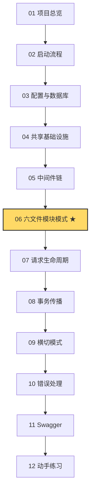

# RIMS Go 后端 · 新手教程

> 本教程面向 **Go 初学者**，以 `rims-goProgect/`（RIMS 零售库存管理系统后端）作为真实项目，逐层剖析企业级 Go Web 服务的写法与工程约定。

## 这份教程能帮你学到什么

- **Go 语言层面**：结构体嵌入、接口与结构性类型、`context.Context` 的用法、错误包装（`errors.As` / `errors.Is`）、闭包、方法集、反射式 tag。
- **Web 后端层面**：Gin 路由与中间件链、GORM ORM、JWT 鉴权、统一响应外壳、分页、事务传播、Swagger API 文档生成。
- **工程层面**：分层架构（Model / DTO / Repo / Service / Handler / Routes）、依赖注入、模块解耦、消费者定义接口、可插拔基础设施。

学完后，你应该能够：

1. 独立读懂本项目任何一个模块的代码
2. 模仿现有模块新增一个自己的业务模块
3. 把本项目中的模式迁移到你自己的 Go 项目

## 学习路线图

**★ 标记的是核心章节**，其它章节都在为它做铺垫或从它延伸。如果你时间有限，读完 01~02 后直接跳到 06，再回头补其它章节也可以。

## 章节一览

| # | 章节 | 主要内容 |
|---|---|---|
| 01 | [项目总览](./01-overview.md) | 业务背景、技术栈、目录结构 |
| 02 | [启动流程](./02-bootstrap.md) | `main()` → `app.Run()` 的四步启动 |
| 03 | [配置与数据库](./03-config-db.md) | Viper 读 `.env`、GORM 连接 PostgreSQL |
| 04 | [共享基础设施](./04-shared-types.md) | `types/`、`db/`、`auth/` 三大公共包 |
| 05 | [中间件链](./05-middleware.md) | Recovery / RequestID / Logger / CORS / JWTAuth / WarehouseScope |
| 06 | [六文件模块模式 ★](./06-module-pattern.md) | 以 `user` 模块为样板，逐文件拆解 |
| 07 | [请求生命周期](./07-request-lifecycle.md) | 一次登录请求从客户端到数据库 |
| 08 | [事务传播](./08-transactions.md) | `RunInTx` + `FromCtx` + 单据完成原子写 |
| 09 | [横切模式](./09-cross-cutting.md) | 消费者定义接口、可插拔存储、仓库作用域 |
| 10 | [错误处理](./10-error-handling.md) | `AppError` 从 service 一路映射到 HTTP |
| 11 | [Swagger 文档](./11-swagger.md) | 注解语法与泛型外壳 `{data=...}` |
| 12 | [动手练习](./12-exercises.md) | L1 读懂 + L2 小改动 |

## 阅读约定

- **代码链接**：教程中所有源码引用都使用相对路径链接，例如 [app.go:29-70](../../rims-goProgect/internal/app/app.go#L29-L70)。在 VSCode / GitHub 上可直接跳转。
- **中文释义**：Go 关键字与三方库名保持英文，概念释义使用中文。
- **代码片段**：为节省篇幅会删去无关行，用 `// ...` 占位。要看完整实现请跳到源码链接。
- **运行环境**：所有 `go` / `docker` 命令都假设你在 **WSL** 中执行，项目目录 `/mnt/e/My Work/RIMS`，详见项目根 [CLAUDE.md](../../CLAUDE.md)。

## 前置知识

读本教程**不要求**你会 Gin / GORM，但建议先熟悉：

- Go 基础语法：变量、函数、结构体、切片、map
- 能跑通一个 "Hello World" HTTP 服务（任何 Go Web 框架均可）
- 能在本地启动 PostgreSQL 或 Docker（可选，仅在做练习时需要）

如果以上还有不熟的，推荐先过一遍 [A Tour of Go](https://go.dev/tour/)。

---

**开始阅读** → [01-项目总览](./01-overview.md)
