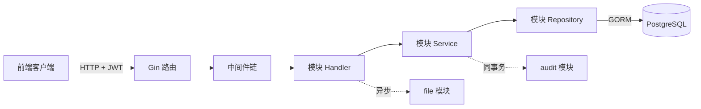

# 第 1 章 · 项目总览

> 本章目标：
> 1. 搞清楚 RIMS 是做什么的
> 2. 认识技术栈里每个库的角色
> 3. 记住 Go 项目的经典目录约定（`cmd/` / `internal/`）

## 1.1 业务是什么

**RIMS = Retail Inventory Management System**（零售库存管理系统）。

你可以把它想成便利店老板的后台：

- **商品**（Product）：一个 SKU 的基础信息，比如可口可乐 500ml。
- **仓库**（Warehouse）：实体门店或仓储点。一个用户绑定一个仓库（管理员可绑多个）。
- **库存**（Inventory）：商品 × 仓库的二维关系——哪家店还有几瓶可乐。
- **单据**（Document）：一切库存变动都要走单据——入库、销售、退货、调拨、盘点、非标转标。
- **库存流水**（InventoryTransaction）：每张单据完成后，系统会写流水，保证"现存库存 = 历史流水累加"可追溯。
- **审计日志**（AuditLog）：谁在什么时间对什么资源做了什么操作——监管合规需要。

本项目是它的**后端服务**，为前端提供 REST API。

## 1.2 技术栈

| 库 / 技术 | 作用 | 官方文档 |
|---|---|---|
| **Go 1.25** | 语言与标准库 | https://go.dev/doc/ |
| **Gin** | HTTP 框架（路由、中间件、参数绑定） | https://gin-gonic.com/docs/ |
| **GORM** | ORM（对象关系映射），把 Go struct 读写到 PostgreSQL | https://gorm.io/docs/ |
| **PostgreSQL 16** | 数据库（Docker 里跑） | https://www.postgresql.org/docs/16/ |
| **golang-jwt/jwt/v5** | JWT 令牌签发与解析 | https://github.com/golang-jwt/jwt |
| **Viper** | 配置管理（读 `.env` 与环境变量） | https://github.com/spf13/viper |
| **swaggo/swag** | 根据注释生成 Swagger/OpenAPI 文档 | https://github.com/swaggo/swag |
| **bcrypt** | 密码哈希（`golang.org/x/crypto/bcrypt`） | https://pkg.go.dev/golang.org/x/crypto/bcrypt |

**记忆法**：Gin 是"接客"的、GORM 是"管库"的、Viper 是"看账单"的、JWT 是"发门票"的、Swag 是"写菜单"的。

## 1.3 目录结构

```
rims-goProgect/
├── cmd/
│   └── server/
│       └── main.go          # 程序入口（第 2 章）
├── internal/                # Go 约定：仅本模块可见
│   ├── app/
│   │   ├── app.go           # Run() 启动流程
│   │   └── router.go        # 依赖装配 + 路由注册（合成根）
│   ├── auth/
│   │   └── jwt.go           # JWT 服务
│   ├── config/
│   │   └── config.go        # Viper 配置加载
│   ├── db/
│   │   ├── db.go            # GORM 连接
│   │   └── tx.go            # 事务传播（RunInTx / FromCtx）
│   ├── middleware/          # Gin 中间件（第 5 章）
│   │   ├── cors.go
│   │   ├── jwt.go
│   │   ├── logger.go
│   │   ├── requestid.go
│   │   └── warehouse.go
│   ├── modules/             # 业务模块（第 6 章）
│   │   ├── user/            # 用户 / 角色 / 权限
│   │   ├── warehouse/       # 仓库管理
│   │   ├── product/         # 商品与库存
│   │   ├── document/        # 单据与流水
│   │   ├── report/          # 报表
│   │   ├── file/            # 文件上传
│   │   └── audit/           # 审计日志
│   └── types/               # 跨模块共享类型（第 4 章）
│       ├── base_model.go
│       ├── context.go
│       ├── errors.go
│       ├── pagination.go
│       └── response.go
├── migrations/              # SQL 迁移脚本
├── deploy/
│   └── docker-compose.yml   # PostgreSQL 容器定义
├── docs/                    # swag 自动生成的 OpenAPI 文档
├── go.mod
├── go.sum
└── .env                     # 数据库密码 / JWT 密钥（早期开发期提交到仓库）
```

## 1.4 `cmd/` 与 `internal/` —— Go 项目的两条潜规则

这是**所有成熟 Go 项目**都会遵守的两条约定，不是 RIMS 特有：

### `cmd/<name>/main.go` —— 可执行程序入口

Go 一个仓库可以产出多个二进制。每个二进制的 `package main` 就放在 `cmd/<name>/` 下。RIMS 目前只有一个 `cmd/server/`，未来如果加一个离线任务，就会是 `cmd/job/` 之类。

### `internal/` —— Go 编译器强制的访问控制

`internal/` 是 Go **语言级别**的保留目录：**该目录下的包只能被其直属的父目录（及其子目录）下的代码导入**。换句话说：

- `rims-go/internal/auth` 可以被 `rims-go/cmd/server` 导入 ✅
- 外部项目 `github.com/other/proj` 试图 import `rims-go/internal/auth`，**编译报错** ❌

这就是 Go 做到"私有包"的方式。所以当你看到 `internal/` 时，意思是：**这些包是本项目的实现细节，外面不许碰。**

## 1.5 运行环境一瞥

> 详细命令见 [CLAUDE.md](../../CLAUDE.md) 与第 2~3 章。

- 所有 Go 命令在 **WSL** 里跑（Ubuntu 22.04）
- PostgreSQL 跑在 Docker 里，由 `deploy/docker-compose.yml` 启动
- Go 服务通过 `127.0.0.1:5432` 连数据库
- 项目在 WSL 中的路径是 `/mnt/e/My Work/RIMS`

**为什么不能在 Windows 下直接 `go run`？** 因为 Docker 容器在 WSL 的网络命名空间里，Windows 的 Go 进程连不到容器。

## 1.6 一张"上帝视角"图



后面 12 章会把这张图里的每个方块都拆给你看。

---

下一章 → [02-启动流程](./02-bootstrap.md)
