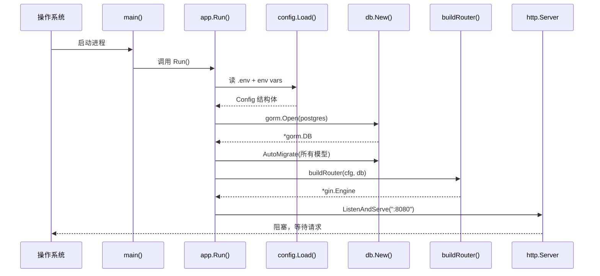

# 第 2 章 · 启动流程

> 本章目标：
> 1. 看懂 `main()` 里两行代码在干什么
> 2. 理解 `app.Run()` 的四步启动流程
> 3. 认识 Go 里的错误包装（`fmt.Errorf("...: %w", err)`）

## 2.1 入口只有两行

打开 [cmd/server/main.go](../../rims-goProgect/cmd/server/main.go)：

```go
package main

import (
    "log"
    "rims-go/internal/app"
)

func main() {
    if err := app.Run(); err != nil {
        log.Fatalf("server exited with error: %v", err)
    }
}
```

**逐行解释**：

1. `package main` — Go 规定：**要编译成可执行程序，必须叫 `main` 包**。
2. `import "rims-go/internal/app"` — 导入本项目自己的 `app` 包。`rims-go` 是 `go.mod` 里声明的模块名（打开 [go.mod](../../rims-goProgect/go.mod) 第一行可看到 `module rims-go`）。
3. `func main()` — 所有 Go 程序从 `main.main()` 开始执行。
4. `app.Run()` 返回 `error`。如果启动过程中任何一步失败，就打印错误并 `log.Fatalf` 让进程以非零退出码终止。

**为什么不把启动逻辑直接写在 `main()` 里？**

因为 `main()` 不能被测试（`package main` 不能被其他包导入）。把真正的逻辑挪到 `internal/app` 包里，测试代码就能 `import` 它。`main()` 只是个壳。

这是 Go 项目的一个小惯例：**`main` 做最少的事**。

## 2.2 `app.Run()` 的四步

打开 [internal/app/app.go](../../rims-goProgect/internal/app/app.go)，精简后长这样：

```go
func Run() error {
    // 步骤 1：加载配置
    cfg, err := config.Load()
    if err != nil {
        return fmt.Errorf("load config: %w", err)
    }

    // 步骤 2：连数据库
    gormDB, err := db.New(cfg)
    if err != nil {
        return fmt.Errorf("init db: %w", err)
    }

    // 步骤 3：AutoMigrate（可选）
    if cfg.DBAutoMigrate {
        if err := gormDB.AutoMigrate( /* 所有模型 */ ); err != nil {
            return fmt.Errorf("auto migrate: %w", err)
        }
    }

    // 步骤 4：构建 HTTP server 并监听
    server := &http.Server{
        Addr:         ":" + cfg.AppPort,
        Handler:      buildRouter(cfg, gormDB),
        ReadTimeout:  time.Duration(cfg.ReadTimeout) * time.Second,
        WriteTimeout: time.Duration(cfg.WriteTimeout) * time.Second,
    }
    return server.ListenAndServe()
}
```

### 步骤 1：加载配置

`config.Load()` 用 Viper 读 `.env` + 环境变量，返回一个 `Config` 结构体（详见 [第 3 章](./03-config-db.md)）。

### 步骤 2：连数据库

`db.New(cfg)` 用 DSN（Data Source Name）调 `gorm.Open(postgres.Open(dsn), ...)`，返回 `*gorm.DB`。

### 步骤 3：AutoMigrate（按配置开关）

```go
gormDB.AutoMigrate(
    &user.Role{},
    &user.Permission{},
    &user.User{},
    &warehouse.Warehouse{},
    // ... 共 13 个模型
)
```

GORM 的 `AutoMigrate` 会**按 struct 字段自动建表 / 补列**（但不会删列、不会改字段类型——生产环境依赖 `migrations/*.sql`）。开发阶段开着方便，生产环境通过 `DB_AUTO_MIGRATE=false` 关掉。

### 步骤 4：启 HTTP 服务

`http.Server` 是 Go 标准库的 HTTP 服务器。`Handler` 字段接受任何实现了 `http.Handler` 接口的对象——`gin.Engine` 正好实现了。

`buildRouter(cfg, gormDB)` 是"装配中心"——它创建所有 repo、service、handler，注册所有路由。这块内容大到需要单独讲（[第 5 章](./05-middleware.md) 和 [第 6 章](./06-module-pattern.md)）。

## 2.3 时序图



## 2.4 Go 概念 · 错误包装 `%w`

你看到的：

```go
return fmt.Errorf("load config: %w", err)
```

这里的 `%w`（注意不是 `%v` 或 `%s`）是 Go 1.13 引入的**错误包装**。它做两件事：

1. 生成一个新的 error，消息是 `"load config: 原错误信息"`
2. 新 error 保留了对原 `err` 的引用，可以被 `errors.Is` / `errors.Unwrap` 递归展开

对比：

| 语法 | 效果 | 能否 `errors.Is/As` 回溯 |
|---|---|---|
| `fmt.Errorf("xxx: %v", err)` | 只把 err 格式化成字符串，原 err 丢了 | ❌ |
| `fmt.Errorf("xxx: %w", err)` | 包装 err，可用 `errors.Unwrap` 取出 | ✅ |

**结论**：在调用链的每一层加上下文信息时，用 `%w`。你就能在最外层日志里看到完整的错误链：

```
server exited with error: init db: connect postgres: failed to connect to `host=127.0.0.1 user=app...`
```

## 2.5 Go 概念 · `log.Fatalf` vs `panic`

```go
log.Fatalf("server exited with error: %v", err)
```

`log.Fatalf` = `log.Printf` + `os.Exit(1)`。**不会执行 `defer`**，**不会打印堆栈**。适合"启动失败、干净退出"。

相比之下 `panic(err)` 会触发 `defer` 并打印 goroutine 堆栈——调试时更有用，但对用户来说信息过于原始。

项目约定：**只在 `main()` 顶层用 `log.Fatal`**，其他地方都 `return error` 往上传。

## 2.6 动手试试

```bash
# WSL 里跑
cd /mnt/e/My\ Work/RIMS/rims-goProgect
go run ./cmd/server
```

期待看到：

```
2026/xx/xx xx:xx:xx [GIN-debug] Listening and serving HTTP on :8080
```

然后 `curl http://127.0.0.1:8080/healthz` 应该返回 `{"status":"ok"}`。

**如果失败**：

- 报 `DB_PASSWORD is required` → 先看下一章配置；
- 报 `connect postgres: dial tcp ...: connection refused` → Docker Postgres 没启，跑 `docker compose --project-directory . -f deploy/docker-compose.yml up -d`；
- 报 `no go.mod in current directory` → 你没 `cd` 到 `rims-goProgect/` 目录。

---

上一章 ← [01-项目总览](./01-overview.md) | 下一章 → [03-配置与数据库](./03-config-db.md)
