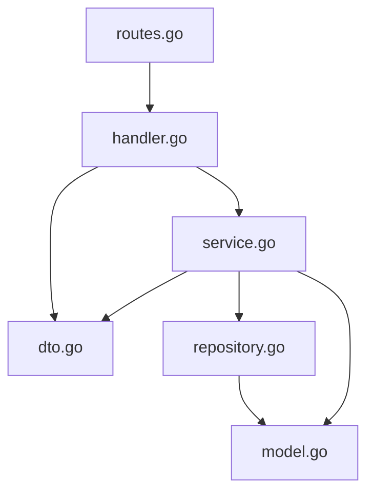
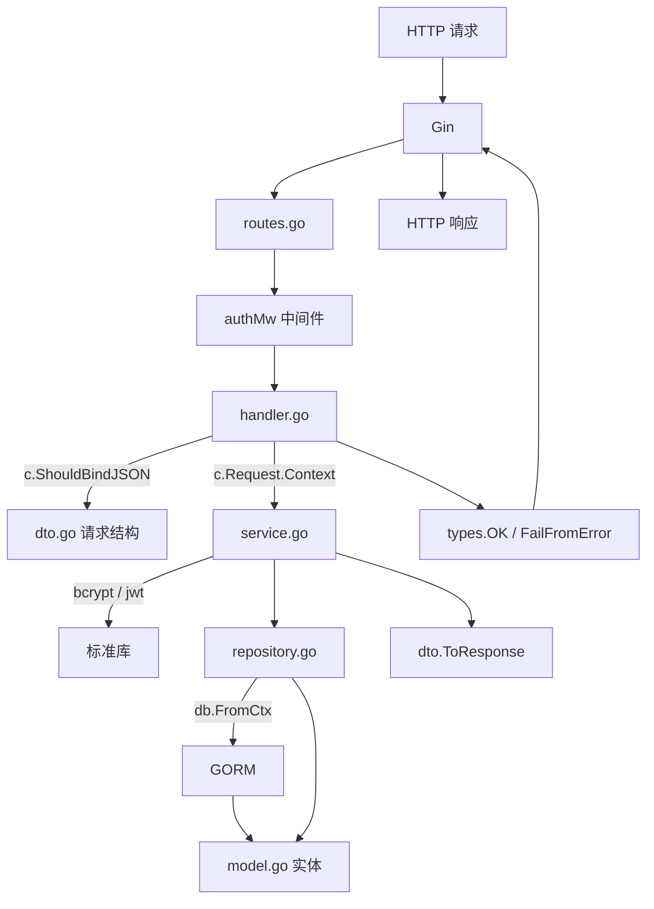

# 第 6 章 · 六文件模块模式 ★

> 本章是全教程**最核心**的一章。理解本章，你就理解了这个项目的基因。

> 本章目标：
> 1. 彻底掌握本项目的**六文件模块模式**：`model / dto / repository / service / handler / routes`
> 2. 以 `user` 模块为样本，逐文件看懂每一层在干什么
> 3. 知道新增一个模块时每个文件应该放什么

## 6.1 为什么要分层

一个业务"**创建用户**"的请求，会牵扯到：

- 解析 HTTP body → **参数校验** → **查库看用户名是否存在** → **密码 bcrypt 哈希** → **插入一条记录** → **转换成响应 DTO** → **统一 JSON 响应外壳**

如果全写在一个函数里，300 行起步，还无法写单元测试。分层的目标是：

- **每一层只做一件事**
- **上层依赖下层的接口，不依赖具体实现** → 可替换、可测试

本项目的分层叫"**六文件模块模式**"，每个业务模块都是这 6 个文件：

```
internal/modules/user/
├── model.go        ← ① GORM 实体
├── dto.go          ← ② API 入参 / 出参
├── repository.go   ← ③ 数据访问层（接口 + GORM 实现）
├── service.go      ← ④ 业务逻辑
├── handler.go      ← ⑤ HTTP 层
└── routes.go       ← ⑥ 路由注册
```

依赖方向**自上而下**：`routes → handler → service → repository → model`。下层不知道上层存在。



## 6.2 `model.go` · GORM 实体

打开 [internal/modules/user/model.go](../../rims-goProgect/internal/modules/user/model.go)：

```go
type User struct {
    types.BaseModel                                    // 嵌入 ID/CreatedAt/UpdatedAt/DeletedAt
    Username     string `gorm:"uniqueIndex;size:64;not null"`
    PasswordHash string `gorm:"size:255;not null" json:"-"`     // json:"-" 绝不外泄
    RealName     string `gorm:"size:64"`
    Phone        string `gorm:"size:20"`
    Email        string `gorm:"size:128"`
    RoleID       uint   `gorm:"not null;index"`
    Status       int8   `gorm:"default:1;not null"`             // 1=启用, 0=禁用
    Role         *Role  `gorm:"foreignKey:RoleID" json:"role,omitempty"`  // 关联
}

func (User) TableName() string { return "users" }
```

### struct tag 的三类

- **`gorm:"..."`** → GORM 建表时的约束（索引、长度、默认值、外键）
- **`json:"..."`** → 序列化 JSON 时的字段名或行为
- **`binding:"..."`** → Gin 校验规则（本层不用，DTO 层才用）

### 关键 GORM tag

| tag | 作用 |
|---|---|
| `primaryKey` | 主键（`BaseModel.ID` 自带） |
| `uniqueIndex` | 唯一索引 |
| `index` | 普通索引 |
| `size:64` | varchar(64) |
| `not null` | NOT NULL |
| `default:1` | 默认值 |
| `foreignKey:RoleID` | 关联 Role，本表外键是 RoleID |

### `json:"-"` vs `json:"xxx,omitempty"`

- `json:"-"` —— **永不出现**在 JSON 里（密码哈希必备）
- `json:"xxx,omitempty"` —— 字段**为零值时省略**（空指针、空字符串、数字 0）

### Role 和 Permission

同文件里还有 `Role` 和 `Permission`：

```go
type Role struct {
    types.BaseModel
    Code        string       `gorm:"uniqueIndex;size:32;not null"`   // e.g. "admin"
    Name        string       `gorm:"size:64;not null"`
    Description string       `gorm:"size:255"`
    Permissions []Permission `gorm:"many2many:role_permissions"`      // 多对多
}
```

`many2many:role_permissions` 让 GORM 自动建**中间表** `role_permissions (role_id, permission_id)`。

## 6.3 `dto.go` · 入参 / 出参

打开 [internal/modules/user/dto.go](../../rims-goProgect/internal/modules/user/dto.go)：

```go
type LoginRequest struct {
    Username string `json:"username" binding:"required"`
    Password string `json:"password" binding:"required"`
}

type LoginResponse struct {
    Token     string    `json:"token"`
    ExpiresAt int64     `json:"expiresAt"`
    User      UserBrief `json:"user"`
}

type CreateUserRequest struct {
    Username string `json:"username" binding:"required,min=3,max=64"`
    Password string `json:"password" binding:"required,min=6,max=72"`
    RealName string `json:"realName" binding:"max=64"`
    Phone    string `json:"phone" binding:"max=20"`
    Email    string `json:"email" binding:"omitempty,email,max=128"`
    RoleID   uint   `json:"roleId" binding:"required"`
}

type UpdateUserRequest struct {
    RealName *string `json:"realName" binding:"omitempty,max=64"`   // 指针！
    Phone    *string `json:"phone" binding:"omitempty,max=20"`
    Email    *string `json:"email" binding:"omitempty,email,max=128"`
    RoleID   *uint   `json:"roleId"`
    Status   *int8   `json:"status" binding:"omitempty,oneof=0 1"`
}
```

### `binding` tag

Gin 用的是 [go-playground/validator](https://github.com/go-playground/validator) 库。常用：

| tag | 含义 |
|---|---|
| `required` | 必填（零值视为缺失） |
| `min=N,max=N` | 字符串长度 / 数字大小范围 |
| `email` | 邮箱格式 |
| `omitempty` | 字段为空时跳过校验 |
| `oneof=a b c` | 取值必须是 a / b / c 之一 |

### 指针字段做"部分更新"

`UpdateUserRequest` 所有字段都是指针——**为什么？**

因为 JSON 反序列化时，缺失字段会留零值。但对"更新"而言，我们要**区分"字段没传"和"字段传了空值"**。

- 普通 `string` → 传不传都是 `""`，无法区分
- `*string` → 没传是 `nil`，传空字符串是非 nil 指向 `""`

handler 里根据 `req.RealName != nil` 判断是否要更新这个字段：

```go
if req.RealName != nil {
    u.RealName = strings.TrimSpace(*req.RealName)
}
```

这就是**PATCH 语义**的正确实现。

### 转换函数 `ToResponse`

```go
func ToResponse(u *User) UserResponse {
    resp := UserResponse{
        ID: u.ID, Username: u.Username, /* ... */
    }
    if u.Role != nil {
        resp.RoleCode = u.Role.Code
        resp.RoleName = u.Role.Name
    }
    return resp
}
```

**为什么不直接返回 `*User`？**

因为 `User` 结构里有 `PasswordHash`、`DeletedAt` 这些**不该出现在 API 里的字段**。虽然 `json:"-"` 已经能隐藏密码，但 DTO 的意义更深：

- **API 契约与数据库解耦** —— 将来 `User` 加了内部字段也不影响前端
- **可以摊平嵌套** —— 把 `User.Role.Name` 提成 `UserResponse.RoleName`
- **可以做额外计算** —— 例如只有某些条件才返回某字段

## 6.4 `repository.go` · 数据访问层

打开 [internal/modules/user/repository.go](../../rims-goProgect/internal/modules/user/repository.go)：

### 接口先定义

```go
type UserRepository interface {
    Create(ctx context.Context, user *User) error
    GetByID(ctx context.Context, id uint) (*User, error)
    GetByUsername(ctx context.Context, username string) (*User, error)
    List(ctx context.Context, page types.PageRequest) ([]User, int64, error)
    Update(ctx context.Context, user *User) error
    Delete(ctx context.Context, id uint) error
}
```

**所有公开方法第一个参数都是 `ctx context.Context`**——这是 Go 后端铁律。`ctx` 携带取消信号、超时、事务句柄、追踪 ID。即使当前用不到，也**一定要留接口**，将来不用改签名。

### GORM 实现

```go
type userRepo struct {
    gormDB *gorm.DB
}

func NewUserRepository(gormDB *gorm.DB) UserRepository {
    return &userRepo{gormDB: gormDB}
}

func (r *userRepo) getDB(ctx context.Context) *gorm.DB {
    return db.FromCtx(ctx, r.gormDB)   // ← 关键！
}

func (r *userRepo) GetByUsername(ctx context.Context, username string) (*User, error) {
    var u User
    err := r.getDB(ctx).
        Preload("Role.Permissions").
        Where("username = ?", username).
        First(&u).Error
    if err != nil { return nil, err }
    return &u, nil
}
```

### `db.FromCtx(ctx, fallback)` —— 事务透传魔法

**这是整个项目最关键的 3 行代码**（在 [internal/db/tx.go](../../rims-goProgect/internal/db/tx.go)）：

```go
func FromCtx(ctx context.Context, fallback *gorm.DB) *gorm.DB {
    if tx, ok := ctx.Value(txKey{}).(*gorm.DB); ok {
        return tx
    }
    return fallback.WithContext(ctx)
}
```

意思是：**如果 ctx 里有活跃的事务，就用事务句柄；否则用默认连接池**。

所以 repo 方法**不需要两个版本**（一个普通、一个事务）——只要上层想开事务，只需把 repo 调用放到 `db.RunInTx` 的回调里即可。详见 [第 8 章](./08-transactions.md)。

### `Preload` —— 预加载关联

```go
r.getDB(ctx).Preload("Role.Permissions").Where(...).First(&u)
```

`Preload("Role")` 触发一条额外 SQL 把 `roles` 表里 `id=u.RoleID` 的行查出来填到 `u.Role`。`"Role.Permissions"` 是**嵌套预加载**，连角色下的权限一起查。

不 Preload 的话，`u.Role` 是 nil 指针。

### 返回 `(entity, error)` vs `(entity, bool)`

Go 里查询单条记录的惯例是**两个返回值：实例 + 错误**。`gorm.ErrRecordNotFound` 是一个特殊错误。service 层要做：

```go
u, err := s.userRepo.GetByUsername(ctx, username)
if err != nil {
    if errors.Is(err, gorm.ErrRecordNotFound) {
        return nil, types.ErrAuth("用户名或密码错误")  // 业务错误
    }
    return nil, types.ErrSystem(err)                 // 系统错误
}
```

## 6.5 `service.go` · 业务逻辑

打开 [internal/modules/user/service.go](../../rims-goProgect/internal/modules/user/service.go)。以 `Create` 方法为例：

```go
func (s *UserService) Create(ctx context.Context, req CreateUserRequest) (*UserResponse, error) {
    // 1. 用户名唯一性检查
    existing, err := s.userRepo.GetByUsername(ctx, strings.TrimSpace(req.Username))
    if err == nil && existing != nil {
        return nil, types.ErrDuplicate("用户名已存在")
    }
    if err != nil && !errors.Is(err, gorm.ErrRecordNotFound) {
        return nil, types.ErrSystem(err)
    }

    // 2. 角色存在性检查
    role, err := s.roleRepo.GetByID(ctx, req.RoleID)
    if err != nil {
        if errors.Is(err, gorm.ErrRecordNotFound) {
            return nil, types.ErrValidation("角色不存在")
        }
        return nil, types.ErrSystem(err)
    }

    // 3. 密码哈希
    hash, err := bcrypt.GenerateFromPassword([]byte(req.Password), bcrypt.DefaultCost)
    if err != nil {
        return nil, types.ErrSystem(err)
    }

    // 4. 插入
    u := &User{
        Username: strings.TrimSpace(req.Username),
        PasswordHash: string(hash),
        // ...
        Status: 1,
    }
    if err := s.userRepo.Create(ctx, u); err != nil {
        return nil, types.ErrSystem(err)
    }

    // 5. 返回 DTO
    u.Role = role
    resp := ToResponse(u)
    return &resp, nil
}
```

### 关键观察

1. **Service 依赖接口** —— `userRepo UserRepository` 而不是 `*userRepo`。测试时可以传 mock。
2. **错误都转成 `*AppError`** —— 向上层暴露的错误都是业务语义的，handler 无须判断 GORM 错误。
3. **校验 → 查库 → 修改 → 返回** —— 标准 CRUD 流程。
4. **`strings.TrimSpace`** —— 防止前端传带空格的用户名。

### `Login` 方法

```go
func (s *UserService) Login(ctx context.Context, req LoginRequest) (*LoginResponse, error) {
    u, err := s.userRepo.GetByUsername(ctx, req.Username)
    if err != nil {
        if errors.Is(err, gorm.ErrRecordNotFound) {
            return nil, types.ErrAuth("用户名或密码错误")
        }
        return nil, types.ErrSystem(err)
    }
    if u.Status != 1 {
        return nil, types.ErrAuth("账号已禁用")
    }
    if err := bcrypt.CompareHashAndPassword([]byte(u.PasswordHash), []byte(req.Password)); err != nil {
        return nil, types.ErrAuth("用户名或密码错误")
    }
    // 生成 JWT
    token, expiresAt, err := s.tokenSvc.GenerateToken(u.ID, u.Username, u.RoleID, roleCode)
    // ...
}
```

### 安全提示 · "用户不存在"和"密码错误"返回同样的错误

注意：**用户名不存在**和**密码错**都返回 `"用户名或密码错误"`。这是刻意的——防止攻击者通过错误信息枚举用户名。

## 6.6 `handler.go` · HTTP 层

打开 [internal/modules/user/handler.go](../../rims-goProgect/internal/modules/user/handler.go)：

### Handler 结构

```go
type Handler struct {
    userSvc  *UserService
    roleSvc  *RoleService
    auditSvc AuditLogger
}

func NewHandler(userSvc *UserService, roleSvc *RoleService, auditSvc AuditLogger) *Handler {
    return &Handler{userSvc: userSvc, roleSvc: roleSvc, auditSvc: auditSvc}
}
```

Handler 拿**已经构造好的** service。谁构造？`router.go`（合成根）。

### 登录 handler

```go
// @Summary 用户登录
// @Tags 认证
// @Accept json
// @Produce json
// @Param payload body LoginRequest true "登录凭证"
// @Success 200 {object} types.Response{data=LoginResponse}
// @Failure 401 {object} types.Response
// @Router /api/v1/auth/login [post]
func (h *Handler) Login(c *gin.Context) {
    var req LoginRequest
    if err := c.ShouldBindJSON(&req); err != nil {
        types.Fail(c, http.StatusBadRequest, types.ErrValidation(err.Error()))
        return
    }
    resp, err := h.userSvc.Login(c.Request.Context(), req)

    // 审计（无论成功失败）
    h.auditLogin(c, req.Username, resp, err)

    if err != nil {
        types.FailFromError(c, err)
        return
    }
    types.OK(c, resp)
}
```

### 五板斧

标准 handler 写法：

```go
// ① 权限判断（如需）
if !types.IsAdmin(c) { types.FailFromError(c, types.ErrForbidden()); return }

// ② 绑参校验
var req XxxRequest
if err := c.ShouldBindJSON(&req); err != nil {
    types.Fail(c, http.StatusBadRequest, types.ErrValidation(err.Error())); return
}

// ③ 调 service
resp, err := h.svc.Do(c.Request.Context(), req)
if err != nil { types.FailFromError(c, err); return }

// ④ 返回响应
types.OK(c, resp)
```

为什么 `c.Request.Context()` 而不是 `c.Copy()` 或别的？因为业务逻辑要 `context.Context`（标准库接口），而 `*gin.Context` 是 Gin 特有的。两者不是一回事——`c.Request.Context()` 返回的才是真正的 `context.Context`。

### 辅助函数 `parseID`

```go
func parseID(c *gin.Context, param string) (uint, error) {
    idStr := c.Param(param)
    id, err := strconv.ParseUint(idStr, 10, 64)
    if err != nil || id == 0 {
        appErr := types.ErrValidation("无效的ID")
        types.Fail(c, http.StatusBadRequest, appErr)
        return 0, appErr
    }
    return uint(id), nil
}
```

每个 handler 都需要从 URL 里取 `:id`，抽个本地小函数。**注意**：失败时这个函数**自己写了响应**（`types.Fail`），handler 只需要 `if err != nil { return }`。

### Swagger 注解

每个 handler 上方的注释块是 [swaggo/swag](https://github.com/swaggo/swag) 的注解，会在运行 `swag init` 时扫描并生成 `docs/` 下的 OpenAPI JSON/YAML。详见 [第 11 章](./11-swagger.md)。

## 6.7 `routes.go` · 路由注册

打开 [internal/modules/user/routes.go](../../rims-goProgect/internal/modules/user/routes.go)：

```go
func RegisterRoutes(
    rg *gin.RouterGroup,
    handler *Handler,
    authMw gin.HandlerFunc,
) {
    auth := rg.Group("/auth")
    auth.POST("/login", handler.Login)       // 公开

    users := rg.Group("/users")
    users.Use(authMw)                         // 组级挂 JWT 中间件
    users.POST("", handler.CreateUser)
    users.GET("", handler.ListUsers)
    users.GET("/me", handler.GetCurrentUser)
    users.PUT("/me/password", handler.ChangePassword)
    users.GET("/:id", handler.GetUser)
    users.PUT("/:id", handler.UpdateUser)
    users.DELETE("/:id", handler.DeleteUser)
    users.PUT("/:id/password", handler.ResetPassword)

    roles := rg.Group("/roles")
    roles.Use(authMw)
    // ... 更多路由
}
```

**设计亮点**：

- `RegisterRoutes` 是模块暴露的唯一路由入口。新增路由只需改这个文件，不必改 `router.go`。
- 参数里传**中间件** `authMw` 而不是自己构造——保证全局用的是同一份 JWT 中间件实例。
- `rg.Group` 可以嵌套任意多层，中间件也可以按组挂。

## 6.8 六文件模式的依赖流图



## 6.9 对照：`user` 模块 vs `product` 模块

| 维度 | user | product |
|---|---|---|
| 嵌入 | `BaseModel` | `AuditableModel`（商品/库存需要审计操作人） |
| 事务 | 不需要（登录/CRUD 都是单表操作） | `product.ConvertNonStd` 需要原子更新非标+标准库存，所以 `NewProductService` 接受一个 `db.TxRunner` |
| 跨模块 | 依赖 `audit.AuditLogger`（可选，best-effort） | 被其他模块依赖（`document` 要用 `product.InventoryRepository`） |
| 路由 | 不挂 `WarehouseScope` | inventory / non-std-inventory 路由挂 `WarehouseScope` |

对照时你应该发现：**六文件结构一致，只是内部复杂度不同**。这就是模式的价值。

## 6.10 新增模块的 checklist

假设你要加一个 `supplier`（供应商）模块，按以下顺序：

1. 新建 `internal/modules/supplier/` 目录，创建六个空文件
2. `model.go` 定义 `Supplier` 实体，选 `BaseModel` 或 `AuditableModel`
3. `migrations/000008_supplier.sql` 写建表 SQL（与 AutoMigrate 互为备份，生产环境用 SQL）
4. `dto.go` 写 `CreateSupplierRequest` / `UpdateSupplierRequest` / `SupplierResponse` / `ToSupplierResponse`
5. `repository.go` 写 `SupplierRepository` 接口 + `supplierRepo` 实现，所有方法记得 `getDB(ctx)` 而不是直接 `r.gormDB`
6. `service.go` 写 `*SupplierService`，依赖 repo 接口；把错误都转成 `types.Err*`
7. `handler.go` 写 `*Handler`，每个方法写 Swagger 注解，走"五板斧"
8. `routes.go` 写 `RegisterRoutes(rg *gin.RouterGroup, h *Handler, authMw gin.HandlerFunc)`
9. `internal/app/app.go` 的 `AutoMigrate` 数组加 `&supplier.Supplier{}`
10. `internal/app/router.go`：构造 repo → service → handler，最后 `supplier.RegisterRoutes(api, supplierHandler, authMw)`
11. `cd rims-goProgect && go build ./...` 确保编译
12. `swag init -g internal/app/app.go --parseDependency --parseInternal -o docs` 重新生成文档

## 6.11 动手试试

1. 在本模块的 `Handler` 上加一个 `GetRoleStats`，返回角色数量。需要改哪几个文件？（答：`routes.go` 注册路由、`handler.go` 写 method、`service.go` 加 `GetRoleStats`、`repository.go` 加 `Count`。共 4 个文件。**不**需要改 `model.go` 和 `dto.go`，因为没新实体、响应 `{count: int}` 用 `gin.H` 临时写也可以。）
2. 把 `handler.ChangePassword` 里的 `userID := types.GetUserID(c)` 改成 `userID := types.GetUserID(c); if userID == 0 { ... 返回 401 ... }`。思考：为什么原本没写这层校验？（答：因为这个路由经过了 `authMw`，没 userID 的请求在中间件就 401 了。但加一层防御不亏。）

---

上一章 ← [05-中间件链](./05-middleware.md) | 下一章 → [07-请求生命周期](./07-request-lifecycle.md)
