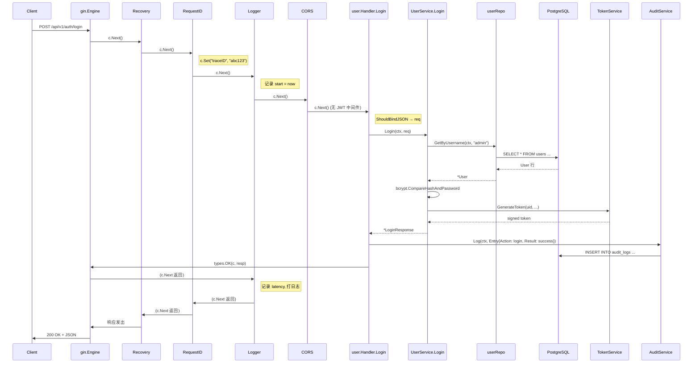

# 第 7 章 · 请求生命周期

> 本章目标：
> 1. 追踪**一次登录请求**从 TCP 连接到 JSON 响应的全过程
> 2. 观察每一步 `*gin.Context` 里"多"了什么值
> 3. 把前面 1~6 章的知识**串起来**

## 7.1 场景

前端发起：

```http
POST /api/v1/auth/login HTTP/1.1
Host: 127.0.0.1:8080
Content-Type: application/json
X-Request-ID: abc123

{"username": "admin", "password": "admin123"}
```

后端返回：

```http
HTTP/1.1 200 OK
Content-Type: application/json
X-Request-ID: abc123

{
  "code": 0,
  "message": "success",
  "data": {
    "token": "eyJhbGc...",
    "expiresAt": 1712000000,
    "user": {"id": 1, "username": "admin", "realName": "...", "roleCode": "admin", "roleName": "管理员"}
  },
  "traceId": "abc123"
}
```

下面把中间的每一步摊开看。

## 7.2 时序图



## 7.3 逐帧解析

### ① gin.Engine 接收

Gin 监听在 `:8080`。它根据路由树匹配到：`POST /api/v1/auth/login` → `user.Handler.Login`。

Gin 内部维护一个 handler 切片（中间件 + 最终 handler 合并）：

```
[gin.Recovery, middleware.RequestID, middleware.Logger, middleware.CORS, user.Handler.Login]
```

逐个执行，每个都收到同一个 `*gin.Context`。

### ② gin.Recovery

包裹一层 `defer recover()`。如果后面任何人 panic，这里捕获并返回 500。本次登录不 panic，所以透明穿过。

### ③ RequestID

```go
id := c.GetHeader("X-Request-ID")  // 如果前端带了，复用；没带就生成
if id == "" { id = generateID() }
c.Set(types.CtxKeyTraceID, id)
c.Header("X-Request-ID", id)
c.Next()
```

**此时 context 里有**：
```
traceID = "abc123"
```

### ④ Logger

```go
start := time.Now()
c.Next()   // ← 注意：这里把后续所有处理一口气跑完
// 下面是后处理：
log.Printf("[traceID] METHOD PATH | status | latency | user=X", ...)
```

Logger 此时还没打日志，等整个链跑完才打。

### ⑤ CORS

对于 `POST` 请求，CORS 只是加几个响应头（`Access-Control-Allow-*`），然后 `c.Next()` 放行。

### ⑥ handler.Login（第 6 章的代码）

进入 handler，做这几件事：

```go
var req LoginRequest
c.ShouldBindJSON(&req)  // ← 读 body，反序列化进 req
```

Gin 调底层 `json.Decoder.Decode(&req)`。`LoginRequest` 上的 `binding:"required"` 会被 validator 检查。如果密码字段缺失，这里直接返回 `ErrValidation`。

接着：

```go
resp, err := h.userSvc.Login(c.Request.Context(), req)
```

**注意**：传的是 `c.Request.Context()` 不是 `c` 本身。service 层不应该触碰 `*gin.Context`，只认标准 `context.Context`。

### ⑦ service.Login

```go
u, err := s.userRepo.GetByUsername(ctx, req.Username)
```

service 层：
- **没有 gin 感知** —— 它是纯业务代码
- **没有 HTTP 感知** —— 它只知道"用户不存在"、"密码错误"，不知道 401 还是 403

### ⑧ repository.GetByUsername

```go
return r.getDB(ctx).
    Preload("Role.Permissions").
    Where("username = ?", username).
    First(&u).Error
```

GORM 生成 SQL：

```sql
-- 主查询
SELECT * FROM users WHERE username = 'admin' AND deleted_at IS NULL ORDER BY id LIMIT 1;
-- Preload Role
SELECT * FROM roles WHERE id IN (1);
-- Preload Role.Permissions（通过中间表）
SELECT * FROM role_permissions WHERE role_id IN (1);
SELECT * FROM permissions WHERE id IN (...);
```

这三到四条 SQL 都**在同一个连接上**（假设不开事务，GORM 会从连接池借一条连接用完还）。

### ⑨ 回到 service · bcrypt 比对

```go
bcrypt.CompareHashAndPassword([]byte(u.PasswordHash), []byte(req.Password))
```

bcrypt 是**慢哈希**算法，刻意计算密集。生产环境约 100ms 一次（用来防爆破）。这也是为什么登录不走事务——一个事务占着连接 100ms 会很浪费。

### ⑩ 生成 JWT

```go
token, expiresAt, err := s.tokenSvc.GenerateToken(u.ID, u.Username, u.RoleID, roleCode)
```

- 构造 `Claims{UserID, Username, RoleID, RoleCode, RegisteredClaims{ExpiresAt: now+24h}}`
- HS256 签名，返回 Base64 编码的 token
- **密钥从哪里来？** 启动时 `config.Load()` 读的 `JWT_SECRET`，传给 `auth.NewTokenService`

### ⑪ 构造 `LoginResponse` 返回

service 把 `*LoginResponse` 返回给 handler。

### ⑫ 回到 handler · 审计

```go
h.auditLogin(c, req.Username, resp, err)
```

这一步是**best-effort**（尽力而为）——不管成功失败都记一条：

- 成功：`{username: "admin", result: "success", userId: 1, ...}`
- 失败：`{username: "...", result: "failure", errorCode: 10001, errorMsg: "用户名或密码错误"}`

`audit.Log` 返回的 error 被 `_ =` 丢弃——审计失败不应该让登录失败（登录也没在事务里，回不了滚）。详见 [第 9 章](./09-cross-cutting.md)。

### ⑬ 写响应

```go
types.OK(c, resp)
```

等价于：

```go
c.JSON(http.StatusOK, Response{
    Code:    ErrCodeOK,
    Message: "success",
    Data:    resp,
    TraceID: GetTraceID(c),  // 从 context 取出来
})
```

Gin 把 `Response` 结构序列化成 JSON，写 `Content-Type: application/json`，发送到 socket。

### ⑭ 链路返回 · Logger 打日志

这时控制权层层 `c.Next()` 返回到 Logger：

```go
latency := time.Since(start)
log.Printf("[abc123] POST /api/v1/auth/login | 200 | 123ms | user=0", ...)
```

注意 `user=0` —— 登录接口不经过 JWT 中间件，context 里没 userID。

### ⑮ Recovery 退出，TCP 响应送出

## 7.4 `*gin.Context` 的演化

| 时刻 | context 里的值 |
|---|---|
| 进入 Recovery | 空 |
| 离开 RequestID | `traceID = "abc123"` |
| 离开 Logger（进入时） | `traceID` + `start` 变量（局部，不存 context） |
| 离开 CORS | 不变 |
| 进入 Login handler | `traceID`（未过 JWT，没有 userID） |
| 离开 Login handler | 同上 + 响应已写 |

**对比** `GET /api/v1/users/me`（需要 JWT）：

| 时刻 | context |
|---|---|
| 进入 RequestID | 空 |
| 离开 RequestID | `traceID` |
| 进入 JWTAuth | `traceID` |
| 离开 JWTAuth | `traceID`, `userID`, `username`, `roleID`, `roleCode` |
| 进入 handler | 同上，可读 |

## 7.5 失败路径示例：密码错误

假设第 ⑨ 步 bcrypt 比对失败：

1. service 返回 `types.ErrAuth("用户名或密码错误")` —— 这是 `*AppError{Code: 10001}`
2. handler 先走 `auditLogin(c, username, nil, err)` 记一条 failure 审计
3. handler 走 `types.FailFromError(c, err)`
4. `FailFromError` 用 `errors.As` 取出 `*AppError`，调 `HTTPStatus()` 得到 401
5. 写响应 `{"code":10001,"message":"用户名或密码错误","traceId":"abc123"}`，HTTP 401
6. Logger 打日志：`[abc123] POST /api/v1/auth/login | 401 | 110ms | user=0`

## 7.6 动手试试

1. 启动服务，用 curl 发一次登录：

   ```bash
   curl -i -X POST http://127.0.0.1:8080/api/v1/auth/login \
     -H "Content-Type: application/json" \
     -H "X-Request-ID: my-trace-001" \
     -d '{"username":"admin","password":"admin123"}'
   ```

   观察响应头有没有 `X-Request-ID: my-trace-001`，响应 body 的 `traceId` 字段是不是一样。

2. 看服务日志，应该出现类似：

   ```
   [my-trace-001] POST /api/v1/auth/login | 200 | xxx ms | user=0
   ```

3. 故意发错密码，观察 401 响应和日志里的 `| 401 |` 状态码。

---

上一章 ← [06-六文件模块模式 ★](./06-module-pattern.md) | 下一章 → [08-事务传播](./08-transactions.md)
