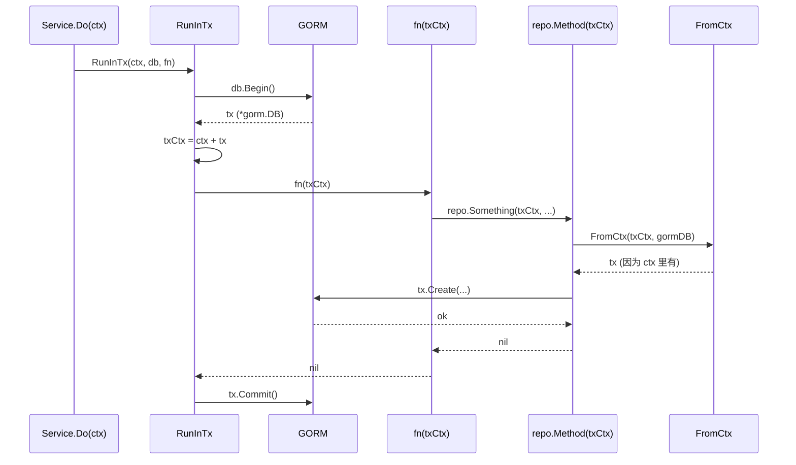

# 第 8 章 · 事务传播

> 本章目标：
> 1. 理解 `db.RunInTx` + `db.FromCtx` 的工作原理
> 2. 看懂"**上层决定是否开事务，下层无感知**"的分层
> 3. 以 `document.Complete` 为例，看多表原子更新怎么写

## 8.1 问题背景

"完成销售单"这个操作要做：

1. 更新单据状态 `documents.status` 从 `draft` → `completed`
2. 对每一行明细，**扣减库存** `inventories.quantity`
3. 插入**库存流水** `inventory_transactions`
4. 写一条**审计日志** `audit_logs`

这 4 张表的操作必须**同生共死**——如果第 3 步失败了，第 1、2 步必须全部回滚，不能出现"单据完成了但库存没扣"的幽灵状态。

这就是数据库**事务**。问题是：**事务句柄如何在服务层和数据访问层之间传递，而不让业务代码到处写 `db.Begin() / db.Commit()`？**

## 8.2 方案：用 context 传事务

项目的做法（[internal/db/tx.go](../../rims-goProgect/internal/db/tx.go)）：

```go
type txKey struct{}   // 空结构体，作为 context key 用

func RunInTx(ctx context.Context, db *gorm.DB, fn func(ctx context.Context) error) error {
    tx := db.WithContext(ctx).Begin()
    if tx.Error != nil { return fmt.Errorf("begin tx: %w", tx.Error) }

    txCtx := context.WithValue(ctx, txKey{}, tx)   // 把 tx 塞进 context

    if err := fn(txCtx); err != nil {              // 调业务函数
        if rbErr := tx.Rollback().Error; rbErr != nil {
            return fmt.Errorf("rollback failed: %v (original: %w)", rbErr, err)
        }
        return err
    }

    if err := tx.Commit().Error; err != nil {
        return fmt.Errorf("commit tx: %w", err)
    }
    return nil
}

func FromCtx(ctx context.Context, fallback *gorm.DB) *gorm.DB {
    if tx, ok := ctx.Value(txKey{}).(*gorm.DB); ok {
        return tx
    }
    return fallback.WithContext(ctx)
}
```

### 执行流



### 关键点 1：`txKey{}` 是空 struct

```go
type txKey struct{}
ctx = context.WithValue(ctx, txKey{}, tx)
tx, ok := ctx.Value(txKey{}).(*gorm.DB)
```

**为什么用空 struct 而不是 `"tx"` 字符串？**

Go 官方推荐 context key 用**私有类型**，避免不同包之间的字符串冲突。空 struct 不占内存，完美。

### 关键点 2：闭包回调

```go
RunInTx(ctx, db, func(txCtx context.Context) error {
    // 这里的代码可能失败可能成功
    // 成功 → RunInTx 会 Commit
    // 失败 → RunInTx 会 Rollback
})
```

**闭包**意味着你可以在里面捕获外层的变量（例如用户 ID、参数）。`RunInTx` 不需要知道业务细节，业务代码不需要手写 `Commit/Rollback`。

### 关键点 3：`FromCtx` 的兜底

```go
return fallback.WithContext(ctx)
```

如果 ctx 里**没有** tx（非事务调用），`FromCtx` 返回一个挂着 `ctx` 的默认连接。这保证了 GORM 仍然能感知到 context 的取消信号。

## 8.3 `TxRunner` · 依赖抽象

`db.TxRunner` 是一个函数类型：

```go
type TxRunner func(ctx context.Context, fn func(ctx context.Context) error) error

func NewTxRunner(db *gorm.DB) TxRunner {
    return func(ctx context.Context, fn func(ctx context.Context) error) error {
        return RunInTx(ctx, db, fn)
    }
}
```

### 为什么要有这层

Service 结构体里直接放一个 `TxRunner`（函数），而不是 `*gorm.DB`。好处：

- **测试**：测试时可以传一个"直通"实现——`func(ctx, fn) error { return fn(ctx) }`（不真开事务，直接跑）
- **符合依赖倒置**：Service 依赖**抽象**（`TxRunner` 这个函数签名），不依赖 GORM 具体类型

用法：

```go
// router.go 里装配
docSvc := document.NewDocumentService(
    docRepo, lineRepo, ...,
    db.NewTxRunner(gormDB),   // ← 生产环境的实现
    auditSvc,
)

// service.go 里使用
func (s *DocumentService) Complete(ctx context.Context, ...) error {
    return s.txRunner(ctx, func(txCtx context.Context) error {
        // 业务逻辑，所有 repo 调用都传 txCtx
    })
}
```

## 8.4 实战：`document.Complete` 全流程

打开 [internal/modules/document/service.go:179](../../rims-goProgect/internal/modules/document/service.go#L179)：

```go
func (s *DocumentService) Complete(ctx context.Context, actor audit.Actor, warehouseID, id uint, isAdmin bool) error {
    userID := actor.UserID
    return s.txRunner(ctx, func(txCtx context.Context) error {
        // ① 查单据
        doc, err := s.docRepo.GetByID(txCtx, id)
        if err != nil {
            if errors.Is(err, gorm.ErrRecordNotFound) {
                return types.ErrNotFound("单据")
            }
            return types.ErrSystem(err)
        }
        if doc.WarehouseID != warehouseID {
            return types.ErrNotFound("单据")
        }
        if doc.Status != StatusDraft {
            return types.ErrInvalidState("单据状态不允许此操作")
        }

        // ② 查明细行
        lines, err := s.lineRepo.ListByDocumentID(txCtx, doc.ID)
        if err != nil {
            return types.ErrSystem(err)
        }
        if len(lines) == 0 {
            return types.ErrValidation("单据无明细行")
        }

        now := time.Now()
        beforeStatus := doc.Status

        // ③ 按单据类型分发执行（内部会改库存、写流水）
        switch doc.DocType {
        case DocTypeInbound:
            if !isAdmin { return types.ErrForbidden() }
            if err := s.executeInbound(txCtx, doc, lines, userID, now); err != nil { return err }
        case DocTypeSales:
            if err := s.executeSales(txCtx, doc, lines, userID, now); err != nil { return err }
        // ... 其他类型
        }

        // ④ 更新单据状态
        doc.Status = StatusCompleted
        doc.OperatedAt = &now
        doc.UpdatedBy = userID
        if err := s.docRepo.Update(txCtx, doc); err != nil {
            return types.ErrSystem(err)
        }

        // ⑤ 写审计日志（在事务里，失败会回滚整个事务）
        docID := doc.ID
        return s.audit.Log(txCtx, audit.Entry{
            Actor:      actor,
            Action:     audit.ActionComplete,
            Resource:   audit.ResourceDocument,
            ResourceID: &docID,
            DocNo:      doc.DocNo,
            Before:     map[string]any{"status": beforeStatus, ...},
            After:      map[string]any{"status": doc.Status, ...},
        })
    })
}
```

### 注意 5 处都传 `txCtx` 不是 `ctx`

在闭包内部，所有 repo 调用都必须用 `txCtx`。如果不小心传了外层的 `ctx`（没 tx 的那个），那条 SQL 就会**在事务外**执行，破坏原子性。

这是最容易犯的 bug。**IDE 重命名技巧**：给闭包参数起一个很不同的名字（如 `txCtx`），避免和外层 `ctx` 混淆。

### 审计为什么要在事务里

普通服务（如 `user.Login`）的审计是 best-effort——失败了 `_ = h.auditSvc.Log(...)` 直接忽略。

但 `document.Complete` 不一样：

- 单据完成是**强审计场景**（合规要求）
- 如果库存改了但审计没写，监管会出事
- 所以审计写在事务里，**写审计失败 → 整个事务回滚**

这是业务决策不是技术决策。在 `NewDocumentService` 的注释里也明写了：

```go
// The auditLogger is required: Complete emits an audit record from inside
// its business transaction and cannot silently drop it.
```

## 8.5 与 `user.Login` 对照

| 维度 | `user.Login` | `document.Complete` |
|---|---|---|
| 事务 | 无 | 有 |
| 审计 | best-effort（失败忽略） | 事务内（失败回滚） |
| service 依赖 tx runner | 不需要 | 需要 |
| 同时改的表数 | 0（只读） | 3~4 |

## 8.6 常见疑问

**Q: 可以在事务里套另一个事务（嵌套事务）吗？**
A: 本项目不嵌套。如果在 `fn` 里再调 `RunInTx`，新的 `txKey{}` 会**覆盖**外层（GORM 侧看其实是新开个事务）。想要真正的嵌套事务，需要 savepoint 支持。目前没这需求。

**Q: 一个事务持续太久会怎样？**
A: 会占着一条数据库连接，连接池可能耗尽。bcrypt 这种 100ms 的操作**绝不能放事务里**。文件上传之类的 I/O 也要放外面。

**Q: 事务里可以发 HTTP 调用吗？**
A: 强烈不建议。一旦外部服务卡住，事务就一直不 commit，长时间占连接 + 锁行。如果必须，加严格的超时 context。

**Q: `go build` 时编译器怎么知道 repo 的 `getDB(ctx)` 一定会从 context 拿到 tx？**
A: 编译器不知道。这是**运行时约定**。如果某个 repo 方法粗心写了 `r.gormDB.XXX` 而不是 `r.getDB(ctx).XXX`，事务就漏了。code review 时要特别警惕这种情况——这就是 [第 12 章练习 L1](./12-exercises.md) 的题目之一。

## 8.7 动手试试

1. 阅读 `document.executeSales`（同文件下方），找出它在事务里一共动了几张表。（答：inventories、inventory_transactions，可能还有 documents 本身——但 documents 的 update 是在 Complete 主流程里做，不是 executeSales 做的。）

2. 模拟一次失败事务。在 `Complete` 的最后（审计 Log 之前）临时插入：
   ```go
   return fmt.Errorf("manual failure")
   ```
   重启服务，通过 API 完成一张单据，观察：
   - 响应：500 系统异常
   - 数据库：单据 `status` 仍是 `draft`，库存**没变**，审计**没记录**——整个事务被回滚了
   - 改完记得删掉调试代码

3. 把 `document.NewDocumentService` 的 `txRunner` 参数改成直通实现（只为测试用）：
   ```go
   docSvc := document.NewDocumentService(..., func(ctx context.Context, fn func(context.Context) error) error {
       return fn(ctx)
   }, auditSvc)
   ```
   此时完成单据失败了是否会回滚？（答：不会——每个 repo 操作都是独立 SQL，事务被吞了。所以这只能做单元测试级别的"直通"，不能直接当生产替身。）

---

上一章 ← [07-请求生命周期](./07-request-lifecycle.md) | 下一章 → [09-横切模式](./09-cross-cutting.md)
