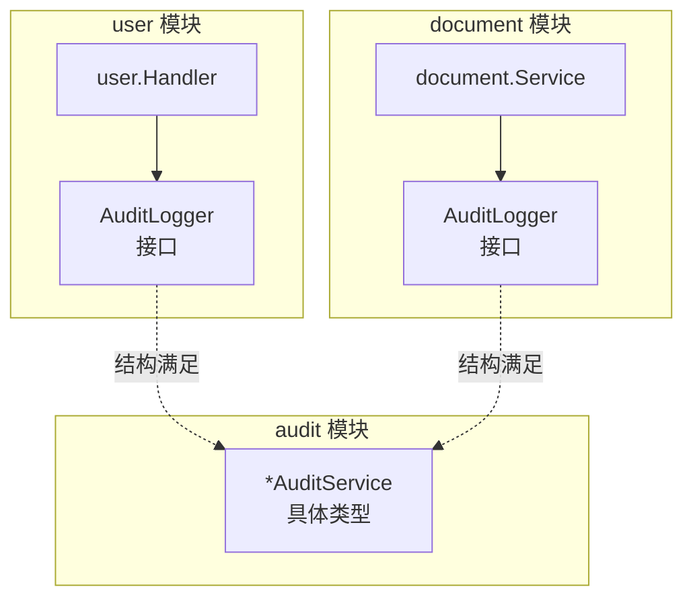

# 第 9 章 · 横切模式

> 本章目标：
> 1. 掌握 **消费者定义接口**（Consumer-Defined Interface）—— Go 解耦的终极武器
> 2. 看懂可插拔基础设施（`file.Storage`）怎么为将来换实现做准备
> 3. 理解中间件往 context 塞值、服务层取值的完整链路

"横切关注点"（cross-cutting concerns）指那些**跨多个模块共同依赖的事**——审计、文件存储、仓库作用域。它们在架构图上是"穿插"而不是"堆叠"。本章讲 3 个典型横切模式。

## 9.1 消费者定义接口 · 最重要的 Go 模式

### 问题

`document` 模块的 `Complete` 方法需要写审计日志。最直观的做法：

```go
// 反例：直接依赖 audit.AuditService 具体类型
type DocumentService struct {
    audit *audit.AuditService    // ← 硬依赖
    // ...
}
```

这有两个问题：

1. **循环导入风险**：如果 audit 模块哪天也想依赖 document（比如查询带上单据号），编译器会报 "import cycle"。
2. **耦合过紧**：测试 `document` 时必须构造一个真实的 `audit.AuditService`。

### 解法：在消费者端定义接口

打开 [internal/modules/document/service.go:22-27](../../rims-goProgect/internal/modules/document/service.go#L22-L27)：

```go
// document 模块内部
type AuditLogger interface {
    Log(ctx context.Context, e audit.Entry) error
}

type DocumentService struct {
    audit AuditLogger    // ← 依赖抽象
    // ...
}
```

对比 [internal/modules/user/handler.go:22-24](../../rims-goProgect/internal/modules/user/handler.go#L22-L24)：

```go
// user 模块内部
type AuditLogger interface {
    Log(ctx context.Context, e audit.Entry) error
}
```

**两个模块各自定义了一个 `AuditLogger` 接口**，都只有一个方法 `Log`。然后 [router.go:80](../../rims-goProgect/internal/app/router.go#L80) 里：

```go
auditSvc := audit.NewAuditService(auditRepo)
// ...
docSvc := document.NewDocumentService(..., auditSvc)
userHandler := user.NewHandler(userSvc, roleSvc, auditSvc)
```

注意：`auditSvc` 是 `*audit.AuditService` 具体类型。它被传给两个模块，**两个模块都接受它**，虽然它们声明的接口名不同。

### Go 结构性类型（Duck Typing）

Go 的接口是**结构性**的，不是**名义性**的。

- Java：`class AuditService implements AuditLogger` —— 必须显式写 `implements`
- Go：`*AuditService` 只要**有 `Log(ctx, e) error` 方法**，就自动满足任何声明了这个方法的接口

这意味着**接口的定义方**不必是实现方。消费者可以"长什么样我要你是什么样"地自己写一个最小接口。

### 效果



**三个关键好处**：

1. **零循环依赖**：user、document 不导入 audit 的**接口**（因为 audit 没导出接口），只导入 `audit.Entry` 这个 struct 类型。
2. **接口最小化**：document 只用 `Log` 一个方法——接口就只有一个方法。Go 的 **interface segregation** 比 Java 彻底得多。
3. **易测试**：单测时自己写个 mock 结构体实现 `Log` 方法即可。

### 记忆法

> **"Accept interfaces, return structs."** —— Go 社区名言。
> 参数用接口（方便替换），返回值用具体类型（信息更丰富）。

## 9.2 可插拔存储 · `file.Storage`

### 当前实现

打开 [internal/modules/file/storage.go](../../rims-goProgect/internal/modules/file/storage.go)：

```go
type Storage interface {
    Save(ctx context.Context, objectKey string, r io.Reader) error
    Open(ctx context.Context, objectKey string) (io.ReadCloser, error)
    Delete(ctx context.Context, objectKey string) error
    PublicURL(objectKey string) string
}

type LocalStorage struct {
    baseDir      string
    publicPrefix string
}

func NewLocalStorage(baseDir, publicPrefix string) (*LocalStorage, error) { ... }

func (s *LocalStorage) Save(_ context.Context, objectKey string, r io.Reader) error { ... }
func (s *LocalStorage) Open(_ context.Context, objectKey string) (io.ReadCloser, error) { ... }
func (s *LocalStorage) Delete(_ context.Context, objectKey string) error { ... }
func (s *LocalStorage) PublicURL(objectKey string) string { ... }
```

### FileService 依赖抽象

```go
type FileService struct {
    repo    FileRepository
    storage Storage     // ← 接口，不是具体类型
    // ...
}
```

router.go 组装：

```go
localStorage, err := file.NewLocalStorage(uploadDir, filePublicPrefix)
fileSvc := file.NewFileService(fileRepo, localStorage, ...)
```

### 将来要换 MinIO / S3

添加一个新实现就行，业务代码一个字不改：

```go
// 未来的 s3_storage.go
type S3Storage struct {
    bucket string
    client *s3.Client
}

func (s *S3Storage) Save(ctx context.Context, objectKey string, r io.Reader) error {
    _, err := s.client.PutObject(ctx, &s3.PutObjectInput{
        Bucket: &s.bucket, Key: &objectKey, Body: r,
    })
    return err
}
// ... Open / Delete / PublicURL
```

router.go 里：

```go
var storage file.Storage
if cfg.StorageBackend == "s3" {
    storage = file.NewS3Storage(cfg.S3Bucket, ...)
} else {
    storage, _ = file.NewLocalStorage(cfg.UploadDir, "/uploads")
}
fileSvc := file.NewFileService(fileRepo, storage, ...)
```

这就是**策略模式 / 适配器模式**的 Go 实现。

### 为什么要接口而不是 if 分支

假如不抽象，每次 `FileService.Upload` 都得：

```go
if cfg.StorageBackend == "s3" {
    // 大段 S3 调用
} else {
    // 大段本地文件系统调用
}
```

业务逻辑和存储细节混成一团，**无法单独测试上传逻辑**。有接口后测试是：

```go
type fakeStorage struct{}
func (fakeStorage) Save(ctx, key, r) error { return nil }
// ... 其他方法

svc := file.NewFileService(repo, fakeStorage{}, ...)
// 测试 svc 的业务逻辑
```

## 9.3 WarehouseScope 中间件 · Context 数据流

已在[第 5 章 5.8 节](./05-middleware.md)讲过原理，这里重点看**数据从哪里来、到哪里去**：

```mermaid
flowchart TD
    Header["HTTP Header<br>X-Warehouse-ID: 5"] --> MW[WarehouseScope 中间件]
    Default["用户绑定的默认仓库<br>从 DB 查"] -.fallback.-> MW
    MW -->|c.Set| Ctx["gin.Context<br>warehouseID = 5"]
    Ctx -->|types.GetWarehouseID| H[Handler]
    H -->|参数传递| S[Service.Do&#40;ctx, whID, ...&#41;]
    S --> Repo[Repository<br>WHERE warehouse_id = 5]
```



**四段链路**：

1. **前端发 header** 或使用默认
2. **中间件解析 + 权限校验 + `c.Set`**
3. **Handler `types.GetWarehouseID(c)` 取出**
4. **作为显式参数传给 Service**

### 为什么 Service 不直接从 context 取

Service 层的 `context.Context` 是标准 `context.Context`，**不是** `*gin.Context`。`c.Set` / `c.Get` 是 Gin 独有的，标准 context 不支持按 key 取用户业务值。

所以 handler 是"翻译员"：

```go
warehouseID := types.GetWarehouseID(c)   // gin 独有
userID := types.GetUserID(c)
// 显式传给 service
err := h.svc.Do(c.Request.Context(), userID, warehouseID, req)
```

Service 签名：

```go
func (s *DocumentService) Complete(ctx context.Context, actor audit.Actor, warehouseID, id uint, isAdmin bool) error
```

**参数很长也没关系**——这样业务入参一目了然，不用猜 "ctx 里到底有什么"。

### 反例 · 不要这么写

```go
// 反例
func (s *DocumentService) Complete(ctx context.Context, id uint) error {
    warehouseID := ctx.Value("warehouseID").(uint)  // 隐藏依赖
    userID := ctx.Value("userID").(uint)
    // ...
}
```

坏处：

- **隐式依赖** —— 看签名完全不知道需要 warehouseID
- **运行时类型断言** —— key 写错或 value 是别的类型就 panic
- **无法单元测试** —— 构造 context 必须塞对 key

**原则**：`context.Context` 只存**请求全局元数据**（trace ID、取消信号、事务句柄），**不存**业务参数。

## 9.4 审计的两种姿势 · 回顾

| 姿势 | 例子 | 特点 |
|---|---|---|
| **Best-effort** | `user.Handler.Login` | `_ = h.auditSvc.Log(...)`，错误忽略；登录没事务 |
| **事务内** | `document.Service.Complete` | 审计在 `RunInTx` 闭包里返回错误，失败回滚整个事务 |

选哪种取决于：**审计丢了是否算 bug？**

- 登录：丢一条不致命（失败还能 retry）→ best-effort
- 库存变动：监管合规要求，丢一条是违规 → 事务内

## 9.5 动手试试

1. 在 `document` 模块里定义一个 `InventoryLocker` 接口：

   ```go
   type InventoryLocker interface {
       Lock(ctx context.Context, warehouseID, productID uint) error
   }
   ```

   思考：未来如果想引入分布式锁，怎么注入？（答：在 `NewDocumentService` 里加一个 `locker InventoryLocker` 参数，默认传一个"no-op"实现即可。业务代码调 `s.locker.Lock(...)`，无需改动。）

2. 在 `file.Storage` 接口上加一个方法 `Exists(ctx, objectKey) (bool, error)`。**要做的改动**：
   - 接口定义加一行
   - `LocalStorage` 加实现
   - **任何依赖 Storage 接口的地方都不用改**——但如果有其他实现会编译不过（Go 的接口是非侵入的，加方法会破坏所有实现方）

3. 在 `WarehouseScope` 之后，service 层调用链里**找一处**直接用 context 取 warehouseID 的（应该找不到——项目约定都是显式参数）。如果找到了就说明代码 review 漏了。

---

上一章 ← [08-事务传播](./08-transactions.md) | 下一章 → [10-错误处理](./10-error-handling.md)
