# 第 10 章 · 错误处理

> 本章目标：
> 1. 看清"**原始 error → AppError → FailFromError → HTTP 响应**"的完整链路
> 2. 掌握 `errors.Is` 和 `errors.As` 的区别
> 3. 避开 Go 新手常见的错误处理坑

## 10.1 完整错误链路

以"查一个不存在的用户"为例：

```mermaid
flowchart TD
    A["GORM: db.First(&u, 999)"] -->|返回| B[gorm.ErrRecordNotFound]
    B -->|在 repo 层透传| C["repo.GetByID 返回 err"]
    C -->|service 判断并转换| D[types.ErrNotFound&#40;&quot;用户&quot;&#41;]
    D -->|带 AppError 返回| E["service 返回 *AppError"]
    E -->|handler 调用| F[types.FailFromError&#40;c, err&#41;]
    F -->|errors.As 取 AppError| G["c.JSON&#40;404, Response{code: 10004, ...}&#41;"]
    G --> H[HTTP 响应]
```



## 10.2 层级职责

| 层 | 处理原则 |
|---|---|
| **Repository** | 透传原始错误（`gorm.ErrRecordNotFound` 等），**不**转 AppError |
| **Service** | 把已知错误转成 `*AppError`；未知错误包 `types.ErrSystem(err)` |
| **Handler** | 统一调 `types.FailFromError(c, err)`，不自己判断错误类型 |

看一段典型 service 代码（来自 [user/service.go](../../rims-goProgect/internal/modules/user/service.go)）：

```go
func (s *UserService) GetByID(ctx context.Context, id uint) (*UserResponse, error) {
    u, err := s.userRepo.GetByID(ctx, id)
    if err != nil {
        if errors.Is(err, gorm.ErrRecordNotFound) {
            return nil, types.ErrNotFound("用户")      // ← 已知情况：转业务错误
        }
        return nil, types.ErrSystem(err)               // ← 未知情况：包成系统错误
    }
    resp := ToResponse(u)
    return &resp, nil
}
```

### 为什么 repo 不自己转

因为 repo 不知道"**不存在**"对业务意味着什么：

- `GetByID` 找不到用户 → service 要转成 `ErrNotFound`
- `GetByUsername` 找不到 → service 要转成 `ErrAuth("用户名或密码错误")`（登录场景不暴露是否存在）
- `GetByUsername` 找不到 → service 要转成 `ErrValidation("用户名不存在")`（创建场景）

**同一个错误、三种业务语义**——只有 service 层知道上下文。repo 层老老实实透传。

### 为什么 handler 不自己判断

```go
// 反例
func (h *Handler) GetUser(c *gin.Context) {
    // ...
    resp, err := h.svc.Get(ctx, id)
    if err != nil {
        if errors.Is(err, gorm.ErrRecordNotFound) {  // ← handler 不该知道 GORM 错误
            c.JSON(404, ...); return
        }
        c.JSON(500, ...); return
    }
}
```

这会让 handler 依赖 GORM 细节。**正例**（项目做法）：

```go
func (h *Handler) GetUser(c *gin.Context) {
    // ...
    resp, err := h.svc.GetByID(ctx, id)
    if err != nil {
        types.FailFromError(c, err)   // ← 一行搞定，自动识别 AppError
        return
    }
    types.OK(c, resp)
}
```

## 10.3 `errors.Is` vs `errors.As`

这俩是 Go 错误处理最容易搞混的函数。

### `errors.Is(err, target)` · 看**错误值**

用来判断 err（或它 Unwrap 链里任一层）**是不是某个具体错误值**。

典型用法：

```go
if errors.Is(err, gorm.ErrRecordNotFound) { ... }
if errors.Is(err, io.EOF) { ... }
if errors.Is(err, context.DeadlineExceeded) { ... }
```

target 必须是**哨兵错误值**（sentinel error）——通常是包级 `var`：

```go
// gorm 包里
var ErrRecordNotFound = errors.New("record not found")
```

### `errors.As(err, &target)` · 看**错误类型**

用来判断 err 链里**有没有某个错误类型**，并把它赋给 target 指针。

典型用法（就在本项目 [types/response.go:67-74](../../rims-goProgect/internal/types/response.go#L67-L74)）：

```go
var appErr *AppError
if errors.As(err, &appErr) {
    Fail(c, appErr.HTTPStatus(), appErr)
    return
}
```

`*AppError` 是自定义类型，不是固定值——每次构造的 `*AppError` 实例都不同。所以要用 `As` 而不是 `Is`。

### 速记

| 问 | 用 |
|---|---|
| "err 是不是这个**值**？" | `errors.Is` |
| "err 是不是这个**类型**？能不能帮我拆出那个实例？" | `errors.As` |

## 10.4 错误包装 vs 丢弃

```go
// ✅ 包装（保留 Unwrap 链）
return fmt.Errorf("connect postgres: %w", err)

// ❌ 丢弃（只留字符串，失去类型信息）
return fmt.Errorf("connect postgres: %v", err)
return errors.New("connect postgres: " + err.Error())
```

**结论**：往上抛错误时**永远用 `%w`**。除非你明确要**屏蔽**错误细节（例如安全原因："用户不存在"和"密码错"都说"用户名或密码错误"）。

## 10.5 项目的错误构造函数速查

打开 [types/errors.go](../../rims-goProgect/internal/types/errors.go)：

| 函数 | 错误码 | HTTP | 典型场景 |
|---|---|---|---|
| `ErrAuth(msg)` | 10001 | 401 | 未登录 / token 过期 / 密码错 |
| `ErrForbidden()` | 10002 | 403 | 已登录但无权限 |
| `ErrValidation(msg)` | 10003 | 400 | 参数校验失败 / 业务规则校验失败 |
| `ErrNotFound(entity)` | 10004 | 404 | 资源不存在 |
| `ErrDuplicate(msg)` | 10005 | 409 | 唯一性冲突 |
| `ErrInsufficientStock()` | 20001 | 422 | 库存不足 |
| `ErrInvalidState(msg)` | 20002 | 422 | 状态机流转非法 |
| `ErrSystem(err)` | 50000 | 500 | 兜底：未知系统错误 |

## 10.6 新手常见坑

### 坑 1 · 忘记 `return`

```go
// ❌
if err != nil {
    types.FailFromError(c, err)
    // ← 漏 return，后面的 types.OK 也会执行，双响应！
}
types.OK(c, resp)
```

**后果**：Gin 会 `c.JSON` 两次，第二次会 panic（response 已写入）。

**修复**：每处 Fail 后都 `return`。Go 编译器不会警告——这是自律题。

### 坑 2 · `if err := ...; err != nil` 作用域陷阱

```go
// ❌ 这个 err 只在 if 块里可见
if err := doA(); err != nil { return err }
if err := doB(); err != nil { return err }   // ← 这里是新变量，OK
// 但如果你想在 if 外用 err，就踩坑了：
if err := doA(); err != nil { return err }
fmt.Println(err)   // ← 编译错误：undefined
```

项目里两种写法并存：

```go
// 方式 A：紧凑
if err := s.repo.Create(ctx, u); err != nil { return nil, types.ErrSystem(err) }

// 方式 B：外置
hash, err := bcrypt.GenerateFromPassword(...)
if err != nil { return nil, types.ErrSystem(err) }
```

都可以，选一种保持一致即可。

### 坑 3 · 比较错误用 `==`

```go
// ❌ 只在 err 就是那个值时才成立，被包装过就失效
if err == gorm.ErrRecordNotFound { ... }

// ✅ 推荐
if errors.Is(err, gorm.ErrRecordNotFound) { ... }
```

### 坑 4 · `*AppError` nil 陷阱

```go
func DoSomething() error {
    var appErr *AppError  // nil 指针，但类型是 *AppError
    // ... 某些条件下赋值 appErr = ...
    return appErr          // ← 返回了一个 "类型非 nil、值 nil" 的 error
}

if DoSomething() != nil {   // ← 永远为 true，因为接口不是纯 nil
    // ...
}
```

Go 里"接口 == nil"只有当**类型和值都 nil** 时才成立。返回自定义错误的变量时，**要么赋值要么返回 `nil` 字面量**：

```go
// ✅
if shouldFail {
    return types.ErrAuth("...")
}
return nil    // ← 纯 nil，而不是 (*AppError)(nil)
```

项目里的所有 service 方法都遵守这个约定。读代码时注意。

### 坑 5 · 不要 panic 业务错误

```go
// ❌
if user == nil {
    panic("user not found")
}
```

panic 会被 `gin.Recovery` 捕获，但响应会变成通用 500，没有业务错误码，前端也不知道发生了啥。**业务错误一律 return**。只有**真正不可恢复的** invariant 违反（比如 map 必然存在的 key 却不存在）才 panic。

## 10.7 动手试试

1. 写一个 handler 模拟 "库存不足"：

   ```go
   func (h *Handler) Demo(c *gin.Context) {
       err := fmt.Errorf("deep: %w", types.ErrInsufficientStock())
       types.FailFromError(c, err)
   }
   ```

   挂到一个路由上访问，观察响应：应该是 422 + `{"code":20001,"message":"库存不足",...}`。哪怕 `AppError` 被 `fmt.Errorf` 包了好几层，`errors.As` 仍能揪出来。

2. 故意写错：在 service 里返回 `errors.New("something bad")`（没包成 AppError）。观察响应是 500 + `code:50000`——这就是 `FailFromError` 兜底的作用。

3. 把一个现有 service 方法的错误日志打印出来。比如：

   ```go
   u, err := s.userRepo.GetByUsername(ctx, req.Username)
   if err != nil {
       log.Printf("[login] lookup err: %v", err)   // 加调试日志
       if errors.Is(err, gorm.ErrRecordNotFound) { ... }
   }
   ```

   观察日志里包不包装与不包装的差异（`%w` vs `%v`）。

---

上一章 ← [09-横切模式](./09-cross-cutting.md) | 下一章 → [11-Swagger 文档](./11-swagger.md)
