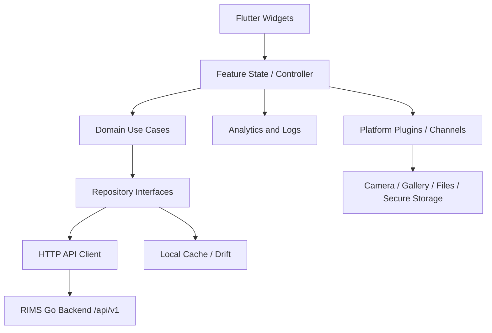

<!-- SPDX-License-Identifier: AGPL-3.0-or-later -->
<!-- Copyright (c) 2026 ShangBin Wang -->

# 零售端库存管理系统前端需求文档 v2

## 1. 文档定位

### 1.1 版本说明
- 本文档为 RIMS 移动端前端需求文档 v2，核心技术路线从 Godot 4.x 调整为 Flutter。
- 原 `docs/前端需求文档.md` 和 `docs/# 零售端库存管理系统APP项目需求文档.md` 中以 Godot 为主的工程组织、插件桥接、导出方案，在 v2 中不再作为一期移动端主路线。
- v2 保留既有产品范围、权限口径、接口契约、弱网策略、终端能力和验收标准，并补充 Flutter 工程架构、状态管理、本地缓存、发布测试与插件边界。
- 本文档用于指导后续 Flutter 移动端 App 设计、开发、联调、测试与发布。

### 1.2 适用范围
- 适用于 Android、iOS、iPad、Android 平板，以及鸿蒙设备 Android 兼容层。
- 一期不交付独立 Web 端，但在设计语言、接口封装、领域模型和页面信息架构上为后续 Web 管理端预留一致口径。
- 后续如建设 Web 端，建议使用独立 Web 技术栈，与 Flutter 移动端复用 API 契约、权限模型、枚举字典和设计 Token，而不是强行复用同一个 Flutter Web 工程承载所有后台管理能力。

### 1.3 前端职责边界
- 前端负责界面组织、导航路由、交互反馈、终端能力调用、本地缓存、草稿恢复、弱网提示、埋点采集与客户端监控。
- 前端负责表单前置校验、权限入口显隐、字段显隐、错误码映射和用户可理解提示。
- 权限校验、库存事务、成本价控制、审计记录、幂等裁决、库存一致性最终以服务端返回结果为准。
- 前端不得以本地缓存或角色判断绕过服务端授权，也不得在普通用户端缓存或展示服务端已屏蔽的成本类字段。

## 2. 前端总体目标

### 2.1 建设目标
- 提供覆盖登录鉴权、仓库切换、库存管理、销售出库、退货入库、入库、调拨、盘点、非标转标准、报表分析、扫码与附件上传等核心流程的移动端操作界面。
- 保证门店和仓库高频操作少步骤可达，关键状态可识别，提交反馈清晰，弱网可恢复。
- 保证管理员和普通用户在菜单入口、字段显隐、操作权限、导出口径和错误提示上的表现一致。
- 保证 Android、iOS、鸿蒙 Android 兼容层核心流程可真机演示、可联调、可回归。

### 2.2 设计原则
- 简洁、专业、现代、扁平化，优先服务库存与单据操作效率。
- 高信息密度但低认知负担，列表、表单、报表页面便于快速扫描和反复使用。
- 关键业务状态必须通过文案、标签、图标协同表达，不得仅依赖颜色。
- 触屏优先，扫码、销售、退货、盘点等高频动作优先放在拇指易达区域。
- 离线和弱网能力以“可浏览、可恢复、可明确告知”为目标，不默认承诺离线自动完成库存变更。

## 3. Flutter 技术路线

### 3.1 总体路线
- 移动端以 Flutter 稳定版本作为主 UI 框架，使用 Dart 作为主要开发语言。
- UI 层采用 Flutter Widget、Material 3、主题 Token、响应式布局和可访问性语义能力建设。
- 业务编排采用特性模块化架构，围绕认证、仓库、库存、单据、报表、文件、设置等业务域拆分。
- 终端能力优先使用维护活跃、许可证清晰、支持 Android/iOS 的 Flutter 插件；插件不足时通过 Flutter Platform Channels 接入 Kotlin/Swift 原生能力。
- 客户端通过版本化 HTTP/JSON 接口访问后端 `/api/v1`，并统一处理 JWT、仓库上下文、响应信封、业务错误码和追踪 ID。

### 3.2 推荐技术栈
| 分层 | 推荐方案 | 说明 |
|---|---|---|
| UI 框架 | Flutter stable + Dart | 主移动端技术栈 |
| 设计系统 | Material 3 + 自定义 ThemeData + 设计 Token | 支持浅色、深色、跟随系统 |
| 路由 | go_router 或同等级声明式路由 | 支持鉴权重定向、深层页面、路由守卫 |
| 状态管理 | Riverpod 或同等级可测试状态管理方案 | 管理会话、仓库上下文、缓存查询和异步状态 |
| 网络 | Dio 或同等级 HTTP Client | 统一拦截 JWT、错误码、traceId、仓库 Header |
| DTO | json_serializable/freezed 或同等级代码生成 | 降低手写 JSON 映射错误 |
| 安全存储 | flutter_secure_storage 或平台安全存储封装 | 保存访问令牌、后续如后端提供的刷新令牌、敏感会话信息 |
| 本地缓存 | Drift(SQLite) 或同等级结构化本地数据库 | 缓存商品、库存、报表摘要、草稿和重试队列 |
| 偏好设置 | shared_preferences 或轻量 KV 封装 | 保存主题、声音、触感、筛选偏好 |
| 扫码 | mobile_scanner、ML Kit 类插件或原生桥接 | 一维码、二维码、连续扫码、相册识别需预研 |
| 图片与文件 | image_picker/file_picker/path_provider/share_plus 等候选 | 拍照、相册、文件选择、导出分享 |
| 图表 | fl_chart、graphic 或商业图表 SDK 候选 | 需验证许可证、性能、深色主题和无障碍 |
| 监控 | Sentry、Firebase Crashlytics 或国内等价方案 | 崩溃、性能、接口错误、关键链路耗时 |
| 构建 | Flutter flavors + dart-define + CI/CD | 区分开发、测试、预发布、生产 |

> 以上插件为候选方向，正式引入前必须完成许可证审查、维护活跃度评估、Android/iOS 真机验证和替代方案记录。

### 3.3 为什么从 Godot 调整为 Flutter
- RIMS 是以表单、列表、扫码、报表、权限显隐、弱网恢复为核心的生产力 App，Flutter 的移动业务生态更匹配。
- Flutter 对安全区、输入法、可访问性、列表性能、表单校验、响应式布局、测试和发布链路支持更成熟。
- Flutter 插件生态更贴近相机、扫码、文件、分享、安全存储、崩溃监控、推送等业务 App 常见能力。
- Flutter 后续可较自然地扩展到平板和部分桌面/网页场景，但一期仍以移动端质量为主，不以“一套代码覆盖所有端”牺牲移动端体验。

## 4. 客户端架构

### 4.1 分层结构
- 表现层：页面、组件、主题、布局、动效、可访问性、图表和用户反馈。
- 应用层：路由、页面状态编排、会话守卫、表单校验、提交锁、草稿恢复、重试队列和错误映射。
- 领域层：角色菜单裁剪、仓库上下文、库存状态标签、单据状态流转、报表指标格式化、权限字段显隐。
- 数据层：接口 Repository、本地缓存 DAO、DTO/Entity 映射、分页查询、文件上传下载封装。
- 基础设施层：HTTP Client、安全存储、本地数据库、日志埋点、终端权限、扫码相机、文件系统、崩溃监控和远程配置。

### 4.2 数据流


### 4.3 工程目录建议
```text
rims-flutter/
  lib/
    main.dart
    app/
      bootstrap.dart
      router.dart
      theme/
      env/
    core/
      api/
      auth/
      cache/
      errors/
      logging/
      permissions/
      platform/
      telemetry/
      widgets/
    shared/
      models/
      dto/
      enums/
      formatters/
      validators/
    features/
      auth/
      home/
      warehouse/
      product/
      inventory/
      document/
      report/
      file/
      audit/
      settings/
    l10n/
  test/
    unit/
    widget/
  integration_test/
  assets/
    images/
    icons/
    fonts/
  android/
  ios/
```

### 4.4 模块划分
- 认证与会话模块：登录、注销、令牌持久化、鉴权失效处理、当前用户信息、角色初始化。
- 首页与导航模块：角色化首页、一级导航、快捷入口、待办摘要、库存预警、最近操作。
- 仓库模块：用户可见仓库、默认仓库、当前仓库、管理员切仓、普通用户固定仓。
- 商品与库存模块：商品列表、商品详情、条码查询、标准库存、非标库存、低库存预警。
- 单据模块：销售出库、退货入库、入库、调拨、盘点、非标转标准、单据历史、库存流水。
- 报表模块：销售统计、销售趋势、销售排行、库存总览、周转率、滞销预警、导出分享。
- 文件模块：商品图片、单据附件、导入模板、导出结果、私有文件下载和权限提示。
- 设置与我的模块：账号安全、主题、声音触感、通知权限、缓存管理、帮助反馈、关于与开源许可。
- 审计模块：管理员查看审计日志；普通用户不展示入口。

## 5. 接口集成规范

### 5.1 基础约定
- 基础路径为 `http(s)://<host>:8080/api/v1`，正式环境必须使用 HTTPS/TLS。
- 除登录、健康检查、Swagger 和公开上传资源外，所有接口请求需携带 `Authorization: Bearer <token>`。
- `/inventory/**`、`/non-std-inventory/**`、`/documents/**`、`/transactions`、`/reports/**` 必须附带仓库上下文，优先使用 `X-Warehouse-ID`。
- `/users`、`/warehouses`、`/roles`、`/permissions`、`/products`、`/files`、`/audit/**` 不经过仓库中间件，但仍需按业务权限展示入口。

### 5.2 响应信封
- 所有非 204 响应按统一信封解析：`code`、`message`、`data`、`traceId`。
- 前端判断业务成功以 `code == 0` 为准，HTTP 状态只作为二级分类。
- 错误提示需优先使用前端错误映射表，必要时附带 `traceId` 供运维排查。

### 5.3 全局错误处理
| code | 前端处理 |
|---|---|
| `10001` | 清理本地会话，保留必要页面意图和草稿，跳转登录 |
| `10002` | 提示无权限，回退或刷新权限上下文 |
| `10003` | 标记为参数或表单校验失败，定位到具体字段或流程节点 |
| `10004` | 提示资源不存在或已删除，刷新列表 |
| `10005` | 提示重复数据，保留表单供用户修改 |
| `20001` | 库存不足，展示商品、仓库、可用数量和修改入口 |
| `20002` | 状态不允许，提示当前单据或库存状态已变化，要求刷新 |
| `20003` | 幂等或重复提交，提示不要重复操作并查询结果 |
| `50000` | 系统异常，展示 traceId 和重试/联系管理员入口 |

### 5.4 仓库上下文
- 登录成功后调用 `GET /users/me/warehouses` 缓存可见仓库列表。
- 普通用户若仅绑定一个仓库，前端固定当前仓库，不展示切换入口。
- 管理员可在授权仓库列表中切换当前仓库，切换成功后刷新库存、单据、报表和首页摘要。
- 仓库切换必须清理或失效与旧仓库绑定的查询缓存、草稿上下文和报表筛选结果。

### 5.5 分页与列表
- 列表接口使用 `page`、`pageSize`、`keyword`，`pageSize` 不超过服务端上限 100。
- 手机端默认采用下拉刷新和滚动加载；平板端可使用分页控件或虚拟滚动列表。
- 列表刷新需支持空态、错误态、加载态、部分数据缓存态和重新加载。

### 5.6 文件上传与下载
- 上传使用 `multipart/form-data`，字段包含 `file`、`businessType`、`businessId`。
- 前端需在上传前做文件大小、扩展名、MIME、权限和网络状态预检查，但最终以后端校验为准。
- `product_image` 可使用公开 `/uploads/<objectKey>` URL 展示。
- 私有文件通过 `/api/v1/files/:id/download` 获取，Flutter 中需使用带鉴权 Header 的 HTTP 下载，不可直接依赖无 Header 的外部浏览器打开。
- 下载或分享前必须再次判断角色和上传者权限，失败时展示服务端返回原因。

## 6. 状态管理、本地缓存与弱网策略

### 6.1 状态分层
- 全局状态：登录会话、当前用户、角色、当前仓库、主题、网络状态、功能开关。
- 页面状态：筛选条件、分页游标、表单输入、加载状态、错误状态、选择项。
- 业务状态：单据草稿、商品明细、库存校验结果、报表查询参数、上传任务状态。
- 持久状态：安全令牌、用户偏好、缓存数据、草稿、弱网重试任务。

### 6.2 本地缓存
- 结构化缓存建议使用 SQLite/Drift，便于按仓库、商品、时间范围和业务类型做精确失效。
- 可缓存数据包括商品列表、库存摘要、报表摘要、最近操作、仓库列表、状态字典和低风险图片缩略图。
- 成本价、敏感审计详情、访问令牌、后续如后端提供的刷新令牌不得进入普通明文缓存。
- 缓存必须带账号 ID、仓库 ID、更新时间和有效期，账号切换、仓库切换、权限刷新后必须失效相关数据。

### 6.3 草稿与重试
- 销售、退货、入库、调拨、盘点、非标转标准等长流程允许保存草稿。
- 草稿需记录账号、角色、仓库、业务类型、明细、创建时间和最后更新时间。
- 弱网重试队列只保存用户明确提交过且服务端未确认结果的请求上下文。
- 涉及库存变更的请求不得在网络恢复后静默自动重放，必须先展示待重试内容和可能风险，由用户确认后再发起。
- 对已提交但结果未知的请求，应优先查询单据状态或请求结果，再决定是否重试，降低重复入账风险。

### 6.4 网络状态
- 客户端需识别离线、弱网、超时、服务端不可达和鉴权失效。
- 离线时允许浏览已有缓存和草稿，不允许直接完成库存变更。
- 弱网下提交按钮需显示加载和锁定状态，并提示用户不要退出当前流程。
- 所有关键提交结果必须有明确成功、失败或未知三类状态。

## 7. 终端能力与权限

### 7.1 扫码
- 支持一维码、二维码识别，覆盖商品查询、销售出库、入库、盘点和退货关联场景。
- 支持连续扫码、手动输入兜底、扫码失败重试和相册图片识别。
- 扫码成功后需立即展示匹配结果；匹配多个商品时进入选择页；未匹配时提供手动搜索或管理员录入入口。
- 普通用户扫描到非标库存时，不得进入销售扣减流程，应展示不可售原因和联系管理员提示。

### 7.2 相机、相册与文件
- 相机用于扫码和商品/单据附件拍照。
- 相册用于图片识别、商品图片选择和附件上传。
- 文件选择用于导入模板、附件上传、导出结果分享。
- 权限申请采用按需申请，申请前说明用途，被拒绝后提供跳转系统设置的引导。

### 7.3 安全存储
- 访问令牌、后续如后端提供的刷新令牌和敏感会话标识必须使用平台安全存储。
- 退出登录、账号切换、服务端鉴权失效时，必须清理该账号关联的敏感会话数据。
- 日志、埋点、崩溃报告中不得记录令牌、密码、验证码、完整手机号、完整条码内容和成本明细。

### 7.4 平台桥接
- 优先使用 Flutter 插件满足平台能力。
- 当扫码性能、厂商设备、系统权限或监控 SDK 无法满足要求时，通过 Platform Channels 封装 Kotlin/Swift 原生能力。
- 平台桥接接口需统一返回成功、取消、权限拒绝、设备不支持、系统异常等结果，不允许 Android/iOS 返回口径不一致。

## 8. 终端适配与响应式布局

### 8.1 设备适配
- 手机默认竖屏，保障登录、扫码、销售、退货、盘点录入等高频流程单手可达。
- 平板支持横竖屏，横屏优先采用“左侧导航 + 右侧内容区”或“主列表 + 详情”结构。
- 鸿蒙设备以 Android 包兼容层运行方式纳入一期验证范围，需单独记录扫码、文件、通知和相册行为差异。
- 使用 Flutter `SafeArea`、`MediaQuery`、响应式断点和自适应导航，避免异形屏、状态栏、底部手势区域遮挡关键操作。

### 8.2 布局断点
| 场景 | 布局策略 |
|---|---|
| 小屏手机 | 单栏页面，底部导航不超过 5 个入口，底部主按钮固定在安全区上方 |
| 大屏手机 | 单栏为主，可加强筛选吸顶、快捷按钮和卡片摘要 |
| 竖屏平板 | 分层页面 + 抽屉筛选 + 较高信息密度列表 |
| 横屏平板 | 侧边导航 + 列表详情联动 + 图表和筛选同屏 |

### 8.3 横竖屏保持
- 横竖屏切换时尽量保留当前仓库、路由、筛选条件、草稿、滚动位置和已录入明细。
- 对扫码、拍照、文件选择等系统能力返回后，页面必须恢复到发起前的业务上下文。

## 9. 视觉与组件规范

### 9.1 视觉风格
- 整体采用简洁、专业、现代、扁平化设计语言。
- 页面优先突出数据、状态和操作，不使用过强装饰、复杂纹理或游戏化视觉。
- 字号、字重、留白、分组边界、图标和语义色共同表达层级。

### 9.2 主题
- 支持浅色主题、深色主题和跟随系统。
- 主题使用统一设计 Token 管理颜色、字号、圆角、间距、图标、阴影、图表配色和语义标签。
- 标准库存、非标库存、已转换标准、失败、禁用、预警、成功等语义在不同主题下含义必须一致。
- 深色主题控制高亮色面积，避免大面积发光、闪烁或低对比文字。

### 9.3 组件
- 建立统一组件库：按钮、输入框、搜索框、筛选器、标签、卡片、列表项、分页加载、空状态、错误页、Toast、Dialog、BottomSheet、底部操作栏、图表容器。
- 触控控件必须有按下、禁用、加载中、完成和错误状态。
- 关键提交按钮在请求处理中必须锁定，防止重复提交。
- 表格、图表和卡片中的文本不得挤压、重叠或被按钮遮挡。

### 9.4 可访问性
- 图标按钮、扫码入口、图表摘要、状态标签和关键表单项必须提供语义标签。
- 需支持系统字体缩放，不得因字号变化导致关键按钮文字溢出。
- 文本和背景对比度需满足可读性要求。
- 关键流程需在 TalkBack 和 VoiceOver 下进行基础可访问性检查。

## 10. 信息架构与核心页面

### 10.1 一级导航
- 首页
- 库存
- 业务单据
- 报表
- 我的

### 10.2 角色化首页
- 管理员首页突出仓库切换、库存预警、待处理单据、报表摘要和快捷业务入口。
- 普通用户首页突出当前仓库、扫码销售、退货入库、库存查询和最近操作。
- 所有涉及库存、商品、单据、报表的页面必须明确展示当前仓库上下文。

### 10.3 核心页面
- 登录与身份认证页。
- 仓库选择与切换页。
- 库存总览页。
- 商品详情与商品维护页。
- 销售出库页。
- 退货入库页。
- 入库页。
- 调拨页。
- 盘点页。
- 非标转标准页。
- 报表与分析页。
- 文件附件页。
- 设置与我的页。
- 管理员审计日志页。

### 10.4 设置与我的
| 菜单 | 内容 |
|---|---|
| 账号与安全 | 账号信息、修改密码、登录状态、退出登录 |
| 当前身份 | 当前角色、当前仓库、默认仓库说明 |
| 主题与显示 | 跟随系统、浅色模式、深色模式、字号偏好 |
| 声音与触感 | 扫码提示音、提交提示音、触感反馈开关 |
| 通知与提醒 | 库存预警提醒、系统消息、权限引导 |
| 数据与缓存 | 清理图片缓存、离线数据更新时间、草稿管理 |
| 帮助与反馈 | 操作指引、常见问题、意见反馈 |
| 关于与协议 | 应用版本、隐私政策、用户协议、开源许可 |

## 11. 关键业务流程

### 11.1 登录
- 用户输入账号密码或手机号验证码。
- 前端做格式校验，调用登录接口。
- 登录成功后保存令牌，拉取用户信息、角色、仓库权限和首页初始化数据。
- 登录失败展示可读原因。
- 鉴权失效时清理令牌，保留必要草稿和页面意图，重新登录后尽量恢复原上下文。

### 11.2 仓库切换
- 普通用户固定绑定仓库，仅展示仓库名称。
- 管理员可查看授权仓库列表、搜索最近使用仓库并切换当前仓库。
- 切换成功后刷新库存、单据、报表、首页快捷入口和缓存上下文。
- 切换失败时保持原仓库不变，并提示原因。

### 11.3 销售出库
- 从首页、库存页或扫码入口进入。
- 选择或继承当前仓库。
- 扫码或手动选商品，前端仅展示可销售标准库存。
- 输入数量和实际销售价，展示建议零售价对比和库存校验。
- 二次确认后提交销售单。
- 失败时区分库存不足、非标不可售、价格校验失败、重复提交、网络中断和状态变化。

### 11.4 退货入库
- 从销售记录详情、首页快捷入口或单据中心进入。
- 查询或扫码关联原销售单。
- 选择可退商品和数量。
- 校验可退数量、状态、仓库归属和权限。
- 填写退货原因并提交。
- 展示库存回写结果和失败原因。

### 11.5 管理员业务
- 入库支持扫码、手动、批量导入三种路径，提交前确认仓库、商品、数量、来源和备注。
- 调拨仅允许标准库存参与，需明确调出仓、调入仓、商品、数量和失败回滚提示。
- 盘点体现“盘点录入 -> 差异确认 -> 盘点结转”三步，支持草稿恢复和差异说明。
- 非标转标准体现“选择非标记录 -> 输入转换数量 -> 关联标准商品 -> 二次确认 -> 完成转换”。

### 11.6 报表查看与导出
- 进入报表页后选择时间范围、仓库范围和图表类型。
- 拉取统计结果，支持图表和表格切换核对。
- 普通用户仅查看绑定仓库数据；管理员查看授权仓库数据，并按权限展示成本、利润、库存总值。
- 导出或分享必须遵循与页面一致的权限口径，服务端二次校验失败时展示原因。

## 12. 权限矩阵与字段显隐

### 12.1 前端权限原则
- 前端权限用于页面入口显隐、按钮可用性、字段可见性和提示信息表达。
- 无权限能力优先隐藏入口；需要解释原因时置灰并展示说明。
- 任何关键受控能力不得仅依赖前端限制，必须接受服务端权限校验。

### 12.2 角色权限矩阵
| 功能域 | 页面或入口 | 管理员 | 普通用户 | 说明 |
|---|---|---|---|---|
| 登录鉴权 | 登录、退出、会话续签 | 可用 | 可用 | 所有用户通用 |
| 仓库上下文 | 仓库切换、默认仓库设置 | 可用 | 不可切换 | 普通用户固定绑定仓库 |
| 首页快捷入口 | 入库、调拨、盘点、非标转标准 | 可见 | 隐藏 | 管理员专属 |
| 首页快捷入口 | 销售出库、退货入库、库存查询 | 可见 | 可见 | 普通用户核心能力 |
| 商品信息 | 基础信息、建议零售价、图片 | 可见 | 可见 | 按仓库范围控制 |
| 商品信息 | 成本价、平均售价 | 可见 | 隐藏 | 受控字段 |
| 库存管理 | 标准库存查看 | 可见 | 可见 | 受仓库权限限制 |
| 库存管理 | 非标库存查看与处理 | 可见 | 摘要或隐藏 | 普通用户不得调整非标库存 |
| 单据操作 | 普通入库 | 可用 | 不可用 | 管理员能力 |
| 单据操作 | 销售出库 | 可用 | 可用 | 仅标准库存可销售 |
| 单据操作 | 退货入库 | 可用 | 可用 | 必须关联销售记录 |
| 单据操作 | 调拨、盘点、非标转标准 | 可用 | 不可用 | 管理员专属 |
| 报表分析 | 单仓报表查看 | 可用 | 可用 | 普通用户限绑定仓库 |
| 报表分析 | 多仓汇总、成本分析 | 可用 | 隐藏 | 受控能力 |
| 导出分享 | 普通报表导出 | 可用 | 可用 | 导出内容受权限口径限制 |
| 导出分享 | 含成本价或多仓敏感数据导出 | 可用 | 不可用 | 服务端二次校验 |
| 文件附件 | 上传本人业务附件 | 可用 | 可用 | 按业务入口约束 |
| 文件附件 | 下载他人私有文件 | 可用 | 不可用 | 服务端 ACL 裁决 |
| 审计日志 | 查询审计日志 | 可用 | 隐藏 | 管理员能力 |

### 12.3 字段级显隐
- 成本价：管理员显示，普通用户不渲染字段。
- 平均售价：管理员显示，普通用户隐藏或不展示。
- 多仓汇总数据：管理员显示，普通用户隐藏。
- 非标处理按钮：管理员显示，普通用户隐藏。
- 仓库切换控件：管理员显示，普通用户隐藏并展示固定仓库名称。
- 审计摘要：管理员按授权显示，普通用户隐藏。
- 后端对普通用户响应中缺失的字段，前端不得使用默认值伪造展示。

## 13. 表单、提交与错误反馈

### 13.1 表单校验
- 表单需支持必填、格式、范围、数量上限、价格异常、仓库权限、库存状态等前置校验。
- 前端校验用于减少无效请求，服务端校验失败仍需完整处理。
- 校验错误应定位到字段或流程节点，避免只在页面顶部显示笼统错误。

### 13.2 提交锁与幂等
- 所有关键提交按钮在请求中必须进入加载和禁用状态。
- 单据完成、销售、退货、盘点结转、调拨、非标转换等操作必须二次确认。
- 当前后端幂等能力以服务端状态裁决为准；前端必须做提交锁、结果查询和重复提交提示。
- 后续如服务端开放 `Idempotency-Key`，前端应在提交类请求中生成并持久化请求键。

### 13.3 结果反馈
- 成功结果页展示单据号、仓库、商品数量、影响库存和后续操作。
- 失败结果页展示失败类型、用户可执行建议、重试入口和 traceId。
- 结果未知时不得直接提示成功，应提供“查询处理结果”或“稍后重试”。

## 14. 报表与图表

### 14.1 数据范围
- 销售汇总、销售趋势、商品销售排行、库存总览、库存周转率、滞销清单。
- 时间范围遵循后端 366 天上限。
- `costAmount`、`grossProfit`、`totalValue` 等成本利润字段仅管理员可见，普通用户响应缺失时前端不渲染。

### 14.2 展示方式
- 手机端采用指标卡片 + 图表卡片 + 明细列表结构。
- 平板横屏支持筛选、图表、排行和明细同屏。
- 图表需提供可读标题、时间范围、单位、空态、加载态、错误态和数据更新时间。
- 图表与表格可切换或联动展示，便于核对。

### 14.3 导出与分享
- 导出内容必须与当前用户权限一致。
- 导出前展示范围、时间、仓库、字段敏感性提示。
- 导出结果为私有文件时，下载必须携带 Authorization Header。
- 导出失败需展示服务端原因和 traceId。

## 15. 埋点、日志与隐私

### 15.1 埋点目标
- 登录转化、首页初始化成功率、功能使用频率、扫码识别效果、关键单据成功率、弱网问题、报表导出使用情况。
- 埋点与崩溃监控、性能监控、关键业务日志共同构成客户端可观测性。

### 15.2 公共字段
- 事件时间。
- 用户 ID。
- 角色类型。
- 当前仓库 ID。
- 终端平台。
- 系统版本。
- 应用版本。
- 页面标识。
- 网络类型。
- 主题模式。
- 是否平板。
- 是否横屏。

### 15.3 核心事件
| 分类 | 事件 | 触发 |
|---|---|---|
| 会话 | `login_submit` | 用户提交登录 |
| 会话 | `login_result` | 登录成功或失败 |
| 页面 | `page_view` | 页面进入完成 |
| 仓库 | `warehouse_switch_result` | 仓库切换成功或失败 |
| 扫码 | `scan_start` | 打开扫码 |
| 扫码 | `scan_result` | 扫码完成 |
| 单据 | `sale_result` | 销售提交返回 |
| 单据 | `return_result` | 退货提交返回 |
| 管理 | `stocktake_settle_result` | 盘点结转返回 |
| 报表 | `report_view` | 查看报表 |
| 报表 | `report_export_result` | 导出完成 |
| 稳定性 | `api_error` | 接口错误提示产生 |

### 15.4 隐私边界
- 不采集密码、验证码、完整手机号、完整条码内容、成本价明细、敏感审计详情和访问令牌。
- 失败原因优先记录错误码、错误分类和流程节点，不记录服务端原始堆栈。
- 埋点开关、采样率和远程关闭能力应纳入远程配置。

## 16. 发布、运维与版本管理

### 16.1 环境
- 使用 Flutter flavors 区分开发、测试、预发布、生产环境。
- 环境配置包括 API 基地址、上传资源域名、日志级别、监控开关、功能开关、渠道标识。
- 构建时通过 flavor、dart-define 或安全 CI 变量注入非敏感配置。
- 密钥、签名文件、生产令牌不得提交到代码仓库。

### 16.2 发布渠道
- Android：应用市场、企业内部分发、测试包。
- iOS：TestFlight、App Store 或企业签名策略。
- 鸿蒙 Android 兼容层：优先复用 Android 包验证，记录机型兼容差异。

### 16.3 运维能力
- 接入崩溃监控、性能监控、接口错误上报、关键链路耗时和行为埋点。
- 高风险能力支持远程配置或特性开关，如扫码策略、批量导入、报表导出、新图表组件。
- 支持建议升级和强制升级。
- 严重问题通过关闭功能开关、回滚应用版本或服务端兼容策略快速止损。

## 17. 测试与验收

### 17.1 测试类型
- 单元测试：DTO 映射、错误码映射、权限判断、状态枚举、表单校验、领域规则。
- Widget 测试：登录表单、库存列表、销售明细、权限显隐、空态、错误态、深浅主题。
- 集成测试：登录、仓库切换、库存查询、销售出库、退货入库、报表查看、文件上传。
- 真机测试：Android、iOS、iPad、Android 平板、鸿蒙 Android 兼容层。
- 兼容性测试：扫码、相册、相机、文件选择、权限拒绝、弱网、横竖屏、深色主题、系统字体缩放。

### 17.2 验收重点
- 登录、首页初始化、仓库上下文、库存查询、销售、退货、入库、调拨、盘点、非标转标准、报表、文件附件形成闭环。
- 页面入口、按钮、字段、导出和提示信息符合角色与仓库权限。
- 弱网、离线浏览、重复点击、扫码失败、相册权限拒绝、鉴权失效可恢复。
- 前端展示状态、报表口径、错误提示与后端接口返回一致。
- 构建包、环境配置、版本记录、监控、灰度策略和回滚预案完备。

## 18. 风险与应对

### 18.1 Flutter 插件风险
- 风险：扫码、图表、文件、监控等插件可能存在维护停滞、许可证不清或平台差异。
- 应对：关键插件先做最小样例和真机验证，建立替代插件或原生桥接方案。

### 18.2 离线提交风险
- 风险：库存类操作离线自动重放可能造成重复入账或状态过期。
- 应对：离线仅允许浏览和草稿；提交结果未知时先查询状态，库存变更重试必须用户确认。

### 18.3 iOS 发布风险
- 风险：iOS 构建、签名、权限声明、TestFlight 和 App Store 审核需要 macOS/Xcode 和账号配合。
- 应对：早期建立 iOS 打包基线，提前准备证书、Bundle ID、权限说明和测试设备。

### 18.4 鸿蒙兼容风险
- 风险：鸿蒙 Android 兼容层在相机、文件、通知、后台行为上可能与标准 Android 不一致。
- 应对：一期明确为 Android 包兼容验证，不承诺 HarmonyOS NEXT 原生能力；建立兼容差异清单。

### 18.5 后续 Web 扩展风险
- 风险：移动端 Flutter 工程直接扩展为完整 Web 管理端可能导致体验和工程复杂度失衡。
- 应对：后续 Web 管理端建议独立建设，复用 API、DTO、权限模型、状态字典和设计 Token。

## 19. 参考资料

- Flutter 官方：Build apps for any screen，https://flutter.dev/。
- Flutter 官方：Adaptive and responsive design，https://docs.flutter.dev/ui/adaptive-responsive。
- Flutter 官方：SafeArea and MediaQuery，https://docs.flutter.dev/ui/adaptive-responsive/safearea-mediaquery。
- Flutter 官方：Platform channels，https://docs.flutter.dev/platform-integration/platform-channels。
- Flutter 官方：JSON and serialization，https://docs.flutter.dev/data-and-backend/serialization/json。
- Flutter 官方：Testing Flutter apps and integration tests，https://docs.flutter.dev/testing。
- Flutter 官方：Build and release Android/iOS apps，https://docs.flutter.dev/deployment/android 与 https://docs.flutter.dev/deployment/ios。
- RIMS：`docs/前端API调用文档.md`。
- RIMS：`docs/产品需求文档.md`。
- RIMS：`docs/前端需求文档.md`。
